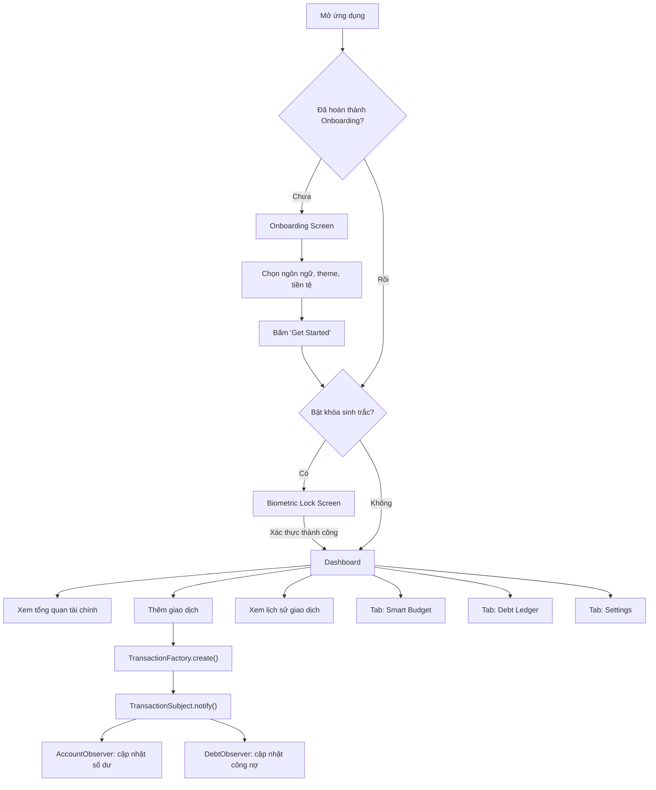
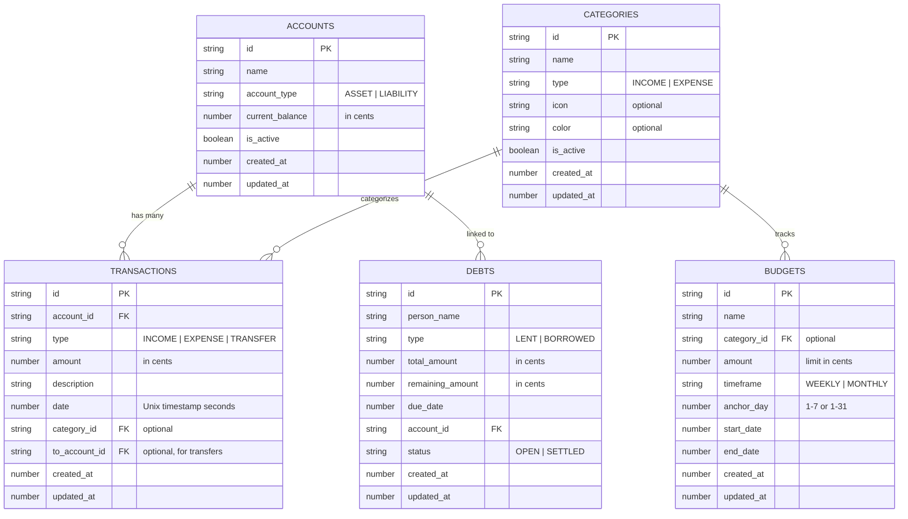

# BÁO CÁO ĐỒ ÁN

# ỨNG DỤNG QUẢN LÝ TÀI CHÍNH CÁ NHÂN — CASH FLOW WAVE

---

**Trường:** `[Đại học Bách Khoa Hà Nội]`

**Khoa:** `[Khoa Khoa học và Công nghệ Giáo dục]`

**Môn học:** `[AC3030 Phát triển ứng dụng / AC3040 Lập trình di động]`

**Giảng viên hướng dẫn:** `[TS. Nguyễn Việt Tùng]`

**Nhóm:** `[Tên nhóm]`

**Thành viên:**

| STT | Họ và tên | MSSV |
|-----|-----------|------|
| 1   | `[Thành viên 1]` | `[MSSV]` |
| 2   | `[Thành viên 2]` | `[MSSV]` |

**Học kỳ:** 20252

---

## Mục lục

- [1. Lời mở đầu](#1-lời-mở-đầu)
- [2. Giới thiệu đề tài](#2-giới-thiệu-đề-tài)
  - [2.1. Bối cảnh](#21-bối-cảnh)
  - [2.2. Mục tiêu](#22-mục-tiêu)
  - [2.3. Đối tượng sử dụng](#23-đối-tượng-sử-dụng)
  - [2.4. Phạm vi thực hiện](#24-phạm-vi-thực-hiện)
- [3. Phân tích yêu cầu](#3-phân-tích-yêu-cầu)
  - [3.1. Yêu cầu chức năng](#31-yêu-cầu-chức-năng)
  - [3.2. Yêu cầu phi chức năng](#32-yêu-cầu-phi-chức-năng)
  - [3.3. Ràng buộc kỹ thuật](#33-ràng-buộc-kỹ-thuật)
- [4. Phân công công việc](#4-phân-công-công-việc)
- [5. Thiết kế tổng thể](#5-thiết-kế-tổng-thể)
  - [5.1. Kiến trúc hệ thống](#51-kiến-trúc-hệ-thống)
  - [5.2. Luồng sử dụng chính](#52-luồng-sử-dụng-chính)
  - [5.3. Cấu trúc thư mục](#53-cấu-trúc-thư-mục)
  - [5.4. Mô hình dữ liệu](#54-mô-hình-dữ-liệu)
  - [5.5. Điều hướng và quản lý trạng thái](#55-điều-hướng-và-quản-lý-trạng-thái)
- [6. Mô tả khối chức năng](#6-mô-tả-khối-chức-năng)
  - [6.1. Khối A — Tài khoản, Giao dịch và Tổng quan tài chính](#61-khối-a--tài-khoản-giao-dịch-và-tổng-quan-tài-chính)
  - [6.2. Khối B — Ngân sách, Công nợ và Cài đặt hệ thống](#62-khối-b--ngân-sách-công-nợ-và-cài-đặt-hệ-thống)
- [7. Kỹ thuật triển khai](#7-kỹ-thuật-triển-khai)
  - [7.1. Cấu trúc project và công nghệ sử dụng](#71-cấu-trúc-project-và-công-nghệ-sử-dụng)
  - [7.2. Design patterns](#72-design-patterns)
  - [7.3. Cơ sở dữ liệu và lưu trữ](#73-cơ-sở-dữ-liệu-và-lưu-trữ)
  - [7.4. Quản lý trạng thái ứng dụng](#74-quản-lý-trạng-thái-ứng-dụng)
  - [7.5. Đa ngôn ngữ và chủ đề giao diện](#75-đa-ngôn-ngữ-và-chủ-đề-giao-diện)
  - [7.6. Bảo mật sinh trắc học](#76-bảo-mật-sinh-trắc-học)
  - [7.7. Biểu đồ và trực quan hóa dữ liệu](#77-biểu-đồ-và-trực-quan-hóa-dữ-liệu)
  - [7.8. Tối ưu hiệu năng](#78-tối-ưu-hiệu-năng)
- [8. Tích hợp và kiểm thử](#8-tích-hợp-và-kiểm-thử)
  - [8.1. Tích hợp module](#81-tích-hợp-module)
  - [8.2. Kiểm thử đơn vị](#82-kiểm-thử-đơn-vị)
  - [8.3. Kết quả coverage](#83-kết-quả-coverage)
  - [8.4. Lỗi gặp phải và cách xử lý](#84-lỗi-gặp-phải-và-cách-xử-lý)
- [9. Kết quả đạt được](#9-kết-quả-đạt-được)
- [10. Khó khăn và hướng phát triển](#10-khó-khăn-và-hướng-phát-triển)
- [11. Kết luận](#11-kết-luận)
- [12. Phụ lục](#12-phụ-lục)

---

## 1. Lời mở đầu

Trong bối cảnh thanh toán số ngày càng phổ biến, việc kiểm soát thu chi cá nhân trở thành nhu cầu thiết thực đối với mọi người, đặc biệt là sinh viên và người trẻ đang bắt đầu quản lý tài chính độc lập. Tuy nhiên, phần lớn các ứng dụng quản lý tài chính phổ biến trên thị trường đều yêu cầu kết nối ngân hàng, tài khoản trực tuyến, hoặc trả phí để sử dụng tính năng nâng cao — điều này tạo ra rào cản đáng kể cho nhóm người dùng phổ thông.

Đồ án **Cash Flow Wave** ra đời nhằm giải quyết vấn đề trên: xây dựng một ứng dụng di động quản lý tài chính cá nhân hoạt động hoàn toàn offline, lưu trữ dữ liệu cục bộ trên thiết bị, không yêu cầu đăng ký tài khoản hay kết nối mạng. Ứng dụng được phát triển bằng React Native và Expo SDK 54, áp dụng nhiều design pattern (Observer, Factory, Strategy, Facade) nhằm đảm bảo tính mở rộng và bảo trì lâu dài.

Báo cáo này trình bày toàn bộ quá trình phân tích, thiết kế, triển khai và kiểm thử sản phẩm Cash Flow Wave trong khuôn khổ học phần AC3030/AC3040 của Đại học Bách Khoa Hà Nội.

---

## 2. Giới thiệu đề tài

### 2.1. Bối cảnh

Thị trường ứng dụng quản lý tài chính cá nhân hiện tại có nhiều giải pháp như Money Lover, MISA, hay Mint, nhưng hầu hết đều vận hành trên mô hình đám mây — dữ liệu người dùng được lưu trên server, yêu cầu đăng nhập và kết nối internet. Đối với một bộ phận người dùng quan tâm đến quyền riêng tư hoặc đơn giản là muốn một công cụ ghi chép nhanh gọn mà không phụ thuộc vào dịch vụ bên ngoài, các giải pháp trên chưa thực sự phù hợp.

Bên cạnh đó, từ góc độ học thuật, việc xây dựng một ứng dụng di động có kiến trúc rõ ràng, áp dụng các design pattern kinh điển (Observer, Factory, Strategy, Facade) vào một bài toán thực tế là cơ hội tốt để nhóm thực hành và chứng minh năng lực kỹ thuật.

### 2.2. Mục tiêu

- Xây dựng ứng dụng di động quản lý tài chính cá nhân hoạt động hoàn toàn offline
- Hỗ trợ quản lý nhiều loại tài khoản (ví tiền mặt, tài khoản ngân hàng, thẻ tín dụng)
- Ghi nhận giao dịch thu/chi với phân loại theo danh mục tùy chỉnh
- Thiết lập và theo dõi ngân sách theo tuần/tháng
- Quản lý công nợ cá nhân (cho vay/đi vay) với khả năng ghi nhận thanh toán từng phần
- Cung cấp biểu đồ trực quan hóa chi tiêu
- Hỗ trợ đa ngôn ngữ (Tiếng Việt, Tiếng Anh) và giao diện sáng/tối
- Bảo mật ứng dụng bằng sinh trắc học (vân tay, Face ID)

### 2.3. Đối tượng sử dụng

- Sinh viên có nhu cầu theo dõi chi tiêu hàng ngày
- Người đi làm muốn kiểm soát ngân sách cá nhân
- Bất kỳ ai cần quản lý các khoản cho vay/đi vay giữa bạn bè, người thân
- Người dùng ưu tiên quyền riêng tư dữ liệu (không muốn upload dữ liệu tài chính lên cloud)

### 2.4. Phạm vi thực hiện

Sản phẩm được xây dựng ở mức **MVP (Minimum Viable Product)** với các ràng buộc:

- Nền tảng: Android và iOS (thông qua React Native + Expo)
- Lưu trữ: hoàn toàn cục bộ trên thiết bị, sử dụng SQLite thông qua WatermelonDB
- Không có backend server, không có đồng bộ đám mây
- Không tích hợp API ngân hàng hay dịch vụ thanh toán bên ngoài
- Giao diện: hỗ trợ Tiếng Việt và Tiếng Anh, chế độ sáng/tối

---

## 3. Phân tích yêu cầu

### 3.1. Yêu cầu chức năng

| STT | Chức năng | Mô tả |
|-----|-----------|-------|
| F01 | Onboarding | Trình hướng dẫn 3 bước cho lần đầu sử dụng: chọn ngôn ngữ, chủ đề giao diện, cấu hình đơn vị tiền tệ |
| F02 | Quản lý tài khoản | Tạo nhiều tài khoản với 2 loại chính: Tài sản (Asset — ví, ngân hàng) và Nợ (Liability — thẻ tín dụng). Hỗ trợ lưu số dư ban đầu, ẩn tài khoản (soft delete) |
| F03 | Ghi giao dịch | Tạo giao dịch Thu nhập (Income), Chi tiêu (Expense), Chuyển khoản (Transfer) với thông tin: số tiền, tài khoản, danh mục, mô tả, ngày |
| F04 | Quản lý danh mục | Hệ thống danh mục mặc định (5 danh mục seed) kèm khả năng tạo/ẩn danh mục tùy chỉnh với màu và icon riêng |
| F05 | Dashboard tổng quan | Hiển thị tài sản ròng (Net Worth), thống kê thu/chi tháng, biểu đồ chi tiêu theo danh mục (Pie Chart) và xu hướng chi tiêu 7 ngày (Bar Chart) |
| F06 | Ngân sách thông minh | Tạo ngân sách theo tuần hoặc tháng, gắn với danh mục cụ thể hoặc toàn bộ chi tiêu. Tự động tính phần trăm sử dụng, cảnh báo khi vượt ngưỡng 80%/100% |
| F07 | Sổ công nợ | Ghi nhận khoản cho vay (Lent) và đi vay (Borrowed), theo dõi số tiền còn lại, ghi nhận thanh toán từng phần, đánh dấu đã tất toán |
| F08 | Lịch sử giao dịch | Xem toàn bộ lịch sử giao dịch, sắp xếp theo ngày mới nhất, xem chi tiết từng giao dịch |
| F09 | Cài đặt | Tùy chỉnh: giao diện (sáng/tối/hệ thống), ngôn ngữ (vi/en), ký hiệu tiền tệ, vị trí ký hiệu, hiển thị số thập phân, ngày đầu tuần, khóa sinh trắc học |
| F10 | Khóa sinh trắc học | Bảo vệ ứng dụng bằng vân tay hoặc Face ID. Tự động mở khóa nếu thiết bị không hỗ trợ sinh trắc |
| F11 | Xóa toàn bộ dữ liệu | Chức năng reset database với xác nhận 2 bước để tránh thao tác nhầm |

### 3.2. Yêu cầu phi chức năng

| Yêu cầu | Mô tả chi tiết |
|----------|-----------------|
| **Hiệu năng** | Dữ liệu tài chính được lưu trữ bằng WatermelonDB (lõi SQLite C++) thay vì AsyncStorage, đảm bảo truy vấn nhanh với hàng nghìn bản ghi. Danh sách giao dịch sử dụng FlashList (Shopify) thay vì FlatList mặc định để tối ưu render list dài |
| **Khả năng sử dụng** | Giao diện hỗ trợ 2 ngôn ngữ (Tiếng Việt, Tiếng Anh). Hệ thống theme sáng/tối/tự động. Luồng onboarding hướng dẫn cài đặt ban đầu. Tiền tệ hiển thị tùy chỉnh (ký hiệu, vị trí, số thập phân) |
| **Bảo mật** | Khóa ứng dụng bằng sinh trắc học thông qua expo-local-authentication. Dữ liệu không rời khỏi thiết bị |
| **Khả năng bảo trì** | Áp dụng 4 design pattern (Observer, Factory, Strategy, Facade) để tách biệt logic nghiệp vụ. Kiến trúc phân tầng rõ ràng: Model → Controller → Pattern → Screen |
| **Khả năng mở rộng** | Observer pattern cho phép thêm side-effect mới (ví dụ: NotificationObserver) mà không sửa code tạo giao dịch. Strategy pattern cho phép thêm chu kỳ ngân sách mới (hàng ngày, quý) chỉ bằng cách thêm strategy mới |
| **Tính toàn vẹn dữ liệu** | Mọi giao dịch và side-effect (cập nhật số dư, công nợ) được ghi vào database trong cùng một batch nguyên tử — hoặc tất cả thành công hoặc không có gì thay đổi |
| **Nền tảng đích** | Hỗ trợ cả Android và iOS thông qua React Native. Sử dụng Custom Dev Client (không chạy trên Expo Go) do WatermelonDB chứa lõi C++ |

### 3.3. Ràng buộc kỹ thuật

Phần này rà soát từng khía cạnh kỹ thuật trong source code, xác định rõ từng ràng buộc **có tồn tại hay không**, và nếu có thì được triển khai ra sao.

#### 3.3.1. Điều hướng (Navigation)

**Có**, nhưng **không sử dụng thư viện navigation chuyên dụng** (React Navigation, Expo Router).

Ứng dụng tự triển khai hệ thống điều hướng bằng conditional rendering trong `App.tsx`. Luồng quyết định như sau:

- Nếu `hasCompletedOnboarding === false` → render `OnboardingScreen`
- Nếu `isBiometricEnabled === true` và `isUnlocked === false` → render `BiometricLockScreen`
- Ngược lại → render Main App với tab bar tự xây

Tab bar gồm 4 tab (Home, Budgets, Debts, Settings) được xây dựng bằng các `Pressable` component và `useState<Tab>` quản lý tab hiện tại. Khi bấm tab, chỉ thay đổi state `activeTab` và conditional render screen tương ứng — không có animation chuyển trang, không có stack navigation, không hỗ trợ gesture back trên Android.

Các modal (AddAccountModal, AddTransactionModal, CategoryManagerModal, TransactionHistoryModal, TransactionDetailsModal) sử dụng component `Modal` có sẵn của React Native với `animationType="slide"` và lớp overlay bán trong suốt. Modal lồng nhau được hỗ trợ: `TransactionHistoryModal` chứa `TransactionDetailsModal` bên trong.

**Hạn chế:** Không hỗ trợ deep linking, không có back stack, Android hardware back button không được xử lý rõ ràng ở tầng navigation.

#### 3.3.2. Quản lý trạng thái và Hooks

**Có**, sử dụng kết hợp **Zustand** (global state) và **React hooks** (local state).

**Zustand store** (`src/store/appStore.ts`):
- Quản lý 8 thuộc tính toàn cục: `theme`, `currencySymbol`, `currencyPosition`, `language`, `hasCompletedOnboarding`, `isBiometricEnabled`, `showDecimals`, `firstDayOfWeek`
- Mỗi thuộc tính có setter riêng (ví dụ `setTheme`, `setLanguage`)
- Persist qua `zustand/middleware/persist` với `AsyncStorage` — tự động phục hồi state khi mở lại app
- Được truy cập bằng hook `useAppStore()` từ mọi screen/component

**React hooks sử dụng xuyên suốt:**

| Hook | Nơi sử dụng | Mục đích |
|------|-------------|----------|
| `useState` | Tất cả screens và modals | Quản lý state cục bộ: form data, loading, error, modal visibility, filter tab |
| `useEffect` | DashboardScreen, SmartBudgetScreen, DebtLedgerScreen, OnboardingScreen | Fetch dữ liệu khi mount, seed categories, khởi tạo TimeService |
| `useRef` | AddAccountModal, AddTransactionModal, CategoryManagerModal, SmartBudgetScreen, DebtLedgerScreen | Input không kiểm soát (tránh re-render mỗi keystroke), lưu tham chiếu debt đang chọn |
| `useCallback` | DashboardScreen, SmartBudgetScreen, DebtLedgerScreen | Ổn định reference hàm `loadData()`, `renderItem` qua các render cycle |
| `useMemo` | DashboardScreen, SmartBudgetScreen, DebtLedgerScreen | Cache `RefreshControl` node, date formatters, style objects tính toán phức tạp |
| `useReducer` | AddTransactionModal | Quản lý nhiều trường form liên quan trong một merged state object |

**Custom hooks** (trong `src/utils/`):
- `useThemeColors()` — đọc theme preference từ store, xử lý `'system'` bằng `useColorScheme()`, trả về bộ token màu phù hợp
- `useTranslation()` — đọc language từ store, trả về hàm `t(key)` tra cứu dictionary

#### 3.3.3. Animation

**Có**, nhưng ở mức **hạn chế**.

Dù `react-native-reanimated` (v4.1.7) được cài đặt và đăng ký trong `babel.config.js`, thực tế các màn hình chính không sử dụng animated transition giữa các tab hay giữa các bước onboarding. Các điểm có animation:

| Vị trí | Loại animation | Công nghệ |
|--------|---------------|-----------|
| Tất cả modals | Slide-up / slide-down khi mở/đóng | React Native `Modal` với `animationType="slide"` (native animation) |
| Pull-to-refresh | Native refresh indicator | `RefreshControl` component (native) |
| Chuyển tab | Không có animation | Conditional rendering tức thì |
| Chuyển bước onboarding | Không có animation | Conditional rendering tức thì |
| Loading states | Native spinner | `ActivityIndicator` component |

`react-native-reanimated` được đăng ký plugin Babel (`react-native-reanimated/plugin`) — đây là yêu cầu bắt buộc của thư viện — nhưng không có file nào trong source code import `useSharedValue`, `useAnimatedStyle`, `withSpring`, `withTiming` hay bất kỳ API nào của Reanimated. Thư viện được cài đặt có thể do là dependency bắc cầu của `react-native-gifted-charts` hoặc dự phòng cho phát triển sau.

#### 3.3.4. Lưu trữ cục bộ

**Có**, sử dụng **2 tầng lưu trữ** phân tách rõ ràng theo tính chất dữ liệu:

**Tầng 1 — WatermelonDB (SQLite)** cho dữ liệu nghiệp vụ:
- Database name: `cashflowwave`, schema version 2
- 5 bảng: `accounts`, `transactions`, `budgets`, `debts`, `categories`
- Adapter: `SQLiteAdapter` với `jsi: false` (sử dụng bridge thay vì JSI)
- Tất cả giá trị tiền tệ lưu dưới dạng **integer (cents)** — tránh sai số floating-point
- Tất cả ngày giờ lưu dưới dạng **Unix timestamp (giây)**
- Ghi dữ liệu luôn qua `database.write()` và `database.batch()` để đảm bảo tính nguyên tử
- Migration v1→v2 đã triển khai: bổ sung cột `category_id` cho bảng `budgets`
- Index trên `account_id` của bảng `transactions` để tối ưu truy vấn

**Tầng 2 — AsyncStorage** cho preferences người dùng:
- Thông qua Zustand persist middleware, key `'app-storage'`
- Lưu: theme, language, currency settings, onboarding flag, biometric flag, first day of week
- Dung lượng nhỏ, đọc/ghi đơn giản, không cần truy vấn phức tạp

**Không sử dụng:** MMKV, SecureStore, FileSystem, hoặc bất kỳ cloud storage nào.

#### 3.3.5. Validation

**Có**, validation được triển khai tại **2 tầng**: Controller (logic nghiệp vụ) và Component (form UI).

**Validation ở tầng Controller:**

| Controller | Rule | Xử lý khi vi phạm |
|------------|------|--------------------|
| `TransactionController` | `accountId` không rỗng, `amount > 0`, `type` hợp lệ (INCOME/EXPENSE/TRANSFER), transfer cần source ≠ destination | Trả về `{ success: false, error: "..." }` |
| `AccountController` | `name` không rỗng, `initialBalance` parse được thành số | Trả về `{ success: false, error: "..." }` |
| `BudgetController` | `name` không rỗng, `amount > 0`, anchor day trong giới hạn (1–7 cho weekly, 1–31 cho monthly) | Trả về `{ success: false, error: "..." }` |
| `DebtController` | `personName` không rỗng, `totalAmount > 0`, repayment ≤ remaining, debt chưa settled | Trả về `{ success: false, error: "..." }` |
| `TransactionFactory` | Amount > 0, accountId không rỗng (lặp lại validation của controller để đảm bảo an toàn) | Throw error hoặc trả về lỗi |

**Validation ở tầng Component (UI):**

| Component | Rule | Phản hồi UI |
|-----------|------|-------------|
| `AddAccountModal` | Name không rỗng (sau trim), balance parse được thành float | Hiển thị inline error message |
| `AddTransactionModal` | Amount không rỗng và parse thành float, phải chọn account, phải chọn category (trừ transfer) | Hiển thị inline error message |
| `CategoryManagerModal` | Tên category không rỗng | `Alert.alert()` native dialog |
| `CurrencySection` (Settings) | Input chỉ chấp nhận ký tự không rỗng | Nút Save disabled khi input rỗng |
| Balance/Amount inputs | Filter regex `/[^0-9.]/g` — chỉ cho phép số và dấu chấm | Tự động loại bỏ ký tự không hợp lệ |

**Cơ chế xử lý lỗi chung:**
- Controllers trả về envelope `{ success: boolean, data?: T, error?: string }` — UI kiểm tra `success` và hiển thị `error` nếu thất bại
- WatermelonDB operations nằm trong `try/catch` — lỗi database được bắt và trả về qua envelope
- Soft delete (accounts, categories) sử dụng cờ `is_active` thay vì xóa vật lý — tránh mất dữ liệu liên kết
- Reset database yêu cầu xác nhận 2 bước qua `Alert.alert()` trước khi gọi `database.unsafeResetDatabase()`

#### 3.3.6. Tích hợp API bên ngoài

**Không có.** Ứng dụng hoạt động hoàn toàn offline, không gọi bất kỳ REST API, GraphQL, hay web service nào. Không sử dụng Axios, React Query, hay TanStack Query. `TimeService.init()` hiện tại là no-op — README đề cập đến "worldtimeapi" sync nhưng chưa triển khai trong code.

#### 3.3.7. Tích hợp thiết bị (Device APIs)

**Có**, tích hợp 2 API thiết bị thông qua Expo:

| API | Thư viện | Vị trí sử dụng | Mô tả |
|-----|----------|-----------------|-------|
| **Sinh trắc học** (vân tay, Face ID) | `expo-local-authentication` v17.0.8 | `BiometricLockScreen.tsx`, `SettingsScreen.tsx` (SecuritySection) | Kiểm tra phần cứng (`hasHardwareAsync`), kiểm tra đăng ký (`isEnrolledAsync`), xác thực (`authenticateAsync`). Fallback tự động mở khóa nếu thiết bị không hỗ trợ |
| **Color scheme hệ thống** | `react-native` `useColorScheme()` | `src/utils/theme.ts` | Đọc preference sáng/tối của hệ điều hành khi user chọn theme `'system'` |

**Permissions khai báo trong `app.json`:**
- Android: `android.permission.USE_BIOMETRIC`, `android.permission.USE_FINGERPRINT`
- iOS: `faceIDPermission` với mô tả "Allow $(PRODUCT_NAME) to use Face ID for secure authentication."

**Không sử dụng:** Camera, GPS/Location, Notifications, Contacts, Calendar, File picker, Clipboard, Haptics, hay bất kỳ sensor nào khác.

#### 3.3.8. Đa ngôn ngữ (i18n)

**Có.** Hệ thống i18n tự xây dựng trong `src/utils/i18n.ts`:
- 2 dictionary: `vi` (Tiếng Việt) và `en` (Tiếng Anh), mỗi bộ ~140 key
- Phân nhóm theo namespace: `nav.*`, `dashboard.*`, `budget.*`, `debt.*`, `settings.*`, `onboarding.*`, `common.*`, `greeting.*`, `account.*`, `category.*`
- Hook `useTranslation()` trả về hàm `t(key)` thực hiện dot-notation lookup
- Thay đổi ngôn ngữ có hiệu lực tức thì (hot-switch, không cần restart app)
- Không sử dụng thư viện i18n bên ngoài (react-i18next, expo-localization...)

**Hạn chế đã phát hiện:** Một số chuỗi trong `CategoryManagerModal` và hộp thoại `Alert.alert` vẫn hardcode tiếng Anh, chưa đưa vào dictionary i18n.

#### 3.3.9. Theming (Giao diện sáng/tối)

**Có.** Hệ thống theme token-based trong `src/utils/theme.ts`:
- 2 bộ palette: `lightTheme` và `darkTheme` với các token: `bgBase`, `bgSurface`, `bgElevated`, `textPrimary`, `textMuted`, `accentPrimary`, `borderDefault`, `stateError`, `stateSuccess`, `stateWarning`
- 3 chế độ: Light, Dark, System (tự động theo OS)
- Hook `useThemeColors()` được gọi ở mọi screen/component — thay đổi theme có hiệu lực tức thì
- Tất cả màu trong StyleSheet đều lấy từ hook (không hardcode)
- `StatusBar` style tự động đổi theo theme (`light` content trên dark bg và ngược lại)

#### 3.3.10. Tối ưu hiệu năng render

**Có**, áp dụng nhiều kỹ thuật:

| Kỹ thuật | File sử dụng | Mục đích |
|----------|-------------|----------|
| `React.memo()` | `AccountPill`, `CategoryPill` trong `AddTransactionModal` | Tránh re-render pill component khi props không đổi |
| `useRef` cho TextInput | Tất cả modals có form nhập liệu | Uncontrolled input — không trigger re-render toàn bộ form mỗi keystroke |
| `useCallback` | `DashboardScreen`, `SmartBudgetScreen`, `DebtLedgerScreen` | Ổn định reference hàm qua render cycles, tránh re-render child components |
| `useMemo` | Tất cả screens có `RefreshControl`, `DashboardScreen` date formatter | Cache giá trị/component tính toán đắt, tránh tạo lại mỗi render |
| `FlashList` (Shopify) | `TransactionHistoryModal` | Recycler-based list, hiệu năng cao hơn `FlatList` cho danh sách dài |
| `FlatList` với `horizontal` | `AddTransactionModal`, `SmartBudgetScreen` | Danh sách ngang cho account pills và category pills |
| `database.batch()` | `TransactionFactory` | Gom nhiều write operations vào 1 lần ghi SQLite |
| Key-based input reset | Modals sử dụng `key={resetKey}` trên `TextInput` | Reset input mà không cần gọi setState |

#### 3.3.11. Tổng hợp ràng buộc kỹ thuật

| Ràng buộc | Có/Không | Ghi chú ngắn |
|-----------|----------|-------------|
| Navigation library | ❌ Không | Tự xây bằng conditional rendering + useState |
| State management library | ✅ Có | Zustand v5 + persist middleware |
| React hooks | ✅ Có | useState, useEffect, useRef, useCallback, useMemo, useReducer, custom hooks |
| Animation library | ⚠️ Cài nhưng chưa dùng trực tiếp | react-native-reanimated v4 đăng ký babel, thực tế chỉ dùng native Modal slide |
| Lưu trữ cục bộ (database) | ✅ Có | WatermelonDB v0.28 (SQLite C++) — schema v2, 5 bảng, migration |
| Lưu trữ cục bộ (key-value) | ✅ Có | AsyncStorage qua Zustand persist |
| Validation (form) | ✅ Có | 2 tầng: UI (inline error) + Controller (envelope response) |
| Validation (data integrity) | ✅ Có | Atomic batch writes, soft delete, cents-based money |
| Tích hợp API bên ngoài | ❌ Không | Hoàn toàn offline |
| Tích hợp thiết bị | ✅ Có | Sinh trắc học (expo-local-authentication), color scheme OS |
| Đa ngôn ngữ (i18n) | ✅ Có | Tự xây, 2 ngôn ngữ, ~140 key, hot-switch |
| Theming | ✅ Có | Token-based, 3 chế độ (light/dark/system) |
| Biểu đồ / Trực quan hóa | ✅ Có | react-native-gifted-charts (BarChart, PieChart) |
| SVG rendering | ✅ Có | react-native-svg cho NetWorthCard gradient |
| High-performance list | ✅ Có | @shopify/flash-list cho lịch sử giao dịch |
| Unit testing | ✅ Có | Jest + jest-expo + Testing Library, 4 file, 25 cases |
| Design patterns | ✅ Có | Observer, Factory, Strategy, Facade — 10 file trong patterns/ |

---

## 4. Phân công công việc

Dựa trên cấu trúc source code và mức độ liên kết giữa các module, project được chia thành 2 khối chức năng chính:

### Bảng phân công

| Thành viên | Khối chức năng chính | Phạm vi chi tiết |
|------------|---------------------|-------------------|
| **Thành viên 1** | **Tài khoản, Giao dịch & Tổng quan** | Dashboard Screen, quản lý tài khoản (AccountController, Account model), giao dịch (TransactionController, TransactionFactory), lịch sử giao dịch, NetWorthCard, biểu đồ (ReportFacade, PieChart, BarChart), Observer pattern (AccountObserver, TransactionSubject, TransactionObserver) |
| **Thành viên 2** | **Ngân sách, Công nợ & Cài đặt** | Smart Budget Screen, DebtLedger Screen, Settings Screen, Onboarding Screen, Biometric Lock Screen, BudgetController, DebtController, CategoryController, Strategy pattern (BudgetStrategyResolver, WeeklyBudgetStrategy, MonthlyBudgetStrategy), DebtObserver |

### Phần dùng chung

| Nội dung | Người thực hiện |
|----------|-----------------|
| Thiết lập project (Expo, WatermelonDB, babel, tsconfig) | Cả hai |
| Thiết kế database schema và migration | Cả hai |
| Hệ thống theme (theme.ts) và đa ngôn ngữ (i18n.ts) | Cả hai |
| Zustand store (appStore.ts) | Cả hai |
| Tiện ích dùng chung (currencyFormatter, seedCategories) | Cả hai |
| Type definitions (types/index.ts) | Cả hai |
| Viết test và kiểm thử | Cả hai |
| Fix bug tích hợp giữa 2 khối | Cả hai |
| Viết README và tài liệu | Cả hai |

---

## 5. Thiết kế tổng thể

### 5.1. Kiến trúc hệ thống

Ứng dụng Cash Flow Wave được thiết kế theo kiến trúc phân tầng kết hợp event-driven, bao gồm 5 tầng chính:

```
┌─────────────────────────────────────────────────────────────────┐
│                    PRESENTATION LAYER                           │
│   Screens: Dashboard, SmartBudget, DebtLedger, Settings,       │
│            Onboarding, BiometricLock                            │
│   Components: Modals (AddAccount, AddTransaction,              │
│               CategoryManager, TransactionDetails/History),     │
│               NetWorthCard                                      │
├─────────────────────────────────────────────────────────────────┤
│                    BUSINESS LOGIC LAYER                         │
│   Controllers: AccountController, TransactionController,        │
│                BudgetController, DebtController,                │
│                CategoryController                               │
├─────────────────────────────────────────────────────────────────┤
│                    PATTERN LAYER (Event-Driven)                 │
│   Factory:  TransactionFactory                                  │
│   Observer: TransactionSubject → AccountObserver, DebtObserver   │
│   Strategy: BudgetStrategyResolver → Weekly / Monthly Strategy   │
│   Facade:   ReportFacade                                        │
├─────────────────────────────────────────────────────────────────┤
│                    DATA ACCESS LAYER                             │
│   WatermelonDB Models: Account, Transaction, Budget,            │
│                        Debt, Category                           │
│   SQLite Adapter (C++ core)                                     │
├─────────────────────────────────────────────────────────────────┤
│                    INFRASTRUCTURE LAYER                          │
│   Zustand + AsyncStorage (preferences)                          │
│   TimeService, i18n, Theme, CurrencyFormatter                  │
│   expo-local-authentication (biometrics)                        │
└─────────────────────────────────────────────────────────────────┘
```

Điểm đáng chú ý trong kiến trúc là tầng Pattern nằm giữa Controller và Model, đóng vai trò trung gian điều phối. Khi một giao dịch được tạo, `TransactionFactory` không chỉ ghi bản ghi vào database mà còn thông báo cho `TransactionSubject`, từ đó kích hoạt chuỗi Observer: `AccountObserver` cập nhật số dư tài khoản, `DebtObserver` cập nhật trạng thái công nợ. Toàn bộ thao tác này được gom vào một batch nguyên tử duy nhất của WatermelonDB.

### 5.2. Luồng sử dụng chính



### 5.3. Cấu trúc thư mục

```
cash-flow-wave/
├── App.tsx                          # Root component, tab navigation, auth gate
├── index.tsx                        # Entry point, SafeAreaProvider
├── app.json                         # Expo configuration
├── package.json                     # Dependencies & scripts
├── tsconfig.json                    # TypeScript config với path aliases
├── babel.config.js                  # Babel + Reanimated plugin + decorators
├── jest.config.js                   # Jest + jest-expo preset
├── jest.setup.js                    # Mock native modules
├── metro.config.js                  # Metro bundler config
├── eslint.config.js                 # ESLint flat config
│
├── src/
│   ├── screens/                     # 6 màn hình chính
│   │   ├── DashboardScreen.tsx      # Tổng quan tài chính
│   │   ├── SmartBudgetScreen.tsx     # Quản lý ngân sách
│   │   ├── DebtLedgerScreen.tsx      # Sổ công nợ
│   │   ├── SettingsScreen.tsx        # Cài đặt ứng dụng
│   │   ├── OnboardingScreen.tsx      # Hướng dẫn lần đầu
│   │   └── BiometricLockScreen.tsx   # Màn hình khóa sinh trắc
│   │
│   ├── components/                  # 6 component tái sử dụng
│   │   ├── AddAccountModal.tsx      # Modal tạo tài khoản
│   │   ├── AddTransactionModal.tsx  # Modal tạo giao dịch
│   │   ├── CategoryManagerModal.tsx # Modal quản lý danh mục
│   │   ├── NetWorthCard.tsx         # Card tài sản ròng
│   │   ├── TransactionDetailsModal.tsx  # Chi tiết giao dịch
│   │   └── TransactionHistoryModal.tsx  # Lịch sử giao dịch
│   │
│   ├── controllers/                 # 5 controller xử lý logic nghiệp vụ
│   │   ├── AccountController.ts
│   │   ├── TransactionController.ts
│   │   ├── BudgetController.ts
│   │   ├── DebtController.ts
│   │   └── CategoryController.ts
│   │
│   ├── patterns/                    # 10 file triển khai design pattern
│   │   ├── TransactionFactory.ts    # Factory Pattern
│   │   ├── TransactionSubject.ts    # Observer Pattern - Subject
│   │   ├── TransactionObserver.ts   # Observer Pattern - Interface
│   │   ├── AccountObserver.ts       # Observer Pattern - Concrete
│   │   ├── DebtObserver.ts          # Observer Pattern - Concrete
│   │   ├── BudgetTimeframeStrategy.ts    # Strategy Pattern - Interface
│   │   ├── WeeklyBudgetStrategy.ts       # Strategy Pattern - Concrete
│   │   ├── MonthlyBudgetStrategy.ts      # Strategy Pattern - Concrete
│   │   ├── BudgetStrategyResolver.ts     # Strategy Resolver
│   │   └── ReportFacade.ts               # Facade Pattern
│   │
│   ├── database/                    # Tầng dữ liệu WatermelonDB
│   │   ├── index.ts                 # Khởi tạo database singleton
│   │   ├── schema.ts               # Schema v2, 5 bảng
│   │   ├── migrations.ts           # Migration v1 → v2
│   │   └── models/                  # 5 model ORM
│   │       ├── Account.ts
│   │       ├── Transaction.ts
│   │       ├── Budget.ts
│   │       ├── Debt.ts
│   │       └── Category.ts
│   │
│   ├── store/
│   │   └── appStore.ts              # Zustand store + AsyncStorage persist
│   │
│   ├── services/
│   │   └── TimeService.ts           # Service cung cấp thời gian
│   │
│   ├── types/
│   │   └── index.ts                 # Enum definitions
│   │
│   └── utils/                       # Tiện ích dùng chung
│       ├── currencyFormatter.ts     # Format/parse tiền tệ
│       ├── i18n.ts                  # Hệ thống đa ngôn ngữ
│       ├── seedCategories.ts        # Seed danh mục mặc định
│       └── theme.ts                 # Hệ thống theme sáng/tối
│
├── tests/                           # Unit tests
│   ├── components/
│   │   ├── AccountsAndCategories.spec.tsx
│   │   └── Transactions.spec.tsx
│   ├── patterns/
│   │   └── budgetStrategies.spec.ts
│   └── utils/
│       └── currencyFormatter.spec.ts
│
├── coverage/                        # Kết quả coverage
└── assets/                          # Tài nguyên (icon, splash)
```

### 5.4. Mô hình dữ liệu

Ứng dụng sử dụng WatermelonDB (SQLite) với schema version 2 gồm 5 bảng:



**Quy ước quan trọng:**
- Tất cả giá trị tiền tệ được lưu dưới dạng **số nguyên (cents)** — tránh sai số floating-point
- Tất cả ngày giờ lưu dưới dạng **Unix timestamp (giây)**, không phải millisecond
- Tài khoản và danh mục sử dụng cơ chế **soft delete** qua cờ `is_active`
- Migration v1→v2 bổ sung cột `category_id` cho bảng `budgets`

### 5.5. Điều hướng và quản lý trạng thái

**Điều hướng:** Ứng dụng không sử dụng thư viện điều hướng (React Navigation hay Expo Router). Thay vào đó, `App.tsx` tự triển khai một hệ thống tab bar đơn giản bằng conditional rendering:

```
App.tsx
├── if (!hasCompletedOnboarding) → OnboardingScreen
├── if (isBiometricEnabled && !isUnlocked) → BiometricLockScreen
└── Main App
    ├── Tab: home → DashboardScreen
    ├── Tab: budgets → SmartBudgetScreen
    ├── Tab: debts → DebtLedgerScreen
    └── Tab: settings → SettingsScreen
```

Tab bar được xây dựng bằng các `Pressable` component với icon từ `lucide-react-native`. Trạng thái tab hiện tại (`activeTab`) được quản lý bằng `useState` trong `App.tsx`.

**Quản lý trạng thái:** Ứng dụng sử dụng mô hình phân tách trạng thái:

| Loại dữ liệu | Nơi lưu trữ | Cơ chế |
|---------------|-------------|--------|
| Dữ liệu nghiệp vụ (giao dịch, tài khoản, ngân sách, công nợ, danh mục) | WatermelonDB (SQLite) | ORM model + Controller + database.write() |
| Tùy chọn người dùng (theme, ngôn ngữ, tiền tệ, sinh trắc) | Zustand + AsyncStorage | persist middleware, key `'app-storage'` |
| Trạng thái UI tạm thời (modal visibility, form data, loading) | React useState / useRef | Cục bộ trong từng Screen/Component |

---

## 6. Mô tả khối chức năng

### 6.1. Khối A — Tài khoản, Giao dịch và Tổng quan tài chính

**Mục tiêu:** Cung cấp khả năng quản lý tài khoản tài chính, ghi nhận giao dịch thu/chi, và hiển thị tổng quan tình hình tài chính qua dashboard với biểu đồ trực quan.

**Thành viên phụ trách:** Thành viên 1

#### Các màn hình

**DashboardScreen** (743 dòng — màn hình lớn nhất)

Đây là màn hình chính của ứng dụng, hiển thị ngay khi người dùng mở app. Giao diện được chia thành các phần:

- *Header:* Lời chào theo thời gian trong ngày (sáng/chiều/tối) thông qua `TimeService.getGreeting()`, ngày tháng hiện tại được format theo locale, và nút chuyển đổi theme (xoay vòng Light → Dark → System).

- *NetWorthCard:* Component nổi bật nhất trên dashboard, hiển thị tài sản ròng (Tổng tài sản − Tổng nợ) trên nền gradient SVG từ indigo `#4F46E5` sang `#818CF8`. Bên dưới là hai chỉ số: tổng tài sản (xanh) và tổng nợ (đỏ).

- *Khu vực biểu đồ:* Chuyển đổi giữa hai tab — biểu đồ cột (Bar Chart) hiển thị chi tiêu 7 ngày gần nhất, và biểu đồ tròn (Pie Chart dạng donut) hiển thị phân bổ chi tiêu theo danh mục trong tháng. Cả hai đều lấy dữ liệu qua `ReportFacade`.

- *Danh sách tài khoản:* Hiển thị tất cả tài khoản đang hoạt động với icon phân biệt (Wallet cho tài sản, CreditCard cho nợ), tên, loại và số dư. Có nút "+" để thêm tài khoản mới và nút refresh.

- *Giao dịch gần đây:* 5 giao dịch mới nhất, mỗi giao dịch hiển thị icon thu/chi (xanh/đỏ), mô tả, ngày, và số tiền. Bấm vào để xem chi tiết, bấm "See All" để mở lịch sử đầy đủ.

> TODO: Chèn ảnh màn hình Dashboard.

#### Các component

- **AddAccountModal:** Modal bottom-sheet tạo tài khoản mới. Form gồm: chọn loại tài khoản (Asset/Liability) bằng 2 nút toggle, nhập tên, nhập số dư ban đầu. Khi lưu, nếu số dư khác 0, controller tự động tạo một giao dịch "Starting Balance Adjustment" thông qua `TransactionFactory` để đảm bảo Observer chain cập nhật số dư đúng.

- **AddTransactionModal:** Modal tạo giao dịch với: chuyển đổi Thu nhập/Chi tiêu, nhập số tiền (bàn phím số), chọn tài khoản (danh sách pill ngang sử dụng FlatList với `React.memo`), chọn danh mục (lọc theo loại giao dịch), nhập mô tả. Validation: số tiền > 0, phải chọn tài khoản, phải chọn danh mục.

- **TransactionHistoryModal:** Danh sách giao dịch toàn bộ sử dụng `FlashList` (Shopify) với `estimatedItemSize={60}` để tối ưu render. Mỗi item hiển thị icon loại, mô tả, ngày và số tiền. Bấm vào item mở `TransactionDetailsModal` lồng bên trong.

- **TransactionDetailsModal:** Hiển thị chi tiết một giao dịch bao gồm: banner số tiền (xanh cho thu nhập, đỏ cho chi tiêu), mô tả, ngày giờ, tài khoản liên kết, danh mục. Thông tin tài khoản và danh mục được truy vấn bổ sung từ database khi modal mở.

- **NetWorthCard:** Component hiển thị thuần (không có tương tác). Sử dụng `react-native-svg` để vẽ gradient background. Nhận `totalAssets` và `totalLiabilities` (đơn vị cents) rồi tính toán và format hiển thị.

#### Xử lý dữ liệu

Luồng dữ liệu trên Dashboard:

1. `useEffect` gọi `seedDefaultCategories()` (idempotent — chỉ tạo seed nếu bảng categories rỗng)
2. `loadData()` fetch song song qua `Promise.all`: tài khoản hoạt động, giao dịch, chi tiêu theo danh mục, xu hướng chi tiêu 7 ngày
3. Tài sản ròng được tính derived: filter accounts theo `AccountType.ASSET` vs `AccountType.LIABILITY`, sum `currentBalance`
4. Dữ liệu biểu đồ được format qua `getFormattedBarData()` và `getFormattedPieData()`, chuyển đổi từ cents sang đơn vị hiển thị qua `fromCents()`

#### Liên kết với Khối B

- Khi tạo giao dịch → `TransactionFactory` kích hoạt `DebtObserver` (Khối B) để cập nhật công nợ
- Budget progress (Khối B) phụ thuộc vào dữ liệu giao dịch mà Khối A quản lý
- Danh mục (quản lý bởi Khối B qua `CategoryManagerModal`) được sử dụng khi tạo giao dịch và vẽ biểu đồ

---

### 6.2. Khối B — Ngân sách, Công nợ và Cài đặt hệ thống

**Mục tiêu:** Cung cấp công cụ lập ngân sách, quản lý công nợ cá nhân, và toàn bộ cấu hình hệ thống bao gồm giao diện, ngôn ngữ, bảo mật.

**Thành viên phụ trách:** Thành viên 2

#### Các màn hình

**SmartBudgetScreen** (719 dòng)

Màn hình quản lý ngân sách cho phép người dùng thiết lập giới hạn chi tiêu theo tuần hoặc tháng:

- *Danh sách ngân sách:* Mỗi ngân sách hiển thị tên, tag danh mục (nếu có), chu kỳ ngày bắt đầu–kết thúc, thanh progress bar với 3 mức màu (xanh <80%, vàng ≥80%, đỏ ≥100%), số tiền đã chi / giới hạn, trạng thái và số còn lại.

- *Tạo ngân sách:* Modal với form gồm: tên ngân sách, chọn danh mục (horizontal FlatList hoặc "All Expenses"), nhập giới hạn, chọn chu kỳ (Weekly/Monthly) qua segmented control, nhập anchor day. Anchor day quyết định ngày bắt đầu chu kỳ — ví dụ anchor day = 25 với monthly nghĩa là chu kỳ từ ngày 25 tháng này đến ngày 24 tháng sau.

- *Tự động rollover:* Khi `BudgetController.getBudgetsProgress()` phát hiện ngày hiện tại vượt quá `endDate` của ngân sách, nó tự động gọi Strategy pattern để tính chu kỳ mới và cập nhật vào database. Đây là cơ chế "self-rolling budget".

> TODO: Chèn ảnh màn hình Smart Budget.

**DebtLedgerScreen** (830 dòng — màn hình lớn nhất)

Sổ công nợ cho phép theo dõi tiền cho vay/đi vay:

- *Tab bar:* Chuyển đổi giữa OPEN (đang hoạt động) và SETTLED (đã tất toán).

- *Thẻ công nợ:* Hiển thị icon loại (xanh = Lent, đỏ = Borrowed), tên người, badge "Paid" (nếu tất toán), số tiền còn lại vs tổng, ngày hết hạn (kèm cảnh báo "overdue" nếu quá hạn), tên ví liên kết.

- *Tạo công nợ:* Form gồm: tên người, số tiền, loại (Lent/Borrowed), thời hạn (nhập số ngày), chọn ví liên kết, checkbox "Deduct/Add to wallet balance". Khi checkbox được bật, controller tạo giao dịch tương ứng: cho vay → tạo Expense (tiền rời ví), đi vay → tạo Income (tiền vào ví).

- *Ghi nhận thanh toán:* Modal riêng với số tiền (mặc định = toàn bộ còn lại) và chọn ví. Khi ghi nhận, `DebtController.recordRepayment()` tạo giao dịch ngược (Lent repayment → Income, Borrowed repayment → Expense) và truyền context `{debtId}` vào `TransactionFactory`. `DebtObserver` nhận thông báo từ observer chain và tự động giảm `remainingAmount` — nếu về 0 thì đánh dấu `SETTLED`.

> TODO: Chèn ảnh màn hình Debt Ledger.

**SettingsScreen** (593 dòng)

Được thiết kế theo kiểu tách biệt: 6 sub-component độc lập, mỗi cái truy cập Zustand store riêng cho phần dữ liệu của mình:

- *ThemeSection:* 3 nút Light/Dark/System với icon Sun/Moon/Laptop
- *CurrencySection:* Input ký hiệu tiền tệ + nút Save, toggle vị trí (prefix/suffix), toggle hiển thị thập phân
- *LocalizationSection:* Chọn ngôn ngữ EN/VI
- *TimeDateSection:* Chọn ngày đầu tuần (Sunday/Monday) — ảnh hưởng đến `WeeklyBudgetStrategy`
- *SecuritySection:* Toggle sinh trắc học (kiểm tra hardware → enrollment → xác thực trước khi bật)
- *DangerZone:* Nút xóa toàn bộ database với xác nhận 2 bước

> TODO: Chèn ảnh màn hình Settings.

**OnboardingScreen** (404 dòng)

Wizard 3 bước hiển thị khi `hasCompletedOnboarding === false`:

- Bước 0: Chào mừng + chọn ngôn ngữ + chọn theme
- Bước 1: Cấu hình tiền tệ (ký hiệu, vị trí, thập phân) với preview trực tiếp
- Bước 2: Tổng hợp các lựa chọn + nút "Get Started"

Các lựa chọn được ghi vào Zustand store ngay lập tức khi người dùng thao tác. Khi bấm "Get Started", cờ `hasCompletedOnboarding` được đặt thành `true` — từ đó App.tsx sẽ render main app thay vì onboarding.

> TODO: Chèn ảnh màn hình Onboarding.

**BiometricLockScreen** (121 dòng — màn hình nhỏ nhất)

Màn hình khóa đơn giản với icon Lock, tiêu đề "App Locked" và nút "Unlock App". Khi bấm, gọi `LocalAuthentication.authenticateAsync()` từ `expo-local-authentication`. Nếu thiết bị không có phần cứng sinh trắc hoặc chưa đăng ký, tự động mở khóa (fallback an toàn).

> TODO: Chèn ảnh màn hình Biometric Lock.

#### Các component

- **CategoryManagerModal:** Quản lý danh mục thu/chi. Hiển thị danh mục hiện có (chia nhóm Expense/Income), mỗi danh mục có nút xóa (soft delete, giữ lại cho giao dịch cũ). Form thêm danh mục mới với: tên, loại (Expense/Income), bảng chọn màu (8 màu predefined). Icon mặc định là "Tag".

#### Xử lý dữ liệu

**Ngân sách — Strategy Pattern:**

`BudgetController.createBudget()` nhận timeframe và anchor day, gọi `BudgetStrategyResolver.getStrategy(timeframe)` để lấy strategy phù hợp (Weekly hoặc Monthly), rồi gọi `strategy.calculateCycle(anchorDay)` để tính `startDate`/`endDate`. 

`BudgetController.getBudgetsProgress()` đối với mỗi ngân sách: truy vấn giao dịch Expense trong khoảng `[startDate, endDate]`, filter thêm theo `categoryId` nếu có, tính tổng `spentAmount` rồi tính `progressPercent = spentAmount / limitAmount * 100`.

**Công nợ — Observer Pattern:**

Luồng thanh toán công nợ: `DebtController.recordRepayment()` → `TransactionController.createTransaction()` với context `{debtId}` → `TransactionFactory.create()` → `TransactionSubject.notifyCreated()` → `DebtObserver.onTransactionCreated()` cập nhật `remainingAmount` và kiểm tra tất toán → tất cả model updates được batch ghi cùng lúc.

#### Liên kết với Khối A

- Ngân sách phụ thuộc vào giao dịch Expense (Khối A) để tính `spentAmount`
- Công nợ tạo giao dịch thông qua `TransactionFactory` (Khối A) khi liên kết với ví
- Danh mục được sử dụng bởi `AddTransactionModal` (Khối A) để phân loại giao dịch
- `ReportFacade` (Khối A) tra cứu danh mục để lấy màu và tên cho biểu đồ

---

## 7. Kỹ thuật triển khai

### 7.1. Cấu trúc project và công nghệ sử dụng

| Công nghệ | Phiên bản | Vai trò trong project |
|------------|-----------|----------------------|
| **React Native** | 0.81.5 | Framework xây dựng ứng dụng di động cross-platform |
| **Expo SDK** | 54 | Toolchain phát triển, quản lý native modules, build system |
| **TypeScript** | 5.9.3 | Ngôn ngữ chính, strict mode, path aliases |
| **WatermelonDB** | 0.28.0 | ORM database xây dựng trên SQLite (lõi C++), hỗ trợ lazy loading và reactive queries |
| **Zustand** | 5.0.14 | Quản lý global state (preferences), tích hợp persist middleware |
| **AsyncStorage** | 2.2.0 | Storage engine cho Zustand persist middleware |
| **react-native-gifted-charts** | 1.4.77 | Thư viện biểu đồ (BarChart, PieChart) cho dashboard |
| **react-native-svg** | 15.12.1 | Render SVG (gradient background cho NetWorthCard) |
| **react-native-reanimated** | 4.1.7 | Animation engine (đăng ký qua babel plugin, dùng trong một số animation) |
| **react-native-safe-area-context** | 5.6.2 | Xử lý safe area trên các thiết bị có notch/island |
| **expo-local-authentication** | 17.0.8 | API xác thực sinh trắc học (vân tay, Face ID) |
| **expo-linear-gradient** | 15.0.8 | Component gradient (đăng ký nhưng thực tế NetWorthCard dùng SVG gradient) |
| **expo-status-bar** | 3.0.9 | Quản lý status bar style theo theme |
| **lucide-react-native** | 1.17.0 | Bộ icon SVG xuyên suốt ứng dụng |
| **@shopify/flash-list** | 2.0.2 | List component hiệu năng cao thay thế FlatList cho danh sách giao dịch |
| **Jest** | 29.7.0 | Test framework |
| **jest-expo** | 56.0.5 | Jest preset cho Expo project |
| **@testing-library/react-native** | 14.0.0 | Thư viện test component React Native |

Ứng dụng yêu cầu **Custom Dev Client** (không chạy trên Expo Go) vì WatermelonDB chứa lõi SQLite biên dịch từ C++ — native module này không có sẵn trong sandbox của Expo Go.

### 7.2. Design patterns

Project áp dụng 4 design pattern GoF một cách có hệ thống, tất cả nằm trong thư mục `src/patterns/`:

#### Observer Pattern (4 file)

Đây là pattern trung tâm của ứng dụng, giải quyết bài toán: *khi một giao dịch được tạo/sửa/xóa, nhiều thực thể khác cần được cập nhật đồng bộ* (số dư tài khoản, trạng thái công nợ).

- **TransactionObserver** (interface): Định nghĩa contract với 3 phương thức `onTransactionCreated()`, `onTransactionUpdated()`, `onTransactionDeleted()`. Điểm đặc biệt: mỗi phương thức trả về `Promise<Model[]>` — danh sách model cần cập nhật, thay vì tự ghi vào database. Thiết kế này cho phép caller (Factory) gom tất cả changes vào một batch nguyên tử.

- **TransactionSubject** (subject): Duy trì danh sách observer dưới dạng mảng tĩnh, lazy-initialize với `[AccountObserver, DebtObserver]`. Các phương thức `notifyCreated/Updated/Deleted` lặp qua tất cả observer bằng `Promise.all()`, gom flat toàn bộ `Model[]` trả về.

- **AccountObserver** (concrete observer): Khi giao dịch được tạo, tính toán thay đổi số dư tài khoản. Logic phân biệt loại tài khoản: với tài khoản Asset, Income cộng, Expense trừ; với tài khoản Liability thì ngược lại. Giao dịch Transfer xử lý cả tài khoản nguồn lẫn đích.

- **DebtObserver** (concrete observer): Chỉ phản ứng khi giao dịch mang context `{debtId}`. Giảm `remainingAmount` của khoản nợ, tự động đánh dấu `SETTLED` khi về 0.

#### Factory Pattern (1 file)

**TransactionFactory** là điểm truy cập duy nhất cho mọi thao tác tạo/sửa/xóa giao dịch:

```
create(params, context?) → database.write() → prepareCreate → notifyCreated → batch
update(transaction, params, context?) → snapshot old → prepareUpdate → notifyUpdated → batch
delete(transaction, context?) → notifyDeleted → batch(destroyPermanently + observer models)
```

Mỗi thao tác đều: (1) tạo/sửa/xóa bản ghi giao dịch, (2) gọi `TransactionSubject.notify*()` để thu thập side-effects, (3) gom tất cả vào `database.batch()` duy nhất. Nếu bất kỳ bước nào thất bại, toàn bộ batch bị rollback.

#### Strategy Pattern (4 file)

Giải quyết bài toán: *cùng một thao tác "tính chu kỳ ngân sách" nhưng thuật toán khác nhau tùy theo timeframe*.

- **BudgetTimeframeStrategy** (interface): `calculateCycle(anchorDay, referenceDate?) → { startDate, endDate }`
- **WeeklyBudgetStrategy**: Tính từ anchor day (thứ trong tuần) đến 7 ngày sau. Sử dụng `TimeService.getFirstDayOfWeek()` để xử lý locale (Chủ nhật hay Thứ hai là ngày đầu tuần).
- **MonthlyBudgetStrategy**: Tính từ anchor day (ngày trong tháng) đến anchor day tháng sau. Xử lý edge case: tháng ngắn (anchor=31 trong tháng 2 → clamp xuống 28/29), năm nhuận, chuyển năm.
- **BudgetStrategyResolver**: Simple factory trả về strategy singleton phù hợp dựa trên string `timeframe`.

#### Facade Pattern (1 file)

**ReportFacade** đơn giản hóa việc tạo báo cáo tài chính:

- `getExpensesByCategory(startDate, endDate)`: Truy vấn giao dịch Expense trong khoảng thời gian, nhóm theo category, tra cứu màu/tên từ Category model → trả về mảng sẵn sàng cho PieChart.
- `getDailyExpenseTrend(daysCount=7)`: Tính tổng chi tiêu mỗi ngày trong N ngày gần nhất → trả về mảng sẵn sàng cho BarChart.

Facade ẩn đi toàn bộ logic truy vấn WatermelonDB, build lookup map, tính toán tỷ lệ phần trăm — Screen chỉ cần gọi một phương thức và nhận dữ liệu đã format.

### 7.3. Cơ sở dữ liệu và lưu trữ

**WatermelonDB** được chọn thay vì AsyncStorage hay Realm vì:

- Hiệu năng cao với hàng nghìn bản ghi nhờ lõi SQLite C++
- Hỗ trợ lazy loading — model chỉ được fetch khi truy cập
- API truy vấn mạnh mẽ với `Q.where()`, `Q.between()`, `Q.and()`
- Hỗ trợ batch write nguyên tử — quan trọng cho Observer pattern
- Schema migration tích hợp sẵn

Database được khởi tạo trong `src/database/index.ts` dưới dạng singleton, sử dụng `SQLiteAdapter` với `jsi: false`. Năm model class được đăng ký: `Account`, `Transaction`, `Budget`, `Debt`, `Category`.

Mỗi model sử dụng decorator của WatermelonDB: `@table`, `@field`, `@date`, `@readonly`. Quan hệ giữa các bảng không được enforce bằng foreign key constraint ở mức SQLite, mà được quản lý qua logic trong Controller và Observer.

**Seeding:** File `seedCategories.ts` tạo 5 danh mục mặc định (3 Expense: Food & Dining, Shopping, Housing & Bills; 2 Income: Salary, Freelance) khi bảng categories rỗng. Hàm seed được gọi trong `DashboardScreen` useEffect và có tính idempotent.

### 7.4. Quản lý trạng thái ứng dụng

**Zustand store** (`appStore.ts`) quản lý 8 thuộc tính preference:

| Thuộc tính | Kiểu | Mặc định | Mô tả |
|------------|------|----------|-------|
| `theme` | `'light' \| 'dark' \| 'system'` | `'system'` | Chế độ giao diện |
| `currencySymbol` | string | `'$'` | Ký hiệu tiền tệ hiển thị |
| `currencyPosition` | `'prefix' \| 'suffix'` | `'prefix'` | Vị trí ký hiệu |
| `language` | string | `'en'` | Ngôn ngữ ứng dụng |
| `hasCompletedOnboarding` | boolean | `false` | Cổng kiểm tra onboarding |
| `isBiometricEnabled` | boolean | `false` | Bật/tắt khóa sinh trắc |
| `showDecimals` | boolean | `true` | Hiển thị phần thập phân |
| `firstDayOfWeek` | number | `1` (Thứ Hai) | Ngày đầu tuần |

Store được persist qua `zustand/middleware/persist` với `AsyncStorage` dưới key `'app-storage'`. Mỗi thuộc tính có setter tương ứng (ví dụ `setTheme`, `setCurrencySymbol`).

Zustand được chọn thay vì Redux hay Context API vì: API đơn giản (không boilerplate), tích hợp persist sẵn, selector tự động tối ưu re-render, không cần Provider wrapper.

### 7.5. Đa ngôn ngữ và chủ đề giao diện

**Hệ thống i18n** (`i18n.ts`) triển khai đơn giản bằng dictionary lookup:

- Hai bộ dictionary `vi` và `en`, mỗi bộ chứa khoảng 140 key phân nhóm theo namespace (`nav.*`, `dashboard.*`, `budget.*`, `debt.*`, `settings.*`, `onboarding.*`, `common.*`, `greeting.*`, `account.*`)
- Hook `useTranslation()` đọc `language` từ Zustand store, trả về hàm `t(key)` thực hiện dot-notation lookup
- Fallback: nếu key không tồn tại trong dictionary hiện tại, trả về key gốc

**Hệ thống theme** (`theme.ts`):

- Định nghĩa 2 bộ token màu: `lightTheme` và `darkTheme`, mỗi bộ gồm các token: `bgBase`, `bgSurface`, `bgElevated`, `textPrimary`, `textMuted`, `accentPrimary`, `borderDefault`, `stateError`, `stateSuccess`, `stateWarning`
- Light theme: nền trắng/xám nhạt, accent indigo 600 (`#4F46E5`)
- Dark theme: nền slate 700–900, accent indigo 500, state colors sáng hơn (400 thay vì 500) để tăng contrast
- Hook `useThemeColors()` đọc preference từ store, nếu `'system'` thì sử dụng `useColorScheme()` của React Native để lấy setting hệ thống

### 7.6. Bảo mật sinh trắc học

Ứng dụng tích hợp xác thực sinh trắc học thông qua `expo-local-authentication`:

1. Khi bật toggle trong Settings, app kiểm tra: `hasHardwareAsync()` → thiết bị có phần cứng sinh trắc không? → `isEnrolledAsync()` → người dùng đã đăng ký vân tay/Face ID chưa? → `authenticateAsync()` → xác thực để xác nhận.
2. Khi mở app lần sau, nếu `isBiometricEnabled === true` và `isUnlocked === false`, `BiometricLockScreen` được render. Người dùng bấm "Unlock App" → gọi `authenticateAsync()` → thành công thì `setIsUnlocked(true)`.
3. Fallback: nếu thiết bị không có hardware hoặc chưa enroll sinh trắc → tự động unlock.

Permission Android được khai báo trong `app.json`: `USE_BIOMETRIC`, `USE_FINGERPRINT`. iOS khai báo `faceIDPermission`.

### 7.7. Biểu đồ và trực quan hóa dữ liệu

Dashboard sử dụng `react-native-gifted-charts` cho 2 loại biểu đồ:

- **BarChart (7-day trend):** Dữ liệu từ `ReportFacade.getDailyExpenseTrend(7)`. Mỗi cột hiển thị tổng chi tiêu một ngày, label là tên thứ viết tắt ("Mon", "Tue"...). Giá trị được chuyển từ cents sang đơn vị hiển thị qua `fromCents()`.

- **PieChart (category breakdown):** Dữ liệu từ `ReportFacade.getExpensesByCategory()`. Dạng donut với center label hiển thị tổng chi tiêu. Mỗi slice mang màu của danh mục tương ứng. Legend list bên dưới hiển thị tên danh mục, màu, và tỷ lệ phần trăm.

**NetWorthCard** sử dụng `react-native-svg` thay vì `expo-linear-gradient` để vẽ gradient background — `LinearGradient` từ `#4F46E5` sang `#818CF8` ở góc 45°, fill vào `Rect` bo góc.

### 7.8. Tối ưu hiệu năng

Project áp dụng nhiều kỹ thuật tối ưu render:

| Kỹ thuật | Vị trí sử dụng | Mục đích |
|----------|-----------------|----------|
| `React.memo` | `AccountPill`, `CategoryPill` trong AddTransactionModal | Tránh re-render pill khi props không đổi |
| `useRef` | Name/description inputs trong các modal | Input không kiểm soát (uncontrolled), tránh re-render toàn bộ form mỗi keystroke |
| `useCallback` | `loadData()`, `renderItem` functions | Ổn định reference hàm qua các render cycle |
| `useMemo` | `RefreshControl` node, date formatters, style objects | Cache giá trị tính toán/component không cần tạo lại |
| `FlashList` (Shopify) | TransactionHistoryModal | Render list giao dịch hiệu năng cao hơn FlatList nhờ recycling |
| `database.batch()` | TransactionFactory | Gom nhiều write vào một lần ghi SQLite duy nhất |
| Key-based input reset | `TextInput key={resetKey}` | Reset input mà không cần setState, giảm re-render |

---

## 8. Tích hợp và kiểm thử

### 8.1. Tích hợp module

Việc tích hợp giữa 2 khối chức năng diễn ra chủ yếu qua tầng Pattern:

- **TransactionFactory** là điểm hội tụ: cả Khối A (tạo giao dịch thường) và Khối B (tạo giao dịch từ công nợ) đều đi qua Factory → Observer chain xử lý side-effects cho cả hai khối.

- **CategoryController** là cầu nối: Khối B quản lý danh mục (tạo/ẩn), Khối A sử dụng danh mục khi tạo giao dịch và vẽ biểu đồ.

- **Zustand store** chia sẻ preferences giữa tất cả các screen — thay đổi theme/language/currency ở Settings (Khối B) lập tức ảnh hưởng đến Dashboard (Khối A).

### 8.2. Kiểm thử đơn vị

Project sử dụng **Jest** với preset **jest-expo** và **@testing-library/react-native** cho component tests. Cấu hình test:

- Test files theo pattern `*.spec.ts(x)` trong thư mục `tests/`
- `jest.setup.js` mock các native module: AsyncStorage, Reanimated, expo-local-authentication, WatermelonDB, LinearGradient, lucide-react-native, FlashList

**4 file test bao phủ 3 tầng:**

| File test | Đối tượng test | Số test case | Mô tả |
|-----------|---------------|-------------|-------|
| `AccountsAndCategories.spec.tsx` | AddAccountModal, CategoryManagerModal, NetWorthCard | 6 | Test tạo tài khoản (Asset/Liability), validation input số dư, tạo/xóa danh mục, render NetWorthCard |
| `Transactions.spec.tsx` | AddTransactionModal, TransactionDetailsModal, TransactionHistoryModal | 5 | Test tạo giao dịch Expense/Income, render chi tiết, render lịch sử |
| `budgetStrategies.spec.ts` | WeeklyBudgetStrategy, MonthlyBudgetStrategy | 6 | Test tính chu kỳ tuần/tháng với các anchor day khác nhau, xử lý tháng ngắn, năm nhuận |
| `currencyFormatter.spec.ts` | toCents, fromCents, formatCurrency | 8 | Test chuyển đổi cents, format hiển thị với prefix/suffix, số âm, thập phân |

**Test patterns đáng chú ý:**
- Component tests sử dụng `render`, `screen`, `fireEvent`, `waitFor`, `act` từ Testing Library
- Mock strategy: mock toàn bộ controller và database, chỉ test logic UI và validation
- Tên test viết bằng Tiếng Việt (ví dụ: "cho phép thêm Ví (Wallet)")
- `afterEach` dọn dẹp bằng `jest.clearAllMocks()` và `jest.restoreAllMocks()`

### 8.3. Kết quả coverage

Dữ liệu coverage thực tế thu thập từ `coverage/lcov.info`:

| File | Line Coverage | Function Coverage | Ghi chú |
|------|--------------|-------------------|---------|
| `AddAccountModal.tsx` | **77.8%** (28/36) | 100% (6/6) | |
| `AddTransactionModal.tsx` | **79.2%** (57/72) | 80.8% (21/26) | |
| `CategoryManagerModal.tsx` | **67.4%** (31/46) | 52.9% (9/17) | Luồng xóa chưa test đầy đủ |
| `NetWorthCard.tsx` | **100%** (11/11) | 100% (1/1) | ✓ |
| `TransactionDetailsModal.tsx` | **87.0%** (20/23) | 100% (2/2) | |
| `TransactionHistoryModal.tsx` | **86.4%** (19/22) | 50% (3/6) | |
| `BudgetStrategyResolver.ts` | **100%** (5/5) | 100% (1/1) | ✓ |
| `MonthlyBudgetStrategy.ts` | **100%** (23/23) | 100% (2/2) | ✓ |
| `WeeklyBudgetStrategy.ts` | **100%** (13/13) | 100% (1/1) | ✓ |
| `currencyFormatter.ts` | **100%** (7/7) | 100% (3/3) | ✓ |
| `DebtController.ts` | **21.6%** (8/37) | 40% (2/5) | Chưa có unit test riêng |
| `TransactionController.ts` | **35.0%** (14/40) | 20% (1/5) | Chỉ test gián tiếp qua component |
| `appStore.ts` | **27.3%** (3/11) | 20% (2/10) | Chưa test setter actions |
| `TimeService.ts` | **66.7%** (2/3) | 33.3% (1/3) | |

**Tổng hợp:** ~69.1% line coverage, ~62.5% function coverage, ~55.4% branch coverage.

**Files đạt 100% coverage:** NetWorthCard, BudgetStrategyResolver, MonthlyBudgetStrategy, WeeklyBudgetStrategy, currencyFormatter.

**Gaps cần bổ sung:** Controller layer (DebtController, TransactionController) và store (appStore) chưa có unit test riêng, chỉ được touch gián tiếp qua component tests.

### 8.4. Lỗi gặp phải và cách xử lý

Dựa trên nội dung README, project ghi nhận 4 lỗi build Android phổ biến:

| Lỗi | Nguyên nhân | Cách xử lý |
|-----|-------------|------------|
| `Unsupported class file major version 69` | Gradle 8.14.3 không hỗ trợ Java 25 | Chuyển sang Java 21: `export JAVA_HOME=$(/usr/libexec/java_home -v 21)` |
| `SDK location not found` | Project chưa biết đường dẫn Android SDK | Tạo `android/local.properties` với `sdk.dir=...` |
| `Unresolved reference 'OptimizedRecord'` | Bất đồng bộ phiên bản expo / expo-dev-client | Cài lại: `bunx expo install expo-dev-client` |
| `Unresolved reference 'JSIModulePackage'` | WatermelonDB chèn import bị deprecated trong RN 0.74+ | Xóa dòng `import com.facebook.react.bridge.JSIModulePackage` trong MainApplication.kt |

---

## 9. Kết quả đạt được

### Chức năng hoàn thành

| STT | Chức năng | Trạng thái | Ghi chú |
|-----|-----------|-----------|---------|
| 1 | Onboarding 3 bước | ✅ Hoàn thành | Chọn ngôn ngữ, theme, tiền tệ |
| 2 | Quản lý tài khoản (Asset/Liability) | ✅ Hoàn thành | Tạo, soft delete, số dư ban đầu tự tạo giao dịch |
| 3 | Giao dịch Thu/Chi/Chuyển khoản | ✅ Hoàn thành | Validation đầy đủ, Observer chain cập nhật số dư |
| 4 | Quản lý danh mục tùy chỉnh | ✅ Hoàn thành | Seed 5 mặc định, tạo/ẩn custom với màu riêng |
| 5 | Dashboard với biểu đồ | ✅ Hoàn thành | NetWorth card, PieChart, BarChart, giao dịch gần đây |
| 6 | Ngân sách thông minh (tuần/tháng) | ✅ Hoàn thành | Self-rolling, anchor day, progress bar 3 mức |
| 7 | Sổ công nợ | ✅ Hoàn thành | Cho vay/đi vay, thanh toán từng phần, auto-settle |
| 8 | Đa ngôn ngữ (vi/en) | ✅ Hoàn thành | ~140 key, hot-switch không cần restart |
| 9 | Theme sáng/tối/hệ thống | ✅ Hoàn thành | Token-based, hot-switch |
| 10 | Khóa sinh trắc học | ✅ Hoàn thành | Vân tay, Face ID, fallback an toàn |
| 11 | Cấu hình tiền tệ | ✅ Hoàn thành | Ký hiệu, vị trí, thập phân |
| 12 | Reset database | ✅ Hoàn thành | Xác nhận 2 bước |
| 13 | Unit tests | ✅ Hoàn thành | 25 test cases, ~69% line coverage |

### Điểm nổi bật

1. **Kiến trúc pattern-driven:** Đây không phải ứng dụng CRUD đơn thuần. Việc áp dụng 4 design pattern (Observer, Factory, Strategy, Facade) tạo nên kiến trúc event-driven mà ở đó side-effects được xử lý tự động và nguyên tử — điều ít thấy trong các project đồ án cùng quy mô.

2. **Atomic batch writes:** Mọi thao tác tạo giao dịch và side-effects đi kèm (cập nhật số dư, cập nhật công nợ) được gom vào `database.batch()` duy nhất — đảm bảo toàn vẹn dữ liệu ngay cả khi app crash giữa chừng.

3. **Self-rolling budgets:** Ngân sách tự động tính lại chu kỳ khi hết hạn, không cần cron job hay background task — logic kiểm tra và rollover nằm trong `getBudgetsProgress()`.

4. **Hoàn toàn offline:** Không phụ thuộc server hay API bên ngoài. Dữ liệu tài chính nhạy cảm không bao giờ rời thiết bị.

### Khả năng mở rộng

- Thêm observer mới (ví dụ `NotificationObserver` để gửi push notification khi vượt ngân sách) chỉ cần implement interface `TransactionObserver` và đăng ký với `TransactionSubject.subscribe()`
- Thêm chu kỳ ngân sách mới (hàng ngày, quý, năm) chỉ cần implement `BudgetTimeframeStrategy` và thêm case trong `BudgetStrategyResolver`
- Schema migration đã có sẵn cơ chế — migration v1→v2 là ví dụ thực tế
- i18n dictionary có thể mở rộng thêm ngôn ngữ bằng cách thêm bộ key mới

---

## 10. Khó khăn và hướng phát triển

### Khó khăn thực tế

1. **WatermelonDB + Expo:** WatermelonDB chứa lõi C++ nên không thể sử dụng Expo Go — buộc phải build Custom Dev Client. Điều này kéo dài thời gian setup môi trường phát triển đáng kể, đặc biệt trên Windows (cần Android Studio, Java 21, Android SDK).

2. **Xung đột phiên bản native:** React Native 0.81.5 loại bỏ `JSIModulePackage` nhưng plugin WatermelonDB vẫn tự chèn import này vào `MainApplication.kt` — buộc phải sửa thủ công mỗi lần clean build.

3. **Test coverage cho Controller/Store:** Controller layer sử dụng `database.write()` gọi tới SQLite thật — viết unit test thuần túy đòi hỏi mock phức tạp. Hiện tại controller chỉ được test gián tiếp qua component tests, dẫn đến coverage thấp (21-35%).

4. **Không có thư viện navigation:** Quyết định tự xây tab bar bằng conditional rendering thay vì dùng React Navigation giúp giảm dependency nhưng hạn chế khả năng xử lý deep linking, gesture-based navigation, và back button handling trên Android.

5. **i18n còn thiếu sót:** Một số chuỗi trong CategoryManagerModal và alert dialog vẫn hardcode tiếng Anh, chưa được đưa vào dictionary.

### Hướng phát triển

| Hướng | Mô tả | Khả thi |
|-------|-------|---------|
| Đồng bộ đám mây | Firebase/Supabase sync cho multi-device | Trung bình (cần redesign data layer) |
| Export/Import dữ liệu | Xuất CSV/JSON, import từ file | Cao (logic đơn giản, đã có database access) |
| Recurring transactions | Giao dịch lặp (lương hàng tháng, tiền nhà) | Cao (thêm model + background scheduler) |
| Push notification | Cảnh báo vượt ngân sách, công nợ sắp hết hạn | Cao (thêm NotificationObserver) |
| Widget màn hình chính | Hiển thị tài sản ròng / chi tiêu hôm nay | Trung bình (cần expo-widget hoặc native module) |
| Báo cáo nâng cao | So sánh tháng, xu hướng dài hạn, dự đoán | Cao (mở rộng ReportFacade) |
| Multi-currency | Hỗ trợ nhiều đơn vị tiền tệ + quy đổi | Thấp (cần redesign model tiền tệ) |

---

## 11. Kết luận

Cash Flow Wave là ứng dụng quản lý tài chính cá nhân di động được xây dựng trên nền React Native + Expo SDK 54, hoạt động hoàn toàn offline với cơ sở dữ liệu SQLite thông qua WatermelonDB. Ứng dụng cung cấp đầy đủ các chức năng cốt lõi: quản lý tài khoản (tài sản/nợ), ghi nhận giao dịch thu/chi/chuyển khoản, lập ngân sách thông minh tự cuốn chiếu, theo dõi công nợ cá nhân, và trực quan hóa chi tiêu qua biểu đồ.

Điểm khác biệt so với các đồ án tương đương nằm ở kiến trúc phần mềm: project áp dụng có hệ thống 4 design pattern của GoF — Observer để xử lý side-effects nguyên tử khi giao dịch thay đổi, Factory để tập trung hóa tạo/sửa/xóa giao dịch, Strategy để linh hoạt tính chu kỳ ngân sách, và Facade để đơn giản hóa truy vấn báo cáo. Sự kết hợp này tạo ra kiến trúc event-driven trong đó việc thêm tính năng mới (observer mới, timeframe mới) không yêu cầu sửa đổi code hiện có — tuân thủ nguyên lý Open/Closed.

Về mặt kỹ thuật, project chứng minh năng lực triển khai: TypeScript strict mode, WatermelonDB với schema migration, Zustand state management, đa ngôn ngữ, theme sáng/tối, bảo mật sinh trắc học, và bộ test 25 case với ~69% line coverage. Sản phẩm đáp ứng tiêu chí MVP cho học phần AC3030/AC3040 và sẵn sàng làm nền tảng cho các bước phát triển tiếp theo.

---

## 12. Phụ lục

### 12.1. Cấu trúc project đầy đủ

```
cash-flow-wave/
├── App.tsx
├── index.tsx
├── app.json
├── package.json
├── tsconfig.json
├── babel.config.js
├── jest.config.js
├── jest.setup.js
├── metro.config.js
├── eslint.config.js
├── src/
│   ├── screens/ (6 files)
│   ├── components/ (6 files)
│   ├── controllers/ (5 files)
│   ├── patterns/ (10 files)
│   ├── database/ (3 files + models/ 5 files)
│   ├── store/ (1 file)
│   ├── services/ (1 file)
│   ├── types/ (1 file)
│   └── utils/ (4 files)
├── tests/ (4 test files)
├── coverage/
└── assets/ (4 files: icon, splash, adaptive-icon, favicon)
```

**Tổng:** ~42 file source code, ~50 file tổng cộng (không tính node_modules, .git).

### 12.2. Các package quan trọng

**Dependencies (production):**

| Package | Phiên bản | Vai trò |
|---------|-----------|---------|
| expo | ~54.0.35 | SDK nền tảng |
| react-native | 0.81.5 | Framework UI |
| react | 19.1.0 | UI library |
| @nozbe/watermelondb | ^0.28.0 | ORM SQLite |
| zustand | ^5.0.14 | State management |
| @react-native-async-storage/async-storage | 2.2.0 | Key-value storage |
| react-native-gifted-charts | ^1.4.77 | Biểu đồ |
| react-native-reanimated | ~4.1.7 | Animation engine |
| react-native-svg | 15.12.1 | SVG rendering |
| expo-local-authentication | ~17.0.8 | Sinh trắc học |
| lucide-react-native | ^1.17.0 | Icon library |
| @shopify/flash-list | 2.0.2 | High-perf list |

**DevDependencies:**

| Package | Phiên bản | Vai trò |
|---------|-----------|---------|
| typescript | ~5.9.3 | Type checker |
| jest | ^29.7.0 | Test runner |
| jest-expo | ^56.0.5 | Jest preset cho Expo |
| @testing-library/react-native | ^14.0.0 | Component testing |
| eslint | ^9.0.0 | Linter |
| @babel/plugin-proposal-decorators | ^7.29.7 | WatermelonDB decorators |

### 12.3. Lệnh chạy project

```bash
# Cài đặt dependencies
npm install
# hoặc
bun install

# Khởi động Metro bundler
npm start
# hoặc
bun start

# Build và chạy trên Android
npm run android
# hoặc tương đương: npx expo run:android

# Build và chạy trên iOS (chỉ macOS)
npm run ios
# hoặc tương đương: npx expo run:ios

# Chạy web (development)
npm run web

# Chạy test
npm test

# Chạy linter
npm run lint
```

### 12.4. Môi trường phát triển

| Yêu cầu | Chi tiết |
|----------|----------|
| Node.js | LTS (hoặc Bun) |
| Java | JDK 21 (Gradle không hỗ trợ Java 25+) |
| Android Studio | Cần cho build Android + Virtual Device |
| Xcode | Cần cho build iOS (chỉ macOS) |
| Expo CLI | Tích hợp qua `npx expo` |

> **Lưu ý quan trọng:** Project KHÔNG chạy được trên Expo Go vì WatermelonDB chứa lõi C++. Bắt buộc build Custom Dev Client.

---

## GHI CHÚ DÀNH CHO NGƯỜI DÙNG

> ⚠️ Phần này **không phải nội dung của báo cáo nhóm**. Đây là danh sách các nội dung cần được hoàn thiện thủ công trước khi nộp.

- [ ] Điền thông tin trang bìa: tên trường, khoa, môn học, giảng viên hướng dẫn
- [ ] Điền MSSV và họ tên đầy đủ của 2 thành viên
- [ ] Điền tên nhóm
- [ ] Thay tên "Thành viên 1" và "Thành viên 2" trong bảng phân công bằng tên thật
- [ ] Chèn ảnh chụp giao diện ứng dụng cho từng màn hình (thay thế các dòng `TODO: Chèn ảnh`)
- [ ] Thêm ảnh chụp biểu đồ (PieChart, BarChart) trên Dashboard
- [ ] Thêm ảnh chụp modal tạo giao dịch, tạo tài khoản
- [ ] Thêm ảnh chụp flow onboarding (3 bước)
- [ ] Thêm ảnh chụp màn hình khóa sinh trắc
- [ ] Thêm video demo hoặc link YouTube (nếu giảng viên yêu cầu)
- [ ] Thêm link Git repository (hiện tại: https://github.com/8xEducation/AC3030-AC3040)
- [ ] Cập nhật nhật ký tiến độ, commit log, pull request (nếu giảng viên yêu cầu)
- [ ] Xác minh kết quả kiểm thử thực tế (chạy `npm test` và cập nhật bảng coverage nếu có thay đổi)
- [ ] Bổ sung các thông tin chỉ nhóm biết: thời gian thực hiện, vai trò chi tiết, tỷ lệ đóng góp
- [ ] Kiểm tra lại các chuỗi i18n chưa được dịch (hardcode tiếng Anh trong CategoryManagerModal)
- [ ] Rà soát bảng phân công — điều chỉnh nếu thực tế phân chia khác với đề xuất trong báo cáo
- [ ] Xuất báo cáo sang PDF và kiểm tra format (heading, bảng, code block, diagram)
