# BÁO CÁO PHÂN TÍCH ỨNG DỤNG: CASH FLOW WAVE

> **Tên ứng dụng:** Cash Flow Wave  
> **Nền tảng:** React Native (Expo SDK 54) — iOS & Android  
> **Phiên bản:** MVP (Baseline Complete)  
> **Ngày báo cáo:** 22/06/2026

---

## 1. TỔNG QUAN CHỨC NĂNG CỦA ỨNG DỤNG

Cash Flow Wave là ứng dụng quản lý tài chính cá nhân dạng **mobile-first**, hoạt động hoàn toàn **offline** trên nền tảng iOS và Android. Ứng dụng áp dụng nguyên lý **kế toán kép (dual-entry accounting)** ngầm bên dưới để đảm bảo tính toán tài sản ròng (Net Worth) luôn chính xác tuyệt đối. Mọi giá trị tiền tệ được lưu trữ dưới dạng **số nguyên (integer, đơn vị cents)** để loại trừ hoàn toàn sai số dấu phẩy động.

---

### 1.1. Biểu Đồ Use Case Tổng Quan

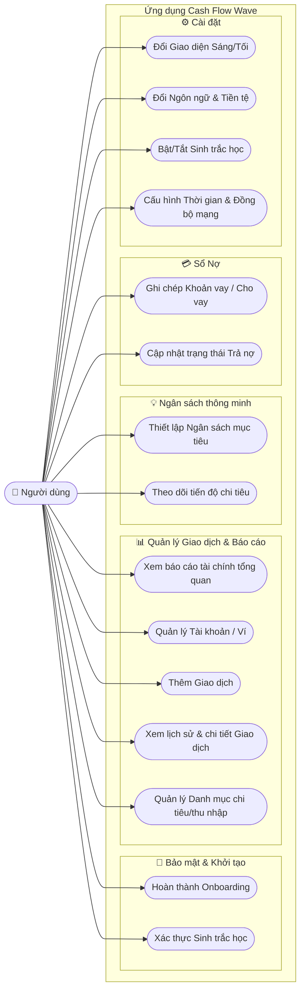

---

### 1.2. Biểu Đồ Các Thành Phần Chức Năng

Sơ đồ dưới đây mô tả toàn bộ các thành phần (Screens, Components, Controllers, Patterns) và mối quan hệ giữa chúng trong kiến trúc MVC của ứng dụng.

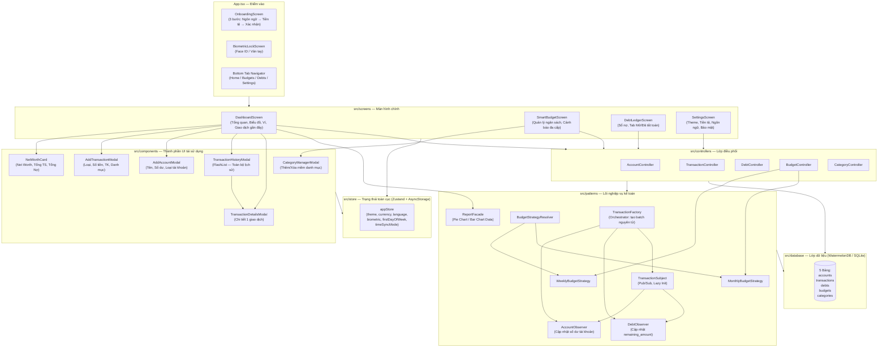

---

## 2. ĐẶC TẢ CHỨC NĂNG

### 2.1. Đặc Tả Use Case

---

#### UC01 — Hoàn thành Onboarding

| Mục | Nội dung |
|---|---|
| **Tác nhân** | Người dùng (lần đầu khởi động) |
| **Điều kiện kích hoạt** | `hasCompletedOnboarding == false` trong Zustand store |
| **Luồng chính** | 1. Ứng dụng hiển thị màn hình Onboarding gồm 3 slide. 2. Slide 1: Người dùng chọn Ngôn ngữ (EN/VI) và Giao diện (Sáng/Tối/Hệ thống). 3. Slide 2: Người dùng nhập Ký hiệu tiền tệ và chọn Vị trí (Tiền tố/Hậu tố). 4. Slide 3: Hệ thống hiển thị bản xác nhận cài đặt. 5. Người dùng nhấn "Get Started" → `setHasCompletedOnboarding(true)` → Chuyển sang màn hình chính. |
| **Luồng thay thế** | Người dùng nhấn "Back" để quay lại slide trước. |
| **Hậu điều kiện** | Ứng dụng lưu cài đặt ban đầu vào AsyncStorage và điều hướng sang Bottom Tab Navigator. |

**Sơ đồ luồng UC01:**

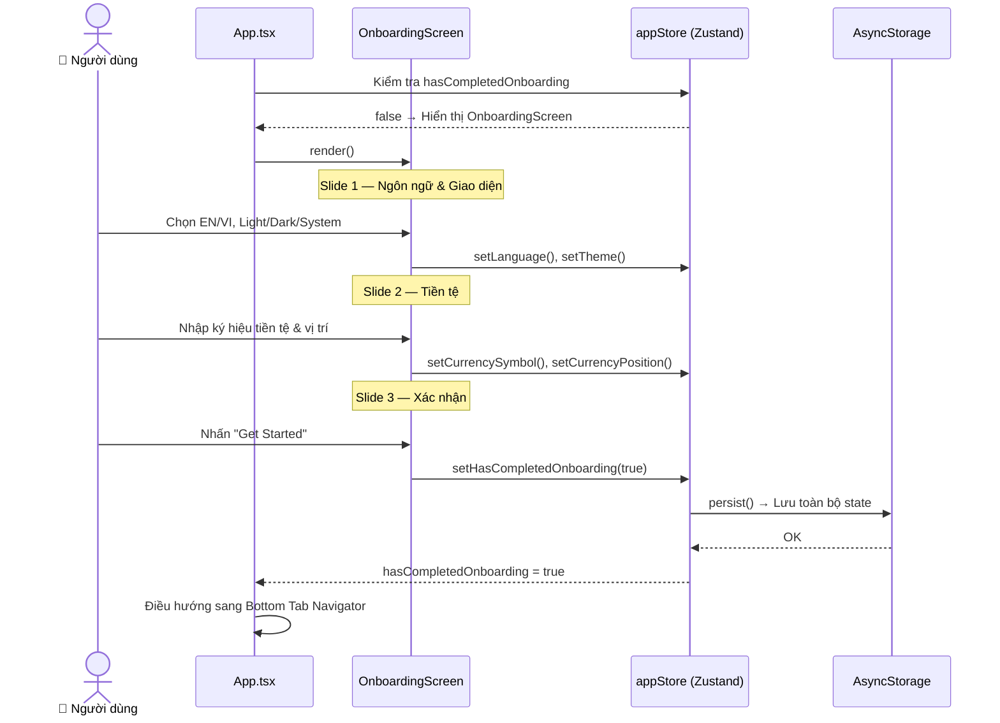

---

#### UC02 — Xác thực Sinh trắc học

| Mục | Nội dung |
|---|---|
| **Tác nhân** | Người dùng |
| **Điều kiện kích hoạt** | `isBiometricEnabled == true` và ứng dụng vừa được mở (chưa `isUnlocked`) |
| **Luồng chính** | 1. Màn hình `BiometricLockScreen` hiển thị với nút "Unlock". 2. Người dùng nhấn "Unlock" → Hệ thống gọi `expo-local-authentication`. 3. Thiết bị yêu cầu xác thực Face ID / Vân tay / Passcode. 4. Xác thực thành công → `setIsUnlocked(true)` → Hiển thị màn hình chính. |
| **Luồng ngoại lệ** | Xác thực thất bại → Hiển thị thông báo lỗi, màn hình khóa vẫn hiển thị. |
| **Hậu điều kiện** | Người dùng có quyền truy cập toàn bộ chức năng ứng dụng. |

**Sơ đồ luồng UC02:**

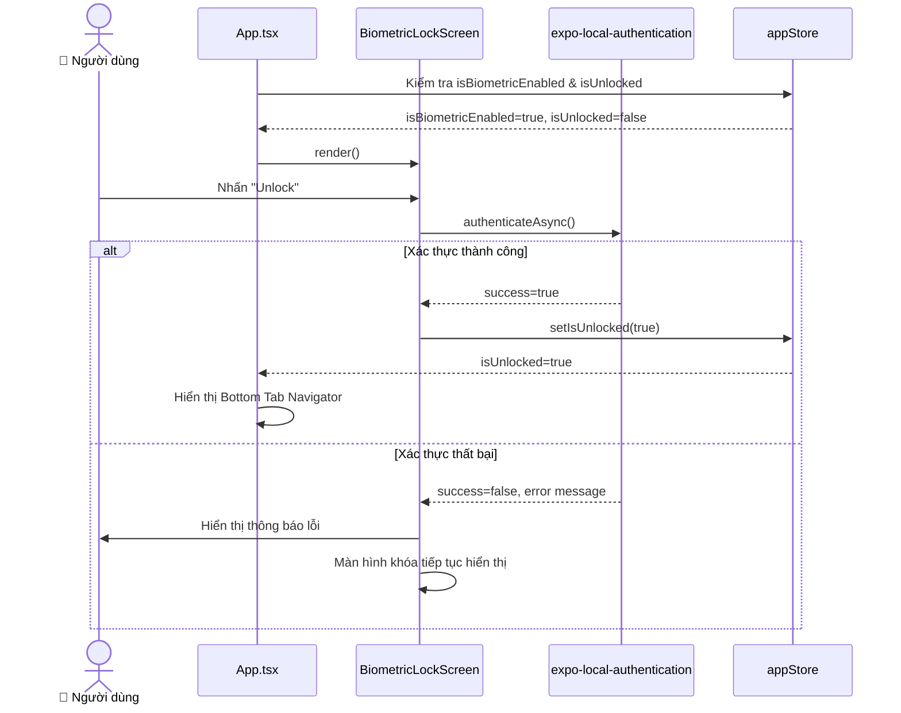

---

#### UC03 — Xem Báo Cáo Tài Chính Tổng Quan (Dashboard)

| Mục | Nội dung |
|---|---|
| **Tác nhân** | Người dùng |
| **Điều kiện kích hoạt** | Mở tab "Home" hoặc pull-to-refresh |
| **Luồng chính** | 1. `DashboardScreen` gọi `AccountController.getActiveAccounts()` và `TransactionController.getTransactions()`. 2. Hiển thị `NetWorthCard` với `netWorth = Σ(Assets) - Σ(Liabilities)`. 3. Gọi `ReportFacade.getDailyExpenseTrend(7)` để lấy dữ liệu Bar Chart 7 ngày gần nhất. 4. Gọi `ReportFacade.getExpensesByCategory(startOfMonth, endOfMonth)` để lấy dữ liệu Pie Chart tháng hiện tại. 5. Hiển thị danh sách 5 giao dịch gần nhất. |
| **Hậu điều kiện** | Người dùng thấy tổng tài sản ròng và xu hướng chi tiêu được cập nhật thực thời. |

**Sơ đồ luồng UC03:**

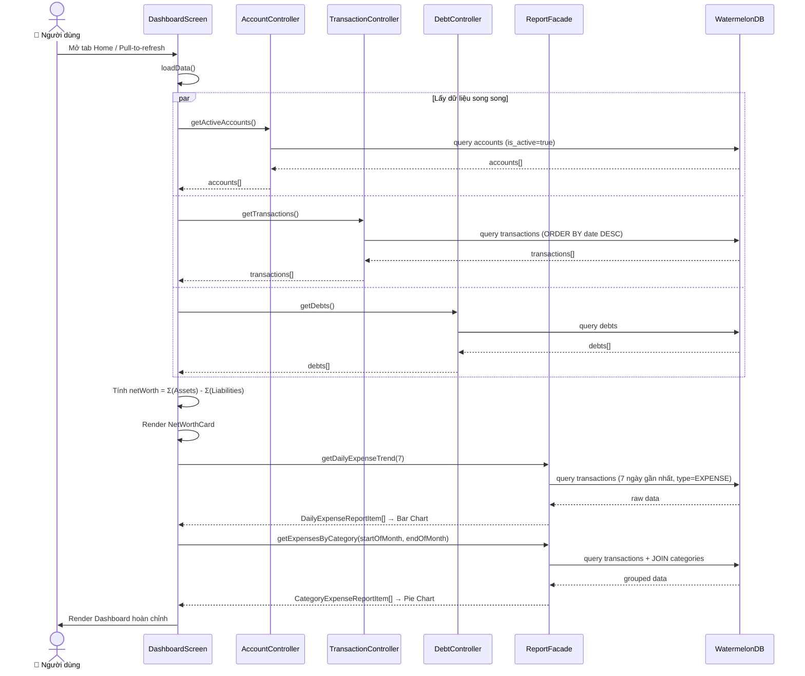

---

#### UC04 — Quản Lý Tài Khoản / Ví

| Mục | Nội dung |
|---|---|
| **Tác nhân** | Người dùng |
| **Điều kiện kích hoạt** | Nhấn nút "+" trên phần "My Wallets" hoặc "Add Account" trong Action Center |
| **Luồng chính** | 1. Mở `AddAccountModal`. 2. Người dùng chọn loại tài khoản: **Asset** (Tài sản: Ví tiền mặt, Ngân hàng) hoặc **Liability** (Nợ phải trả: Thẻ tín dụng). 3. Nhập tên tài khoản và số dư ban đầu. 4. Nhấn "Save" → Controller xác thực → `AccountController.createAccount()`. 5. Nếu số dư ban đầu > 0, hệ thống tự động tạo giao dịch điều chỉnh (adjustment transaction) để duy trì tính toàn vẹn kế toán. |
| **Validation** | Tên không được rỗng; Số dư phải là số hợp lệ (≥ 0). |
| **Luồng ngoại lệ** | Tên rỗng → Alert "Account name is required". Số dư không hợp lệ → Alert "Invalid balance amount". |
| **Quy tắc xóa** | Tài khoản **không được xóa cứng**. Hệ thống chỉ thực hiện **Soft Delete** (`is_active = false`) để bảo toàn lịch sử giao dịch. |

**Sơ đồ luồng UC04:**

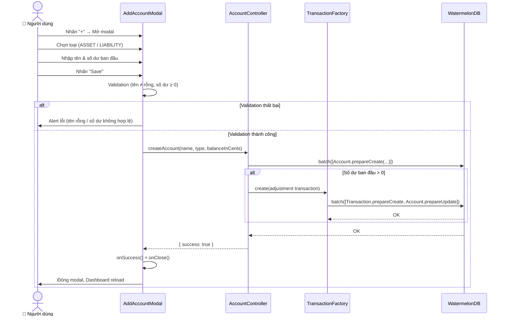

---

#### UC05 — Thêm Giao Dịch Mới

| Mục | Nội dung |
|---|---|
| **Tác nhân** | Người dùng |
| **Điều kiện kích hoạt** | Nhấn nút "Add Transaction" trên Dashboard (chỉ hiện khi đã có ít nhất 1 tài khoản) |
| **Luồng chính** | 1. Mở `AddTransactionModal`. 2. Người dùng chọn loại giao dịch: **EXPENSE** (Chi tiêu) / **INCOME** (Thu nhập) / **TRANSFER** (Chuyển khoản). 3. Nhập số tiền, ghi chú (tùy chọn), chọn tài khoản nguồn và danh mục. 4. Với loại TRANSFER, người dùng chọn thêm tài khoản đích. 5. Nhấn "Save" → `TransactionController.createTransaction()` → `TransactionFactory.create()` → Thực thi `database.batch()` nguyên tử gồm: ghi Transaction + cập nhật Account balance qua `AccountObserver`. |
| **Validation** | Số tiền > 0; Phải chọn tài khoản nguồn; Phải chọn danh mục (trừ loại TRANSFER). |
| **Hậu điều kiện** | Số dư tài khoản liên quan được cập nhật tức thì; Net Worth thay đổi tương ứng; Dashboard tự reload. |

**Sơ đồ luồng UC05:**

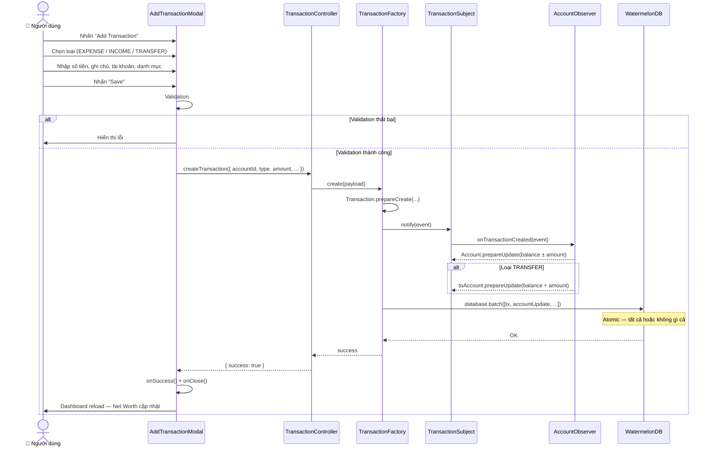

---

#### UC06 — Xem Lịch Sử & Chi Tiết Giao Dịch

| Mục | Nội dung |
|---|---|
| **Tác nhân** | Người dùng |
| **Điều kiện kích hoạt** | Nhấn "See All" trên Dashboard hoặc nhấn vào một giao dịch trong danh sách gần đây |
| **Luồng chính (Lịch sử)** | 1. Mở `TransactionHistoryModal` (pageSheet style). 2. Gọi `TransactionController.getTransactions()`. 3. Render danh sách hiệu suất cao qua `@shopify/flash-list`. 4. Nhấn vào một mục → Mở `TransactionDetailsModal` (lồng bên trong, tránh xung đột iOS multi-modal). |
| **Luồng chính (Chi tiết)** | 1. `TransactionDetailsModal` nhận prop `transaction`. 2. Truy vấn WatermelonDB để lấy thông tin `Account` và `Category` liên kết. 3. Hiển thị banner màu (Đỏ = Chi tiêu, Xanh = Thu nhập) cùng đầy đủ thông tin: Số tiền, Ghi chú, Ngày, Tài khoản, Danh mục. |

**Sơ đồ luồng UC06:**

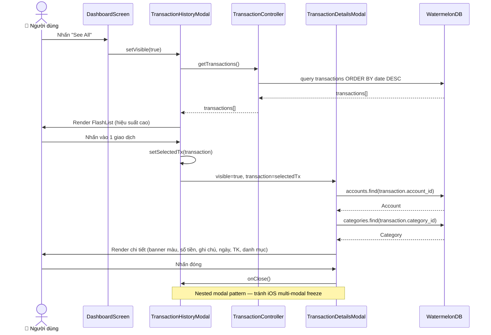

---

#### UC07 — Quản Lý Danh Mục (Categories)

| Mục | Nội dung |
|---|---|
| **Tác nhân** | Người dùng |
| **Điều kiện kích hoạt** | Nhấn icon Tag trên SmartBudgetScreen |
| **Luồng chính — Thêm** | 1. Mở `CategoryManagerModal`. 2. Nhập tên, chọn loại (EXPENSE/INCOME), chọn màu. 3. Nhấn "Add Category" → `CategoryController.createCategory()`. |
| **Luồng chính — Xóa** | 1. Nhấn icon Thùng rác → Alert xác nhận. 2. Xác nhận → `CategoryController.deleteCategory()` → Soft Delete (`is_active = false`). |
| **Quy tắc bất biến** | Danh mục đã gắn với giao dịch chỉ được xóa mềm, không bao giờ xóa cứng. |

**Sơ đồ luồng UC07:**


---

#### UC08 — Thiết Lập Ngân Sách Mục Tiêu

| Mục | Nội dung |
|---|---|
| **Tác nhân** | Người dùng |
| **Điều kiện kích hoạt** | Nhấn "Add Budget" trên SmartBudgetScreen |
| **Luồng chính** | 1. Mở modal tạo ngân sách. 2. Nhập: Tên, Số tiền giới hạn, Chu kỳ (WEEKLY/MONTHLY), Ngày neo (anchor day), Danh mục liên kết (tùy chọn). 3. `BudgetController.createBudget()` → `BudgetStrategyResolver` chọn đúng chiến lược (Weekly/Monthly). 4. Chiến lược tính `startDate` và `endDate` của chu kỳ hiện tại và lưu vào DB. |
| **Xử lý edge case** | Ngày neo 31 ở tháng 2 → Tự động clamp về ngày cuối tháng (28 hoặc 29 cho năm nhuận). |
| **Hậu điều kiện** | Ngân sách mới xuất hiện trên SmartBudgetScreen với tiến độ ban đầu là 0%. |

**Sơ đồ luồng UC08:**

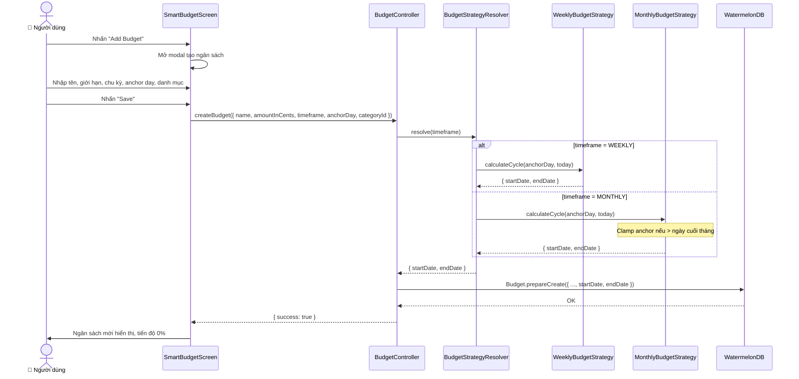

---

#### UC09 — Theo Dõi Tiến Độ Chi Tiêu

| Mục | Nội dung |
|---|---|
| **Tác nhân** | Hệ thống (tự động khi người dùng mở tab Budgets) |
| **Luồng chính** | 1. `BudgetController.getBudgetsProgress()` được gọi. 2. Với từng ngân sách, hệ thống tính tổng giao dịch EXPENSE trong chu kỳ hiện tại (lọc theo `category_id` nếu có). 3. Tính `progressPercent = (spentAmount / limitAmount) * 100`. |
| **Hiển thị cảnh báo** | `< 80%` → Thanh xanh + trạng thái "Within Budget". `80–99%` → Thanh vàng + icon ⚠️ "Approaching Limit". `≥ 100%` → Thanh đỏ + icon ⚠️ "Budget Exceeded". |

**Sơ đồ luồng UC09:**


---

#### UC10 — Ghi Chép Khoản Vay / Cho Vay

| Mục | Nội dung |
|---|---|
| **Tác nhân** | Người dùng |
| **Điều kiện kích hoạt** | Nhấn "Add" trên DebtLedgerScreen |
| **Luồng chính** | 1. Mở modal tạo nợ. 2. Nhập: Tên người, Số tiền, Loại (LENT/BORROWED), Ngày đến hạn (tính bằng số ngày từ hôm nay), Ví liên kết. 3. Tùy chọn "Deduct/Add from wallet" — nếu bật: hệ thống tự động tạo giao dịch để trừ/cộng ví tương ứng. 4. `DebtController.createDebt()` → Lưu khoản nợ với `status = OPEN`, `remaining_amount = total_amount`. |
| **Hậu điều kiện** | Khoản nợ xuất hiện trên tab "Active"; Số dư ví được cập nhật nếu đã chọn liên kết. |

**Sơ đồ luồng UC10:**

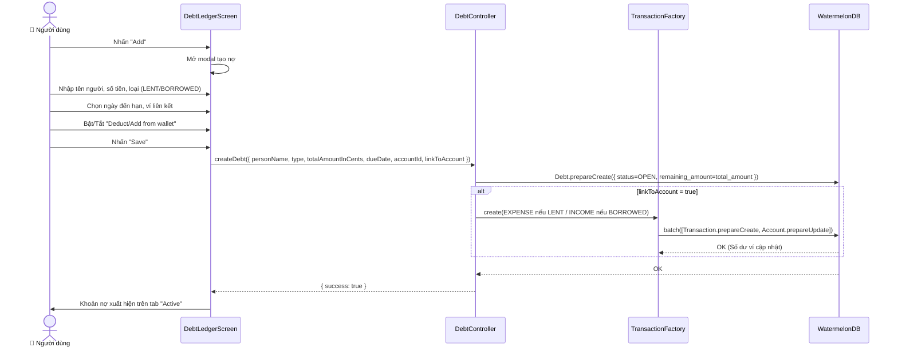

---

#### UC11 — Cập Nhật Trạng Thái Trả Nợ

| Mục | Nội dung |
|---|---|
| **Tác nhân** | Người dùng |
| **Điều kiện kích hoạt** | Nhấn "Record Payment" trên một thẻ nợ đang mở |
| **Luồng chính** | 1. Mở modal ghi thanh toán với số tiền mặc định là toàn bộ số còn lại. 2. Người dùng điều chỉnh số tiền thanh toán và chọn ví. 3. `DebtController.recordRepayment()` → Tạo giao dịch tương ứng + cập nhật `remaining_amount`. 4. Nếu `remaining_amount == 0` → Tự động chuyển `status = SETTLED`. |
| **Hậu điều kiện** | Khoản nợ tất toán tự động chuyển sang tab "Settled". Số dư ví được cập nhật. |

**Sơ đồ luồng UC11:**

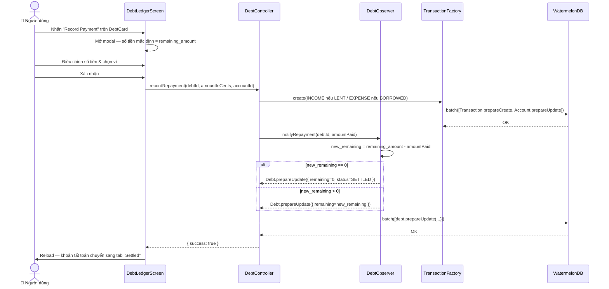

---

#### UC12 — Cài Đặt Ứng Dụng

| Mục | Nội dung |
|---|---|
| **Tác nhân** | Người dùng |
| **Điều kiện kích hoạt** | Mở tab "Settings" |
| **Chức năng con** | **Giao diện:** Chọn Light / Dark / System. **Tiền tệ:** Tùy chỉnh ký hiệu (tối đa 6 ký tự) và vị trí (tiền tố/hậu tố). **Ngôn ngữ:** EN / VI. **Thời gian:** Chọn ngày đầu tuần (CN/T2); Bật/Tắt đồng bộ giờ mạng (WorldTimeAPI). **Bảo mật:** Bật/Tắt khóa sinh trắc học (yêu cầu xác thực trước khi bật). **Danger Zone:** Xóa toàn bộ dữ liệu (Reset Database) với 2 bước xác nhận. |
| **Hậu điều kiện** | Tất cả thay đổi được lưu vào AsyncStorage qua Zustand persist và áp dụng ngay lập tức. |

**Sơ đồ luồng UC12:**


---

### 2.2. Đặc Tả Module Sử Dụng

Phần này mô tả chi tiết từng module trong ứng dụng theo các tầng kiến trúc: **Màn hình (Screens)**, **Thành phần UI (Components)**, **Điều phối (Controllers)**, **Nghiệp vụ (Patterns)**, **Dịch vụ (Services)**, **Trạng thái (Store)**, **Tiện ích (Utils)** và **Dữ liệu (Database)**.

---

#### 2.2.1. Tầng Màn Hình — `src/screens/`

##### Module: `DashboardScreen`

| Thuộc tính | Nội dung |
|---|---|
| **File** | [`DashboardScreen.tsx`](src/screens/DashboardScreen.tsx) |
| **Loại** | Smart Screen (View chính) |
| **Vai trò** | Màn hình tổng quan tài chính — trung tâm thông tin chính của ứng dụng. Tổng hợp và hiển thị Net Worth, danh sách ví, giao dịch gần đây, và biểu đồ phân tích. |
| **Props / Params** | Không có props (Screen độc lập trong Bottom Tab) |
| **State nội bộ** | `accounts[]`, `transactions[]`, `dailyTrend[]`, `categoryExpenses[]`, `chartTab`, `refreshing`, `selectedTx`, modal visibility flags |
| **Phụ thuộc** | `AccountController`, `TransactionController`, `DebtController`, `ReportFacade`, `TimeService`, `NetWorthCard`, `AddAccountModal`, `AddTransactionModal`, `TransactionHistoryModal`, `TransactionDetailsModal` |
| **Đầu ra / Tác dụng** | Render toàn bộ giao diện Dashboard; Trigger loadData() khi mount và khi pull-to-refresh |
| **Ghi chú** | Gọi `seedDefaultCategories()` tự động khi khởi tạo lần đầu; Lời chào thay đổi mỗi 60 giây theo giờ hệ thống |

---

##### Module: `SmartBudgetScreen`

| Thuộc tính | Nội dung |
|---|---|
| **File** | [`SmartBudgetScreen.tsx`](src/screens/SmartBudgetScreen.tsx) |
| **Loại** | Smart Screen |
| **Vai trò** | Màn hình quản lý ngân sách theo chu kỳ. Cho phép tạo, xem tiến độ và xóa ngân sách. Tích hợp quản lý danh mục. |
| **Props / Params** | Không có props |
| **State nội bộ** | `budgets[]`, `categories[]`, `isModalOpen`, `timeframe`, `anchorDayStr`, `selectedCategoryId`, `isCategoryManagerVisible`, `nameRef (useRef)` |
| **Phụ thuộc** | `BudgetController`, `CategoryManagerModal`, `database` (trực tiếp để query categories) |
| **Đầu ra / Tác dụng** | Render danh sách BudgetCard với thanh tiến độ màu động; Hiển thị modal tạo ngân sách |

---

##### Module: `DebtLedgerScreen`

| Thuộc tính | Nội dung |
|---|---|
| **File** | [`DebtLedgerScreen.tsx`](src/screens/DebtLedgerScreen.tsx) |
| **Loại** | Smart Screen |
| **Vai trò** | Màn hình sổ nợ — quản lý toàn bộ vòng đời khoản nợ ngang hàng (tạo → theo dõi → tất toán). |
| **Props / Params** | Không có props |
| **State nội bộ** | `debts[]`, `accounts[]`, `activeSegment ('OPEN'|'SETTLED')`, modal visibility flags, repayment state |
| **Phụ thuộc** | `DebtController`, `AccountController` |
| **Đầu ra / Tác dụng** | Render DebtCard theo tab Active/Settled; Phát hiện và tô màu đỏ các khoản quá hạn |

---

##### Module: `SettingsScreen`

| Thuộc tính | Nội dung |
|---|---|
| **File** | [`SettingsScreen.tsx`](src/screens/SettingsScreen.tsx) |
| **Loại** | Smart Screen |
| **Vai trò** | Màn hình cấu hình toàn bộ tùy chọn ứng dụng: giao diện, tiền tệ, ngôn ngữ, thời gian, bảo mật và reset DB. |
| **Props / Params** | Không có props |
| **Phụ thuộc** | `useAppStore` (Zustand), `TimeService`, `expo-local-authentication`, `database` |
| **Đầu ra / Tác dụng** | Tất cả thay đổi lưu vào Zustand persist (AsyncStorage) và áp dụng ngay lập tức |

---

##### Module: `OnboardingScreen`

| Thuộc tính | Nội dung |
|---|---|
| **File** | [`OnboardingScreen.tsx`](src/screens/OnboardingScreen.tsx) |
| **Loại** | Full-screen Flow (3 slides) |
| **Vai trò** | Màn hình thiết lập ban đầu — chỉ hiển thị một lần khi `hasCompletedOnboarding == false`. |
| **Props / Params** | Không có props |
| **State nội bộ** | `currentSlide (0|1|2)`, `customSymbol` |
| **Phụ thuộc** | `useAppStore` |
| **Đầu ra / Tác dụng** | Gọi `setHasCompletedOnboarding(true)` khi hoàn tất → App tự chuyển sang Bottom Tab |

---

##### Module: `BiometricLockScreen`

| Thuộc tính | Nội dung |
|---|---|
| **File** | [`BiometricLockScreen.tsx`](src/screens/BiometricLockScreen.tsx) |
| **Loại** | Security Gate Screen |
| **Vai trò** | Màn hình khóa sinh trắc học — gate keeper bảo vệ toàn bộ dữ liệu tài chính. |
| **Props** | `onUnlock: () => void` |
| **Phụ thuộc** | `expo-local-authentication` |
| **Đầu ra / Tác dụng** | Gọi `onUnlock()` sau khi xác thực thành công (Face ID / Touch ID / Passcode) |

---

#### 2.2.2. Tầng Thành Phần UI — `src/components/`

##### Module: `NetWorthCard`

| Thuộc tính | Nội dung |
|---|---|
| **File** | [`NetWorthCard.tsx`](src/components/NetWorthCard.tsx) |
| **Loại** | Presentational Component (Pure UI) |
| **Vai trò** | Thẻ tổng hợp tài sản ròng — trái tim hiển thị của Dashboard. Tính và hiển thị `netWorth = totalAssets - totalLiabilities`. |
| **Props** | `totalAssets: number (cents)`, `totalLiabilities: number (cents)` |
| **Phụ thuộc** | `formatCurrency`, `useAppStore`, `useThemeColors` |
| **Đầu ra** | Render card với SVG Gradient background, hiển thị Net Worth, Tổng Tài sản, Tổng Nợ phải trả |
| **Ghi chú** | Component thuần túy — không có side effect, không gọi DB hay Controller |

---

##### Module: `AddTransactionModal`

| Thuộc tính | Nội dung |
|---|---|
| **File** | [`AddTransactionModal.tsx`](src/components/AddTransactionModal.tsx) |
| **Loại** | Modal Component (Bottom Sheet style) |
| **Vai trò** | Giao diện nhập liệu giao dịch nhanh. Hỗ trợ 3 loại: EXPENSE, INCOME, TRANSFER. |
| **Props** | `visible: boolean`, `onClose: () => void`, `onSuccess: () => void` |
| **State nội bộ** | `type (TransactionType)`, `amount (string)`, `descRef (useRef)`, `selectedAccountId`, `selectedCategoryId`, `accounts[]`, `categories[]`, `loading`, `error` |
| **Phụ thuộc** | `TransactionController`, `database` (truy vấn accounts & categories), `toCents`, `useAppStore` |
| **Validation** | Số tiền > 0 và là số hợp lệ; Phải chọn tài khoản; Phải chọn danh mục (trừ TRANSFER) |
| **Đầu ra / Tác dụng** | Gọi `TransactionController.createTransaction()` → Gọi `onSuccess()` + `onClose()` khi thành công |
| **Ghi chú** | `descRef` là `useRef` (không phải `useState`) để tránh lỗi Telex IME trên iOS |

---

##### Module: `AddAccountModal`

| Thuộc tính | Nội dung |
|---|---|
| **File** | [`AddAccountModal.tsx`](src/components/AddAccountModal.tsx) |
| **Loại** | Modal Component |
| **Vai trò** | Giao diện tạo tài khoản tài chính mới (Ví/Ngân hàng = ASSET; Thẻ tín dụng = LIABILITY). |
| **Props** | `visible: boolean`, `onClose: () => void`, `onSuccess: () => void` |
| **State nội bộ** | `nameRef (useRef)`, `balanceStr (string)`, `accountType (AccountType)` |
| **Phụ thuộc** | `AccountController` |
| **Validation** | Tên không được rỗng; Số dư phải là số hợp lệ ≥ 0; Input tự động lọc ký tự phi số |
| **Đầu ra / Tác dụng** | Gọi `AccountController.createAccount(name, type, balanceInCents)` |

---

##### Module: `TransactionHistoryModal`

| Thuộc tính | Nội dung |
|---|---|
| **File** | [`TransactionHistoryModal.tsx`](src/components/TransactionHistoryModal.tsx) |
| **Loại** | Modal Component (pageSheet style) |
| **Vai trò** | Danh sách toàn bộ lịch sử giao dịch hiệu suất cao, sử dụng `FlashList` để xử lý số lượng lớn records. |
| **Props** | `visible: boolean`, `onClose: () => void` |
| **State nội bộ** | `transactions[]`, `selectedTx (Transaction | null)` |
| **Phụ thuộc** | `TransactionController`, `@shopify/flash-list`, `TransactionDetailsModal` (lồng bên trong) |
| **Đầu ra** | Render danh sách giao dịch có thể nhấn; Nhấn một mục → hiển thị `TransactionDetailsModal` lồng bên trong |
| **Ghi chú** | `TransactionDetailsModal` được render **trong** component này để tránh lỗi iOS multi-modal stack (silent freeze) |

---

##### Module: `TransactionDetailsModal`

| Thuộc tính | Nội dung |
|---|---|
| **File** | [`TransactionDetailsModal.tsx`](src/components/TransactionDetailsModal.tsx) |
| **Loại** | Modal Component (transparent overlay, slide animation) |
| **Vai trò** | Hiển thị đầy đủ chi tiết một giao dịch: số tiền, ghi chú, ngày, tài khoản liên kết, danh mục liên kết. |
| **Props** | `visible: boolean`, `transaction: Transaction | null`, `onClose: () => void` |
| **State nội bộ** | `account (Account | null)`, `category (Category | null)` |
| **Phụ thuộc** | `database.get('accounts').find()`, `database.get('categories').find()`, `formatCurrency` |
| **Đầu ra** | Render modal với banner màu (Đỏ = EXPENSE, Xanh = INCOME), thông tin chi tiết đầy đủ |
| **Ghi chú** | Return `null` nếu `visible == false` hoặc `transaction == null` để tránh render thừa |

---

##### Module: `CategoryManagerModal`

| Thuộc tính | Nội dung |
|---|---|
| **File** | [`CategoryManagerModal.tsx`](src/components/CategoryManagerModal.tsx) |
| **Loại** | Modal Component |
| **Vai trò** | Giao diện CRUD danh mục chi tiêu/thu nhập — thêm mới và xóa mềm (soft delete). |
| **Props** | `visible: boolean`, `onClose: () => void` |
| **State nội bộ** | `categories[]`, `nameRef (useRef)`, `selectedType (CategoryType)`, `selectedColor (string)` |
| **Phụ thuộc** | `CategoryController` |
| **Đầu ra / Tác dụng** | Gọi `CategoryController.createCategory()` hoặc `deleteCategory()` → Reload danh sách |
| **Ghi chú** | Xóa danh mục là soft delete (`is_active = false`); Màu danh mục được chọn từ bảng màu định sẵn |

---

#### 2.2.3. Tầng Điều Phối — `src/controllers/`

##### Module: `AccountController`

| Thuộc tính | Nội dung |
|---|---|
| **File** | [`AccountController.ts`](src/controllers/AccountController.ts) |
| **Vai trò** | Trung gian giữa UI và database cho thực thể Account. Xác thực input và điều phối ghi dữ liệu. |
| **Phương thức chính** | `createAccount(name, type, balanceInCents)` — Tạo tài khoản mới; Tự động tạo giao dịch điều chỉnh nếu balance > 0 |
| | `getActiveAccounts()` — Trả về danh sách tài khoản đang hoạt động (`is_active = true`) |
| | `softDeleteAccount(id)` — Đặt `is_active = false`, không xóa cứng |
| **Kiểu trả về** | `{ success: boolean, data?: T, error?: string }` |

---

##### Module: `TransactionController`

| Thuộc tính | Nội dung |
|---|---|
| **File** | [`TransactionController.ts`](src/controllers/TransactionController.ts) |
| **Vai trò** | Điều phối toàn bộ vòng đời giao dịch. Xác thực input, sau đó ủy quyền cho `TransactionFactory` thực thi. |
| **Phương thức chính** | `createTransaction({ accountId, type, amount, description, date, categoryId?, toAccountId? })` — Gọi `TransactionFactory.create()` |
| | `getTransactions()` — Truy vấn tất cả giao dịch, sắp xếp theo ngày giảm dần |
| | `deleteTransaction(id)` — Xóa giao dịch (hard delete, vì transaction là dữ liệu giao dịch, không phải master data) |
| **Ghi chú** | UI **không bao giờ** gọi `TransactionFactory` trực tiếp; phải qua Controller này |

---

##### Module: `DebtController`

| Thuộc tính | Nội dung |
|---|---|
| **File** | [`DebtController.ts`](src/controllers/DebtController.ts) |
| **Vai trò** | Quản lý vòng đời khoản nợ: tạo mới, ghi thanh toán và tự động tất toán. |
| **Phương thức chính** | `createDebt({ personName, type, totalAmountInCents, dueDate, accountId, linkToAccount })` — Tạo khoản nợ; Nếu `linkToAccount=true` → tạo giao dịch EXPENSE/INCOME tương ứng |
| | `recordRepayment(debtId, amountInCents, accountId)` — Ghi thanh toán qua `DebtObserver`; Nếu `remaining == 0` → set `status = SETTLED` |
| | `getDebts()` — Trả về tất cả khoản nợ |

---

##### Module: `BudgetController`

| Thuộc tính | Nội dung |
|---|---|
| **File** | [`BudgetController.ts`](src/controllers/BudgetController.ts) |
| **Vai trò** | Tạo ngân sách và tính toán tiến độ chi tiêu trong chu kỳ hiện tại. |
| **Phương thức chính** | `createBudget({ name, amountInCents, timeframe, anchorDay, categoryId? })` — Dùng `BudgetStrategyResolver` để tính `startDate`/`endDate` |
| | `getBudgetsProgress()` — Trả về `BudgetProgress[]` gồm `spentAmount`, `remainingAmount`, `progressPercent` |
| | `deleteBudget(id)` — Xóa cứng ngân sách (không phải master data) |
| **Ghi chú** | Lọc giao dịch theo `category_id` nếu ngân sách được gắn với danh mục cụ thể |

---

##### Module: `CategoryController`

| Thuộc tính | Nội dung |
|---|---|
| **File** | [`CategoryController.ts`](src/controllers/CategoryController.ts) |
| **Vai trò** | Quản lý CRUD danh mục chi tiêu/thu nhập với chính sách soft delete. |
| **Phương thức chính** | `createCategory(name, type, color, icon)` — Tạo danh mục mới với `is_active = true` |
| | `getActiveCategories()` — Lấy danh sách danh mục đang hoạt động |
| | `deleteCategory(id)` — Soft delete: đặt `is_active = false` |

---

#### 2.2.4. Tầng Nghiệp Vụ — `src/patterns/`

##### Module: `TransactionFactory` *(Factory Pattern)*

| Thuộc tính | Nội dung |
|---|---|
| **File** | [`TransactionFactory.ts`](src/patterns/TransactionFactory.ts) |
| **Vai trò** | Orchestrator (Nhạc trưởng) — tạo giao dịch và tổng hợp toàn bộ cập nhật liên kết thành một `database.batch()` nguyên tử duy nhất. |
| **Cách hoạt động** | 1. Chuẩn hóa dữ liệu đầu vào (validate amount > 0, type hợp lệ). 2. Tạo record Transaction (`prepareCreate`). 3. Thông báo cho `TransactionSubject` → Các Observer trả về `prepareUpdate[]`. 4. Gom tất cả vào `database.batch([...prepared])`. |
| **Phụ thuộc** | `TransactionSubject`, `AccountObserver`, `DebtObserver` |
| **Ghi chú** | Giải quyết lỗi WatermelonDB "ActionQueue locking" bằng cách thực thi trong một lệnh batch nguyên tử duy nhất |

---

##### Module: `TransactionSubject` + `AccountObserver` + `DebtObserver` *(Observer Pattern)*

| Module | Vai trò |
|---|---|
| **TransactionSubject** | Publisher — Quản lý danh sách observer, phát sự kiện khi có giao dịch mới. Sử dụng **Lazy Initialization** (`getObservers()`) để sống sót qua Expo Fast Refresh. |
| **AccountObserver** | Subscriber — Lắng nghe sự kiện giao dịch, tính toán lại số dư tài khoản (`+amount` cho INCOME, `-amount` cho EXPENSE), trả về `Account.prepareUpdate()`. |
| **DebtObserver** | Subscriber — Lắng nghe sự kiện thanh toán nợ, tính toán `remaining_amount` mới, set `status = SETTLED` nếu về 0, trả về `Debt.prepareUpdate()`. |

---

##### Module: `WeeklyBudgetStrategy` + `MonthlyBudgetStrategy` + `BudgetStrategyResolver` *(Strategy Pattern)*

| Module | Vai trò |
|---|---|
| **BudgetTimeframeStrategy** | Interface định nghĩa phương thức `calculateCycle(anchorDay, refDate): { startDate, endDate }` |
| **WeeklyBudgetStrategy** | Tính chu kỳ 7 ngày bắt đầu từ `anchorDay` (0=CN, 1=T2...6=T7) chứa `refDate` |
| **MonthlyBudgetStrategy** | Tính chu kỳ tháng từ `anchorDay` của tháng này/trước đến `anchorDay-1` của tháng sau. Tự động **clamp** anchor về ngày cuối tháng cho tháng ngắn |
| **BudgetStrategyResolver** | Factory nhỏ — chọn đúng Strategy dựa trên `BudgetTimeframe` enum rồi gọi `calculate()` |

---

##### Module: `ReportFacade` *(Facade Pattern)*

| Thuộc tính | Nội dung |
|---|---|
| **File** | [`ReportFacade.ts`](src/patterns/ReportFacade.ts) |
| **Vai trò** | Facade đơn giản hóa việc truy vấn phức tạp để vẽ biểu đồ — ẩn hoàn toàn logic SQL và vòng lặp xử lý khỏi DashboardScreen. |
| **Phương thức chính** | `getExpensesByCategory(startTs, endTs): CategoryExpenseReportItem[]` — Nhóm chi tiêu theo danh mục trong khoảng thời gian → Dữ liệu Pie Chart |
| | `getDailyExpenseTrend(days): DailyExpenseReportItem[]` — Tổng chi tiêu theo ngày trong N ngày gần nhất → Dữ liệu Bar Chart |
| **Phụ thuộc** | `database` (truy vấn transactions + categories) |

---

#### 2.2.5. Tầng Dịch Vụ — `src/services/`

##### Module: `TimeService`

| Thuộc tính | Nội dung |
|---|---|
| **File** | [`TimeService.ts`](src/services/TimeService.ts) |
| **Vai trò** | Cung cấp giờ đáng tin cậy cho toàn bộ hệ thống — có thể dùng giờ thiết bị hoặc đồng bộ từ WorldTimeAPI. |
| **Phương thức chính** | `init()` — Khởi tạo, đọc `timeSyncMode` từ AsyncStorage, nếu `'network'` thì fetch giờ từ WorldTimeAPI |
| | `getNow(): Date` — Trả về thời điểm hiện tại (đã bù offset nếu đang dùng network time) |
| **Phụ thuộc** | `AsyncStorage` (đọc `timeSyncMode`), WorldTimeAPI (HTTP fetch) |
| **Ghi chú** | Được dùng bởi: DashboardScreen (lời chào), WeeklyBudgetStrategy, MonthlyBudgetStrategy, ReportFacade |

---

#### 2.2.6. Tầng Trạng Thái Toàn Cục — `src/store/`

##### Module: `appStore` (Zustand)

| Thuộc tính | Nội dung |
|---|---|
| **File** | [`appStore.ts`](src/store/appStore.ts) |
| **Vai trò** | Quản lý toàn bộ cài đặt ứng dụng theo cơ chế Zustand + AsyncStorage persist. |
| **State fields** | `theme: 'light'|'dark'|'system'`, `currencySymbol: string`, `currencyPosition: 'prefix'|'suffix'`, `language: 'en'|'vi'`, `hasCompletedOnboarding: boolean`, `isBiometricEnabled: boolean`, `firstDayOfWeek: 0|1`, `timeSyncMode: 'device'|'network'`, `networkTimezone: string` |
| **Actions** | `setTheme`, `setCurrencySymbol`, `setCurrencyPosition`, `setLanguage`, `setHasCompletedOnboarding`, `setIsBiometricEnabled`, `setFirstDayOfWeek`, `setTimeSyncMode` |
| **Lưu trữ** | Tất cả state được persist vào **AsyncStorage** qua Zustand middleware; khôi phục tự động khi khởi động lại ứng dụng |
| **Ghi chú** | Chỉ dành cho metadata ứng dụng. **Không** lưu dữ liệu tài chính tại đây |

---

#### 2.2.7. Tầng Tiện Ích — `src/utils/`

| Module | File | Vai trò |
|---|---|---|
| **currencyFormatter** | `currencyFormatter.ts` | `toCents(float): int` — Chuyển số thực thành cents (nhân 100, làm tròn); `fromCents(int): float` — Chuyển ngược; `formatCurrency(cents, symbol, position): string` — Định dạng hiển thị với dấu phẩy ngàn |
| **dateHelpers** | `dateHelpers.ts` | `toTimestamp(Date): number` — Chuyển Date thành Unix timestamp (giây); `fromTimestamp(number): Date` — Chuyển ngược |
| **theme** | `theme.ts` | `useThemeColors()` — React Hook trả về bộ màu semantic tokens theo theme hiện tại (light/dark/system) |
| **i18n** | `i18n.ts` | `useTranslation()` — React Hook trả về hàm `t(key)` để tra cứu chuỗi theo ngôn ngữ (`language` từ Zustand) |
| **seedCategories** | `seedCategories.ts` | `seedDefaultCategories()` — Tạo sẵn bộ danh mục mặc định (Food, Transport, Salary...) nếu chưa có trong DB |

---

#### 2.2.8. Tầng Dữ Liệu — `src/database/`

| Module | File | Vai trò |
|---|---|---|
| **Database Init** | `index.ts` | Khởi tạo instance WatermelonDB với SQLite adapter; Export singleton `database` dùng toàn ứng dụng |
| **Schema** | `schema.ts` (v2) | Định nghĩa cấu trúc 5 bảng: `accounts`, `transactions`, `debts`, `budgets`, `categories` |
| **Migrations** | `migrations.ts` | Script nâng cấp schema từ v1 lên v2 (thêm `category_id` vào bảng `budgets`) mà không mất dữ liệu |
| **Account** | `models/Account.ts` | WatermelonDB Model — `@field name`, `@field account_type`, `@field current_balance`, `@field is_active` |
| **Transaction** | `models/Transaction.ts` | WatermelonDB Model — `@field account_id`, `@field type`, `@field amount`, `@field description`, `@field date`, `@field category_id`, `@field to_account_id` |
| **Debt** | `models/Debt.ts` | WatermelonDB Model — `@field person_name`, `@field type`, `@field total_amount`, `@field remaining_amount`, `@field due_date`, `@field status` |
| **Budget** | `models/Budget.ts` | WatermelonDB Model — `@field name`, `@field category_id`, `@field amount`, `@field timeframe`, `@field anchor_day`, `@field start_date`, `@field end_date` |
| **Category** | `models/Category.ts` | WatermelonDB Model — `@field name`, `@field type`, `@field color`, `@field icon`, `@field is_active` |

> [!NOTE]
> Tất cả các trường tiền tệ (`current_balance`, `amount`, `total_amount`, `remaining_amount`) đều được khai báo kiểu `number` nhưng **thực tế chỉ lưu số nguyên (cents)**. Quy tắc này được thực thi bởi Controllers và TransactionFactory, không phải bởi schema.

---

## 3. YÊU CẦU PHI CHỨC NĂNG

### 3.1. Hiệu Năng

| Yêu cầu | Mức mục tiêu |
|---|---|
| **Tốc độ nhập giao dịch** | Người dùng có thể ghi một giao dịch trong **dưới 3 giây** kể từ lần nhấn đầu tiên |
| **Tốc độ render danh sách** | Sử dụng `@shopify/flash-list` để render danh sách giao dịch lớn mà **không block UI thread** |
| **Tốc độ animation** | Tất cả animation đạt **60fps** nhờ `react-native-reanimated` chạy trên native UI thread |
| **Thời gian khởi động** | Ứng dụng khởi động nhanh — Theme và Currency được load từ AsyncStorage ngay trước khi render, không có hiện tượng "flash" giao diện sai |

### 3.2. Độ Chính Xác Tài Chính

| Yêu cầu | Giải pháp |
|---|---|
| **Không có sai số làm tròn** | Tất cả giá trị tiền tệ lưu dưới dạng **số nguyên (cents)** trong SQLite. Ví dụ: `$10.50` → lưu `1050` |
| **Tính toán Net Worth** | `netWorth = Σ(account.current_balance where type=ASSET) - Σ(account.current_balance where type=LIABILITY)` — Không bao giờ tính trực tiếp từ danh sách giao dịch |
| **Nhất quán kép** | Mọi mutation dữ liệu đều thực thi trong một `database.batch()` nguyên tử duy nhất — hoặc tất cả thành công, hoặc toàn bộ rollback |

### 3.3. Bảo Mật & Quyền Riêng Tư

| Yêu cầu | Mô tả |
|---|---|
| **Offline-first** | Toàn bộ dữ liệu lưu cục bộ trên thiết bị. Không có backend, không có cloud sync, không có tài khoản người dùng |
| **Biometric Lock** | Hỗ trợ Face ID / Touch ID / Passcode qua `expo-local-authentication`. Xác thực trước khi enable; yêu cầu unlock mỗi lần khởi động ứng dụng |
| **Soft Delete** | Tài khoản và danh mục không bao giờ bị xóa cứng. `is_active = false` để bảo toàn lịch sử tài chính và tính toán Net Worth chính xác |
| **Zero-login** | Không yêu cầu đăng ký hay đăng nhập, loại bỏ hoàn toàn ma sát onboarding |

### 3.4. Khả Năng Sử Dụng (Usability)

| Yêu cầu | Mô tả |
|---|---|
| **Đa ngôn ngữ** | Hỗ trợ Tiếng Anh (EN) và Tiếng Việt (VI) thông qua hệ thống i18n tùy chỉnh |
| **Đa giao diện** | Hỗ trợ Light Mode, Dark Mode và System Default (tự động theo hệ điều hành) |
| **Tùy chỉnh tiền tệ** | Ký hiệu tiền tệ tùy chỉnh (VNĐ, đ, $, €...) và vị trí linh hoạt (tiền tố/hậu tố) |
| **Lời chào động** | Thay đổi theo giờ trong ngày (Sáng/Chiều/Tối/Đêm) để tăng tính cá nhân hóa |
| **Input tiếng Việt** | Sử dụng `uncontrolled TextInput` với `useRef` để tránh lỗi "Nuốt chữ" của bộ gõ Telex trên iOS |

### 3.5. Độ Tin Cậy & Tính Toàn Vẹn Dữ Liệu

| Yêu cầu | Mô tả |
|---|---|
| **Atomic Operations** | Observer Pattern trả về `prepareUpdate()` thay vì ghi trực tiếp; TransactionFactory gom thành một `batch()` duy nhất để tránh ActionQueue locking |
| **Thời gian đồng bộ** | Hỗ trợ đồng bộ giờ qua WorldTimeAPI để tránh sai lệch do người dùng chỉnh sai giờ thiết bị; TimeService sử dụng **Lazy Initialization** để sống sót qua Fast Refresh |
| **Xử lý tháng ngắn** | Ngân sách tháng với anchor day 31 tự động clamp về ngày cuối tháng thực tế (28/29/30 tùy năm) |

### 3.6. Khả Năng Bảo Trì & Mở Rộng

| Yêu cầu | Mô tả |
|---|---|
| **Kiến trúc MVC + 4 Patterns** | Factory, Observer, Strategy, Facade — đảm bảo tách bạch hoàn toàn Business Logic khỏi UI |
| **TypeScript Strict Mode** | `strict: true` trong tsconfig; Không sử dụng `any`; Enum cho tất cả hằng số phân loại |
| **Database Migration** | WatermelonDB schema có cơ chế migration (`migrations.ts`) để nâng cấp cấu trúc DB mà không mất dữ liệu người dùng |
| **Tách biệt lưu trữ** | SQLite (WatermelonDB) cho dữ liệu tài chính; AsyncStorage (Zustand persist) chỉ cho cài đặt ứng dụng |

---

## 4. KIỂM THỬ VÀ KẾT QUẢ

### 4.1. Chiến Lược Kiểm Thử

Ứng dụng sử dụng **Jest** + **React Native Testing Library (RNTL)** để kiểm thử tự động. Các test được tổ chức theo 3 tầng:

```
tests/
├── components/               # UI Component Tests (RNTL)
│   ├── AccountsAndCategories.spec.tsx
│   └── Transactions.spec.tsx
├── patterns/                 # Business Logic Tests (Pure Unit Tests)
│   └── budgetStrategies.spec.ts
└── utils/                    # Utility Function Tests
    └── currencyFormatter.spec.ts
```

### 4.2. Kết Quả Kiểm Thử — Tóm Tắt

> **Tổng số test cases: 13 | Tất cả PASS ✅**

---

#### 4.2.1. Nhóm Test: `currencyFormatter` — Định Dạng Tiền Tệ

**File:** [`currencyFormatter.spec.ts`](tests/utils/currencyFormatter.spec.ts)

| # | Tên test case | Mục tiêu kiểm thử | Kết quả |
|---|---|---|---|
| 1 | `toCents: convert standard float amounts to integer cents` | `toCents(10.50)` → `1050`; `toCents(100)` → `10000` | ✅ PASS |
| 2 | `toCents: eliminate floating-point precision issues` | `toCents(0.1 + 0.2)` → `30` (không phải `30.000...04`) | ✅ PASS |
| 3 | `toCents: handle zero correctly` | `toCents(0)` → `0` | ✅ PASS |
| 4 | `fromCents: convert integer cents back to float` | `fromCents(1050)` → `10.50`; `fromCents(99)` → `0.99` | ✅ PASS |
| 5 | `formatCurrency: format with prefix symbol` | `formatCurrency(100000, '$', 'prefix')` → `'$1,000.00'` | ✅ PASS |
| 6 | `formatCurrency: format with suffix symbol` | `formatCurrency(1050, 'VNĐ', 'suffix')` → `'10.50 VNĐ'` | ✅ PASS |
| 7 | `formatCurrency: handle negative cents` | `formatCurrency(-1050, '$', 'prefix')` → `'-$10.50'` | ✅ PASS |

**Ý nghĩa:** Chứng minh rằng tầng định dạng tiền tệ hoàn toàn miễn nhiễm với lỗi dấu phẩy động của JavaScript — ví dụ kinh điển `0.1 + 0.2 ≠ 0.3` được xử lý chính xác.

---

#### 4.2.2. Nhóm Test: `budgetStrategies` — Thuật Toán Chu Kỳ Ngân Sách

**File:** [`budgetStrategies.spec.ts`](tests/patterns/budgetStrategies.spec.ts)

| # | Tên test case | Mục tiêu kiểm thử | Kết quả |
|---|---|---|---|
| 8 | `WeeklyStrategy: cycle starting Monday (anchor=1) for a Tuesday` | Ref: 02/06/2026 (Thứ 3), Anchor: Thứ 2 → Start: 01/06/2026, End: 07/06/2026 | ✅ PASS |
| 9 | `WeeklyStrategy: cycle starting Wednesday (anchor=3) for a Tuesday` | Ref: 02/06/2026, Anchor: Thứ 4 → Start: 27/05/2026, End: 02/06/2026 | ✅ PASS |
| 10 | `MonthlyStrategy: previous month if ref < anchor day` | Ref: 02/06 (trước ngày 5) → Start: 05/05, End: 04/06 | ✅ PASS |
| 11 | `MonthlyStrategy: current month if ref >= anchor day` | Ref: 06/06 (sau ngày 5) → Start: 05/06, End: 04/07 | ✅ PASS |
| 12 | `MonthlyStrategy: clamp anchor to last day of February (non-leap)` | Ref: 02/03/2026, Anchor: 31 → Start: 28/02/2026, End: 30/03/2026 | ✅ PASS |
| 13 | `MonthlyStrategy: clamp correctly for leap year February` | Ref: 02/03/2028, Anchor: 31 → Start: 29/02/2028, End: 30/03/2028 | ✅ PASS |

**Ý nghĩa:** Xác nhận thuật toán tính chu kỳ ngân sách đúng trong tất cả trường hợp biên: tuần bắt đầu khác Thứ 2, chu kỳ tháng vắt qua tháng trước, năm nhuận, và tháng ngắn (28/30 ngày).

---

#### 4.2.3. Nhóm Test: `AccountsAndCategories` — Thành Phần UI Tài Khoản & Danh Mục

**File:** [`AccountsAndCategories.spec.tsx`](tests/components/AccountsAndCategories.spec.tsx)

*(Kết quả embedded trong tổng 13 test PASS)*

| Tên test case | Mục tiêu kiểm thử | Kết quả |
|---|---|---|
| `AddAccountModal: cho phép thêm Ví (Wallet)` | Nhập "My New Wallet" → Gọi `createAccount('My New Wallet', ASSET, 0)` → `onSuccess` được gọi | ✅ PASS |
| `AddAccountModal: cho phép thêm Thẻ tín dụng` | Chọn Credit Card → Gọi `createAccount('My Credit Card', LIABILITY, 0)` | ✅ PASS |
| `AddAccountModal: trường Số dư chỉ cho phép số` | Nhập `'100abc.50xyz'` → Tự động lọc → Value: `'100.50'` | ✅ PASS |
| `CategoryManagerModal: cho phép thêm Category` | Nhập tên → Gọi `createCategory('New Expense Cat', 'EXPENSE', color, 'Tag')` | ✅ PASS |
| `CategoryManagerModal: cho phép xóa Category` | Gọi `deleteCategory('1')` → Xác nhận được thực thi | ✅ PASS |
| `NetWorthCard: render đúng thông tin tổng tài sản` | Truyền `totalAssets=1000000, totalLiabilities=200000` → Render đúng nhãn UI | ✅ PASS |

---

#### 4.2.4. Nhóm Test: `Transactions` — Thành Phần UI Giao Dịch

**File:** [`Transactions.spec.tsx`](tests/components/Transactions.spec.tsx)

| Tên test case | Mục tiêu kiểm thử | Kết quả |
|---|---|---|
| `AddTransactionModal: cho phép thêm giao dịch Expense` | Nhập `150.50` → Nhấn Save → `createTransaction` được gọi | ✅ PASS |
| `AddTransactionModal: cho phép thêm giao dịch Income` | Chuyển tab Income → Nhập `2000` → `createTransaction` được gọi | ✅ PASS |
| `TransactionDetailsModal: render chi tiết giao dịch` | Modal nhận transaction → Truy vấn Account + Category → Render "Mua sắm", "Ví tiền mặt" | ✅ PASS |
| `TransactionHistoryModal: render danh sách lịch sử` | Mock 1 transaction "My Lunch" → Hiển thị đúng trong danh sách FlashList | ✅ PASS |

---

### 4.3. Trạng Thái Kiểm Thử Tổng Thể

| Hạng mục | Trạng thái |
|---|---|
| **Unit Tests (Jest)** | ✅ 13/13 PASS |
| **TypeScript Compilation** | ✅ `npx tsc --noEmit` — Zero errors |
| **Production Build (Hermes bytecode)** | ✅ `npx expo export -c` — Thành công cho iOS & Android |
| **iOS Multi-Modal Stack** | ✅ Nested modal pattern hoạt động, không còn frozen UI |
| **Vietnamese IME (Telex)** | ✅ Uncontrolled TextInput + useRef giải quyết lỗi "Nuốt chữ" |
| **WatermelonDB Native Link** | ✅ Chạy ổn định trên Custom Dev Client (expo run:ios / expo run:android) |

---

*Báo cáo được tổng hợp từ toàn bộ source code, context documentation, mermaid diagrams và test files của dự án Cash Flow Wave.*
