# BÁO CÁO PHÂN TÍCH ỨNG DỤNG: CASH FLOW WAVE

> **Tên ứng dụng:** Cash Flow Wave  
> **Nền tảng:** React Native (Expo SDK 54) — iOS & Android  
> **Phiên bản:** MVP (Baseline Complete)  
> **Ngày báo cáo:** 22/06/2026

---

## 0. GIỚI THIỆU BÀI TOÁN

### 0.1. Bối Cảnh Bài Toán

#### Người dùng mục tiêu

Cash Flow Wave hướng đến **cá nhân và hộ gia đình** trong độ tuổi 18–45 có nhu cầu kiểm soát tài chính cá nhân — đặc biệt là những người:

- Có nhiều nguồn thu nhập hoặc nhiều ví/tài khoản ngân hàng cùng lúc (tiền mặt, thẻ ghi nợ, thẻ tín dụng).
- Thường xuyên vay mượn hoặc cho vay tiền giữa bạn bè, người thân và cần theo dõi rõ ràng.
- Muốn đặt ngân sách theo tháng/tuần nhưng chưa có công cụ tự động nhắc nhở khi gần vượt hạn mức.
- Ngại chia sẻ dữ liệu tài chính lên đám mây hoặc không tin tưởng các dịch vụ yêu cầu đăng ký tài khoản.

#### Vấn đề thực tế cần giải quyết

Quản lý tài chính cá nhân tưởng đơn giản nhưng thực tế phát sinh nhiều điểm đau rõ ràng:

1. **Không biết tiền đi đâu** — Cuối tháng nhìn lại số dư tài khoản mà không hiểu mình đã chi tiêu vào hạng mục nào, bao nhiêu.
2. **Quản lý nợ ngang hàng lộn xộn** — Việc vay/cho vay tiền giữa cá nhân thường chỉ ghi chú vào điện thoại hoặc nhớ trong đầu, dễ gây hiểu lầm, quên số tiền hoặc quên ngày đáo hạn.
3. **Chi tiêu vượt ngân sách không hay biết** — Không có cơ chế cảnh báo tự động, người dùng chỉ nhận ra đã vượt ngân sách khi tháng đã gần kết thúc.
4. **Tài sản ròng mờ nhạt** — Khi có cả tài khoản tiết kiệm lẫn thẻ tín dụng đang nợ, rất khó tính nhanh được "thực ra mình đang có bao nhiêu tiền thực sự".

#### Vì sao cần một ứng dụng phần mềm?

Bài toán này không thể giải quyết hiệu quả bằng cách thủ công vì:

- **Khối lượng dữ liệu lớn và liên tục:** Mỗi ngày có thể phát sinh hàng chục giao dịch nhỏ lẻ (ăn sáng, xăng xe, mua sắm), không thể ghi chép tay một cách bền vững.
- **Tính toán tổng hợp phức tạp:** Net Worth, tiến độ ngân sách, phân bổ chi tiêu theo danh mục — tất cả đòi hỏi tổng hợp dữ liệu từ nhiều chiều, vượt quá khả năng xử lý thủ công nhanh chóng và chính xác.
- **Cần cảnh báo theo thời gian thực:** Chỉ phần mềm mới có thể tính toán và cảnh báo ngay lập tức khi chi tiêu tiếp cận hoặc vượt ngưỡng ngân sách đặt trước.
- **Dữ liệu lịch sử dài hạn:** Phân tích xu hướng chi tiêu qua nhiều tuần, nhiều tháng đòi hỏi lưu trữ và truy vấn có cấu trúc — không thể thực hiện trên giấy hay ghi chú rời rạc.

#### Hạn chế của cách làm thủ công hiện tại

| Cách làm hiện tại | Hạn chế cốt lõi |
|---|---|
| **Ghi chép tay (sổ, giấy)** | Không tổng hợp được tự động; dễ mất, nhàu nát; không có cảnh báo |
| **Bảng tính Excel / Google Sheets** | Phải nhập liệu thủ công trên PC; công thức dễ sai; không dùng được nhanh trên di động |
| **Ghi chú điện thoại (Notes, Zalo)** | Không có cấu trúc danh mục; không tính toán; không phân biệt được loại giao dịch |
| **Ứng dụng ngân hàng** | Chỉ thấy giao dịch qua ngân hàng đó; không ghi nhận tiền mặt, thẻ tín dụng khác, hay nợ cá nhân |
| **Ứng dụng tài chính đám mây** | Yêu cầu tạo tài khoản, đồng bộ dữ liệu online — gây lo ngại bảo mật và phụ thuộc kết nối mạng |

---

### 0.2. Mục Tiêu Của Ứng Dụng

1. **Cung cấp bức tranh tài chính tổng thể, tức thì** — Người dùng mở app là thấy ngay Net Worth (tài sản ròng) chính xác, bao gồm tất cả tài khoản tài sản và khoản nợ, được tính toán theo nguyên lý kế toán kép để không bao giờ sai lệch.

2. **Kiểm soát chi tiêu chủ động qua ngân sách thông minh** — Hỗ trợ đặt ngân sách theo chu kỳ tuần hoặc tháng với hệ thống cảnh báo đa cấp (xanh → vàng → đỏ), giúp người dùng can thiệp trước khi vượt hạn mức thay vì phát hiện sau khi đã xảy ra.

3. **Số hoá sổ nợ cá nhân một cách minh bạch** — Ghi chép toàn bộ vòng đời khoản vay/cho vay (tạo → theo dõi → tất toán) với liên kết trực tiếp đến ví, tự động cập nhật số dư còn lại sau mỗi lần thanh toán một phần.

4. **Bảo đảm quyền riêng tư tuyệt đối theo mô hình offline-first** — Toàn bộ dữ liệu tài chính được lưu cục bộ trên thiết bị, không có server, không đăng ký tài khoản, không đồng bộ đám mây — loại bỏ hoàn toàn rủi ro lộ thông tin tài chính cá nhân.

5. **Đảm bảo độ chính xác tuyệt đối của số liệu tài chính** — Áp dụng lưu trữ số nguyên (integer cents) và thực thi mọi thao tác ghi dữ liệu trong một batch nguyên tử duy nhất, đảm bảo số dư tài khoản và Net Worth luôn nhất quán, không bao giờ bị sai lệch do lỗi làm tròn hay ghi dữ liệu dở dang.

---

## 1. TỔNG QUAN CHỨC NĂNG CỦA ỨNG DỤNG

Cash Flow Wave là ứng dụng quản lý tài chính cá nhân dạng **mobile-first**, hoạt động hoàn toàn **offline** trên nền tảng iOS và Android. Ứng dụng áp dụng nguyên lý **kế toán kép (dual-entry accounting)** ngầm bên dưới để đảm bảo tính toán tài sản ròng (Net Worth) luôn chính xác tuyệt đối. Mọi giá trị tiền tệ được lưu trữ dưới dạng **số nguyên (integer, đơn vị cents)** để loại trừ hoàn toàn sai số dấu phẩy động.

---

### 1.1. Biểu Đồ Use Case Tổng Quan

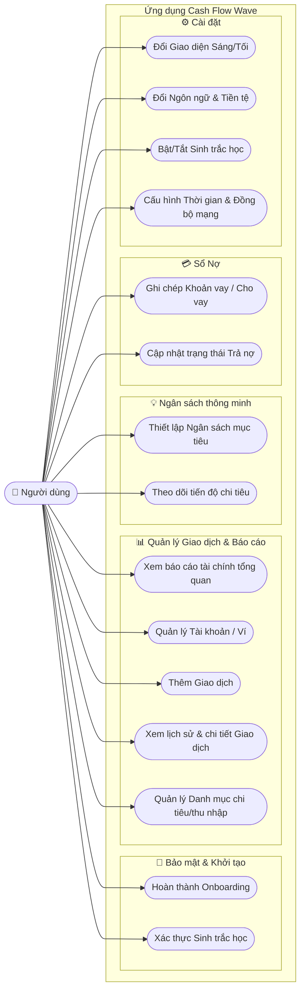
```mermaid
---
id: 365e2f6c-22b4-499f-aba8-e393df0ff0cc
---
flowchart LR
    User(["👤 Người dùng"])

    subgraph System ["Ứng dụng Cash Flow Wave"]

        subgraph Security ["🔐 Bảo mật & Khởi tạo"]
            direction TB
            UC1(["Hoàn thành Onboarding"])
            UC2(["Xác thực Sinh trắc học"])
        end

        subgraph Dashboard ["📊 Quản lý Giao dịch & Báo cáo"]
            direction TB
            UC3(["Xem báo cáo tài chính tổng quan"])
            UC4(["Quản lý Tài khoản / Ví"])
            UC5(["Thêm Giao dịch"])
            UC6(["Xem lịch sử & chi tiết Giao dịch"])
            UC7(["Quản lý Danh mục chi tiêu/thu nhập"])
        end

        subgraph Budget ["💡 Ngân sách thông minh"]
            direction TB
            UC8(["Thiết lập Ngân sách mục tiêu"])
            UC9(["Theo dõi tiến độ chi tiêu"])
        end

        subgraph Debt ["💳 Sổ Nợ"]
            direction TB
            UC10(["Ghi chép Khoản vay / Cho vay"])
            UC11(["Cập nhật trạng thái Trả nợ"])
        end

        subgraph Settings ["⚙️ Cài đặt"]
            direction TB
            UC12(["Đổi Giao diện Sáng/Tối"])
            UC13(["Đổi Ngôn ngữ & Tiền tệ"])
            UC14(["Bật/Tắt Sinh trắc học"])
            UC15(["Cấu hình Thời gian & Đồng bộ mạng"])
        end
    end

    User --> UC1
    User --> UC2
    User --> UC3
    User --> UC4
    User --> UC5
    User --> UC6
    User --> UC7
    User --> UC8
    User --> UC9
    User --> UC10
    User --> UC11
    User --> UC12
    User --> UC13
    User --> UC14
    User --> UC15
```

---

### 1.2. Biểu Đồ Các Thành Phần Chức Năng

Sơ đồ dưới đây mô tả toàn bộ các thành phần (Screens, Components, Controllers, Patterns) và mối quan hệ giữa chúng trong kiến trúc MVC của ứng dụng.

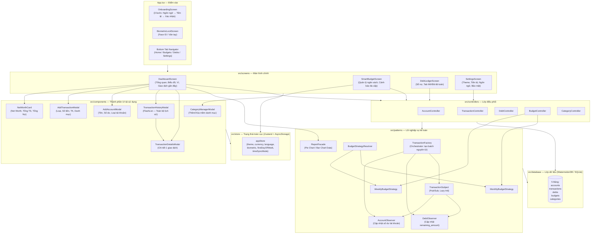
```mermaid
graph TD
    subgraph AppEntry ["App.tsx — Điểm vào"]
        Onboarding["OnboardingScreen\n(3 bước: Ngôn ngữ → Tiền tệ → Xác nhận)"]
        BiometricLock["BiometricLockScreen\n(Face ID / Vân tay)"]
        BottomNav["Bottom Tab Navigator\n(Home / Budgets / Debts / Settings)"]
    end

    subgraph Screens ["src/screens — Màn hình chính"]
        DS["DashboardScreen\n(Tổng quan, Biểu đồ, Ví, Giao dịch gần đây)"]
        SBS["SmartBudgetScreen\n(Quản lý ngân sách, Cảnh báo đa cấp)"]
        DLS["DebtLedgerScreen\n(Sổ nợ, Tab Mở/Đã tất toán)"]
        SS["SettingsScreen\n(Theme, Tiền tệ, Ngôn ngữ, Bảo mật)"]
    end

    subgraph Components ["src/components — Thành phần UI tái sử dụng"]
        NWC["NetWorthCard\n(Net Worth, Tổng TS, Tổng Nợ)"]
        ATM["AddTransactionModal\n(Loại, Số tiền, TK, Danh mục)"]
        AAM["AddAccountModal\n(Tên, Số dư, Loại tài khoản)"]
        THM["TransactionHistoryModal\n(FlashList — Toàn bộ lịch sử)"]
        TDM["TransactionDetailsModal\n(Chi tiết 1 giao dịch)"]
        CMM["CategoryManagerModal\n(Thêm/Xóa mềm danh mục)"]
    end

    subgraph Controllers ["src/controllers — Lớp điều phối"]
        AC["AccountController"]
        TC["TransactionController"]
        DC["DebtController"]
        BC["BudgetController"]
        CC["CategoryController"]
    end

    subgraph Patterns ["src/patterns — Lõi nghiệp vụ kế toán"]
        TF["TransactionFactory\n(Orchestrator: tạo batch nguyên tử)"]
        AO["AccountObserver\n(Cập nhật số dư tài khoản)"]
        DO["DebtObserver\n(Cập nhật remaining_amount)"]
        TS["TransactionSubject\n(Pub/Sub, Lazy Init)"]
        WBS["WeeklyBudgetStrategy"]
        MBS["MonthlyBudgetStrategy"]
        BSR["BudgetStrategyResolver"]
        RF["ReportFacade\n(Pie Chart / Bar Chart Data)"]
    end

    subgraph DataLayer ["src/database — Lớp dữ liệu (WatermelonDB / SQLite)"]
        DB[("5 Bảng:\naccounts\ntransactions\ndebts\nbudgets\ncategories")]
    end

    subgraph Store ["src/store — Trạng thái toàn cục (Zustand + AsyncStorage)"]
        AppStore["appStore\n(theme, currency, language,\nbiometric, firstDayOfWeek,\ntimeSyncMode)"]
    end

    AppEntry --> Screens
    DS --> NWC & ATM & AAM & THM & TDM
    SBS --> CMM
    THM --> TDM

    DS & SBS & DLS & SS --> Controllers
    Controllers --> Patterns
    TF --> AO & DO & TS
    TS --> AO & DO
    BC --> WBS & MBS
    BSR --> WBS & MBS
    DS --> RF
    Patterns --> DataLayer
    Controllers --> DataLayer
    Screens & Components --> Store
```

## 2. KIẾN TRÚC ỨNG DỤNG

### 2.1. Tổng Quan Kiến Trúc

Cash Flow Wave áp dụng kiến trúc **MVC kết hợp 4 Core Design Patterns**, được tổ chức thành các tầng (layer) tách biệt hoàn toàn về trách nhiệm. Đây không phải một lựa chọn ngẫu nhiên — mỗi quyết định kiến trúc đều xuất phát từ một ràng buộc cụ thể của bài toán tài chính cá nhân offline.

---

### 2.2. Vì Sao Kiến Trúc Này Phù Hợp Với Bài Toán?

| Ràng buộc bài toán | Giải pháp kiến trúc |
|---|---|
| **Dữ liệu tài chính không được sai lệch** — một lỗi làm tròn hay ghi dở dang là thảm hoạ | Factory Pattern gom toàn bộ mutation vào một `database.batch()` nguyên tử duy nhất — hoặc tất cả thành công, hoặc rollback toàn bộ |
| **Số dư nhiều tài khoản phải cập nhật đồng bộ** khi có giao dịch mới | Observer Pattern: `AccountObserver` và `DebtObserver` tự động phản ứng, trả về `prepareUpdate[]` để Factory gom vào batch |
| **Logic ngân sách tuần/tháng phức tạp, dễ sai** ở các edge case (tháng ngắn, cuối tuần khác ngày) | Strategy Pattern: mỗi chu kỳ là một class riêng, dễ test độc lập, dễ thêm chu kỳ mới mà không sửa code cũ |
| **Dashboard phải truy vấn nhiều chiều** (theo danh mục, theo ngày) nhưng không thể để Screen biết chi tiết SQL | Facade Pattern: `ReportFacade` ẩn toàn bộ query phức tạp, DashboardScreen chỉ gọi một dòng API |
| **UI không được chứa nghiệp vụ** — React Native component dễ bị "phình" thành God Object | Controller Layer: mọi input từ UI bắt buộc qua validation của Controller trước khi chạm vào DB |
| **Hoạt động hoàn toàn offline**, không có backend | WatermelonDB (SQLite) làm tầng Data duy nhất; Zustand + AsyncStorage cho state UI nhẹ |

---

### 2.3. Các Layer / Module Chính và Trách Nhiệm

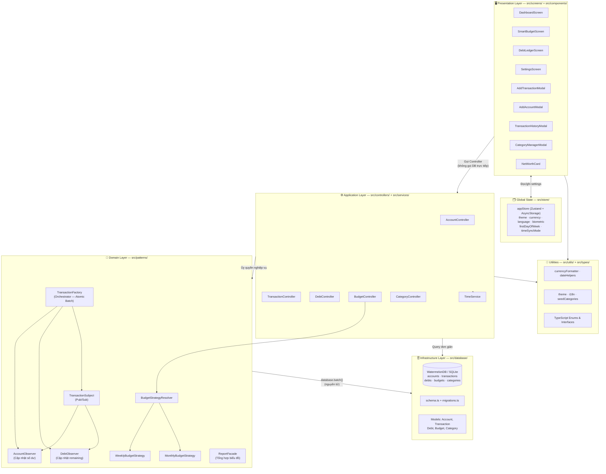
```mermaid
graph TB
    subgraph Presentation ["🖥️ Presentation Layer — src/screens/ + src/components/"]
        S1["DashboardScreen"]
        S2["SmartBudgetScreen"]
        S3["DebtLedgerScreen"]
        S4["SettingsScreen"]
        C1["AddTransactionModal"]
        C2["AddAccountModal"]
        C3["TransactionHistoryModal"]
        C4["CategoryManagerModal"]
        C5["NetWorthCard"]
    end

    subgraph StateLayer ["🗂️ Global State — src/store/"]
        ZS["appStore (Zustand + AsyncStorage)\ntheme · currency · language · biometric\nfirstDayOfWeek · timeSyncMode"]
    end

    subgraph Application ["⚙️ Application Layer — src/controllers/ + src/services/"]
        AC["AccountController"]
        TC["TransactionController"]
        DC["DebtController"]
        BC["BudgetController"]
        CC["CategoryController"]
        TS["TimeService"]
    end

    subgraph Domain ["🧠 Domain Layer — src/patterns/"]
        TF["TransactionFactory\n(Orchestrator — Atomic Batch)"]
        AO["AccountObserver\n(Cập nhật số dư)"]
        DO["DebtObserver\n(Cập nhật remaining)"]
        SUB["TransactionSubject\n(Pub/Sub)"]
        WBS["WeeklyBudgetStrategy"]
        MBS["MonthlyBudgetStrategy"]
        BSR["BudgetStrategyResolver"]
        RF["ReportFacade\n(Tổng hợp biểu đồ)"]
    end

    subgraph Infrastructure ["🗄️ Infrastructure Layer — src/database/"]
        DB[("WatermelonDB / SQLite\naccounts · transactions\ndebts · budgets · categories")]
        SCH["schema.ts + migrations.ts"]
        MOD["Models: Account, Transaction\nDebt, Budget, Category"]
    end

    subgraph Utils ["🔧 Utilities — src/utils/ + src/types/"]
        U1["currencyFormatter · dateHelpers"]
        U2["theme · i18n · seedCategories"]
        U3["TypeScript Enums & Interfaces"]
    end

    Presentation -->|"Gọi Controller\n(không gọi DB trực tiếp)"| Application
    Presentation <-->|"Đọc/ghi settings"| StateLayer
    Application -->|"Ủy quyền nghiệp vụ"| Domain
    Application -->|"Query đơn giản"| Infrastructure
    Domain -->|"database.batch()\n(nguyên tử)"| Infrastructure
    TF --> AO & DO & SUB
    SUB --> AO & DO
    BC --> BSR --> WBS & MBS
    Application --> TS
    Presentation & Application --> Utils
```

---

### 2.4. Luồng Dữ Liệu Qua Các Layer

Dưới đây là ví dụ cụ thể với hành động **"Người dùng thêm một giao dịch chi tiêu"** — luồng phức tạp nhất, đi qua tất cả các tầng:

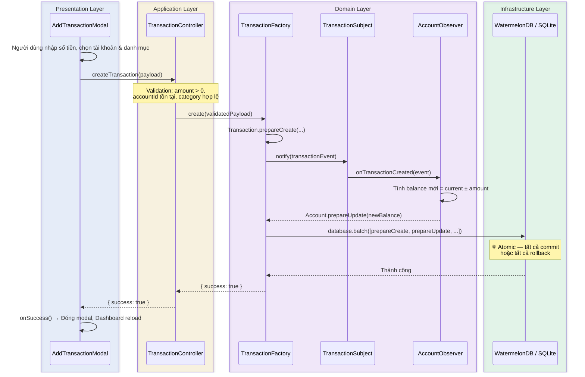
```mermaid
sequenceDiagram
    box rgba(59,130,246,0.1) Presentation Layer
        participant UI as AddTransactionModal
    end
    box rgba(234,179,8,0.1) Application Layer
        participant CTR as TransactionController
    end
    box rgba(168,85,247,0.1) Domain Layer
        participant TF as TransactionFactory
        participant SUB as TransactionSubject
        participant AO as AccountObserver
    end
    box rgba(34,197,94,0.1) Infrastructure Layer
        participant DB as WatermelonDB / SQLite
    end

    UI->>UI: Người dùng nhập số tiền, chọn tài khoản & danh mục
    UI->>CTR: createTransaction(payload)
    Note over CTR: Validation: amount > 0,<br/>accountId tồn tại, category hợp lệ
    CTR->>TF: create(validatedPayload)
    TF->>TF: Transaction.prepareCreate(...)
    TF->>SUB: notify(transactionEvent)
    SUB->>AO: onTransactionCreated(event)
    AO->>AO: Tính balance mới = current ± amount
    AO-->>TF: Account.prepareUpdate(newBalance)
    TF->>DB: database.batch([prepareCreate, prepareUpdate, ...])
    Note over DB: ⚛️ Atomic — tất cả commit<br/>hoặc tất cả rollback
    DB-->>TF: Thành công
    TF-->>CTR: { success: true }
    CTR-->>UI: { success: true }
    UI->>UI: onSuccess() → Đóng modal, Dashboard reload
```

**Nguyên tắc bất biến của luồng dữ liệu:**

> [!IMPORTANT]
> - **UI → Controller → Domain → DB** là chiều duy nhất cho mọi thao tác ghi (mutation).
> - **UI không bao giờ gọi DB trực tiếp** để ghi dữ liệu tài chính — chỉ được query để đọc danh sách hiển thị.
> - **Domain không biết UI tồn tại** — Pattern chỉ nhận dữ liệu thuần túy, trả về `prepareUpdate[]`.
> - **Infrastructure không chứa logic nghiệp vụ** — chỉ là nơi lưu trữ và thực thi batch được giao.

---

### 2.5. Bảng Trách Nhiệm Từng Layer / Module

| Layer / Module | Trách nhiệm | Không nên làm | Ví dụ file / lớp |
|---|---|---|---|
| **🖥️ Presentation** | Render giao diện React Native; thu nhận input người dùng; hiển thị kết quả; điều hướng giữa các màn hình | Không xử lý nghiệp vụ tài chính; không gọi `database` trực tiếp để ghi; không tính toán Net Worth hay số dư | `DashboardScreen.tsx`, `AddTransactionModal.tsx`, `NetWorthCard.tsx`, `TransactionHistoryModal.tsx` |
| **🗂️ Global State** | Lưu trữ và đồng bộ cài đặt ứng dụng (theme, currency, language, biometric) qua Zustand + AsyncStorage persist | Không lưu dữ liệu tài chính (giao dịch, số dư); không chứa logic nghiệp vụ | `src/store/appStore.ts` |
| **⚙️ Application / Controller** | Nhận yêu cầu từ Presentation; validation input; điều phối luồng use case; xử lý và trả về lỗi chuẩn hoá | Không phụ thuộc vào component UI cụ thể; không trực tiếp thực hiện kế toán kép; không chứa công thức tính ngân sách | `AccountController.ts`, `TransactionController.ts`, `DebtController.ts`, `BudgetController.ts`, `CategoryController.ts` |
| **🕐 Service** | Cung cấp khả năng tích hợp hệ thống bên ngoài (WorldTimeAPI) và tính năng cắt ngang (giờ đáng tin cậy, ngày đầu tuần) | Không render UI; không ghi dữ liệu tài chính trực tiếp | `src/services/TimeService.ts` |
| **🧠 Domain / Patterns** | Thực thi toàn bộ quy tắc nghiệp vụ kế toán: tạo giao dịch nguyên tử, cập nhật số dư theo kép, tính chu kỳ ngân sách, tổng hợp báo cáo | Không gọi `setState` của UI; không đọc store Zustand; không biết component nào đang gọi mình | `TransactionFactory.ts`, `AccountObserver.ts`, `DebtObserver.ts`, `TransactionSubject.ts`, `WeeklyBudgetStrategy.ts`, `MonthlyBudgetStrategy.ts`, `ReportFacade.ts` |
| **🗄️ Infrastructure / Database** | Lưu trữ bền vững toàn bộ dữ liệu tài chính (SQLite); định nghĩa schema và migration; thực thi atomic batch do Domain giao | Không chứa business rule; không validation nghiệp vụ; không biết giao dịch đó có hợp lệ hay không | `src/database/index.ts`, `schema.ts`, `migrations.ts`, `models/Account.ts`, `models/Transaction.ts` |
| **🔧 Utilities** | Cung cấp hàm tiện ích thuần túy (pure functions) không có side effect: định dạng tiền tệ, chuyển đổi ngày, seed danh mục, i18n, theming | Không gọi DB; không dispatch action; không có state nội bộ | `currencyFormatter.ts`, `dateHelpers.ts`, `theme.ts`, `i18n.ts`, `seedCategories.ts` |

---

### 2.6. Kiến Trúc Hỗ Trợ Kiểm Thử, Bảo Trì và Mở Rộng Ra Sao?

#### Kiểm thử (Testability)

Sự tách biệt layer tạo ra ranh giới kiểm thử sắc nét:

| Tầng | Chiến lược kiểm thử | Ví dụ trong dự án |
|---|---|---|
| **Utilities** | Unit test thuần — không cần mock | `currencyFormatter.spec.ts` — test 7 case `toCents/fromCents/formatCurrency` |
| **Domain / Patterns** | Unit test với input giả — không cần DB thật | `budgetStrategies.spec.ts` — test 6 case biên của Weekly/Monthly strategy |
| **Presentation** | Component test với RNTL + mock Controller | `AccountsAndCategories.spec.tsx`, `Transactions.spec.tsx` — mock `AccountController`, `TransactionController` |
| **Controller** | Integration test — mock DB, kiểm tra validation flow | Kiểm tra luồng lỗi khi input thiếu trường bắt buộc |

> [!TIP]
> Vì Domain Layer không phụ thuộc vào UI hay DB thật, các test cho `WeeklyBudgetStrategy` hay `MonthlyBudgetStrategy` chạy cực nhanh (< 5ms/case) và không cần emulator.

#### Bảo trì (Maintainability)

- **Thay đổi cô lập**: Sửa công thức tính chu kỳ ngân sách → chỉ sửa `WeeklyBudgetStrategy.ts`, không ảnh hưởng UI hay Controller.
- **Lỗi dễ truy vết**: Bug về số dư sai → chắc chắn nằm trong `AccountObserver` hoặc `TransactionFactory`, không phải ở màn hình.
- **Soft Delete bắt buộc**: Controller thi hành chính sách — UI không thể bypass để xóa cứng dữ liệu master.

#### Mở rộng (Extensibility)

| Tính năng mới | Cách mở rộng không phá vỡ kiến trúc cũ |
|---|---|
| Thêm chu kỳ ngân sách **Quý** | Tạo `QuarterlyBudgetStrategy.ts` implement cùng interface → đăng ký vào `BudgetStrategyResolver` |
| Thêm loại báo cáo mới (Bar Chart theo tuần) | Thêm method vào `ReportFacade` — DashboardScreen gọi thêm 1 dòng |
| Thêm loại tài khoản mới (Tiết kiệm, Đầu tư) | Mở rộng enum `AccountType` + cập nhật `AccountObserver` logic |
| Thêm Observer thứ 3 (thông báo push khi vượt ngân sách) | Tạo `BudgetObserver.ts` và đăng ký vào `TransactionSubject` |
| Xuất báo cáo CSV / PDF | Thêm `ExportService` ở tầng Service — gọi `ReportFacade` để lấy data |

---

## 3. ĐẶC TẢ CHỨC NĂNG

### 3.1. Đặc Tả Use Case

#### Phân Loại Độ Quan Trọng

Mỗi use case được phân loại theo ba mức độ quan trọng dựa trên hai tiêu chí: **mức độ ảnh hưởng đến giá trị cốt lõi** của ứng dụng và **tần suất sử dụng** thực tế của người dùng.

**Bảng tổng quan phân loại:**

| Use Case | Tên | Mức độ | Lý do |
|---|---|---|---|
| UC01 | Hoàn thành Onboarding | 🔴 Thiết yếu | Gate keeper — không qua đây thì không dùng được app |
| UC02 | Xác thực Sinh trắc học | 🟡 Quan trọng | Bảo mật dữ liệu tài chính nhạy cảm; tùy chọn nhưng quan trọng |
| UC03 | Xem Báo cáo Tổng quan | 🔴 Thiết yếu | Màn hình chính — giá trị cốt lõi số 1 của ứng dụng |
| UC04 | Quản lý Tài khoản / Ví | 🔴 Thiết yếu | Nền tảng: không có tài khoản thì không thể ghi giao dịch |
| UC05 | Thêm Giao dịch mới | 🔴 Thiết yếu | Chức năng trung tâm — tần suất cao nhất, dữ liệu đầu vào chính |
| UC06 | Xem Lịch sử Giao dịch | 🔴 Thiết yếu | Truy vết tài chính — không có thì mất khả năng kiểm soát |
| UC07 | Quản lý Danh mục | 🟡 Quan trọng | Cần cho phân tích biểu đồ; danh mục mặc định đã seed sẵn |
| UC08 | Thiết lập Ngân sách | 🟡 Quan trọng | Tính năng phân biệt với app ghi chép đơn thuần |
| UC09 | Theo dõi Tiến độ Chi tiêu | 🟡 Quan trọng | Giá trị thực của module ngân sách — cảnh báo chủ động |
| UC10 | Ghi chép Khoản Vay/Cho vay | 🟡 Quan trọng | Giải quyết điểm đau sổ nợ cá nhân — khác biệt cạnh tranh |
| UC11 | Cập nhật Trạng thái Trả nợ | 🟡 Quan trọng | Bổ sung cho UC10 — hoàn thiện vòng đời khoản nợ |
| UC12 | Cài đặt Ứng dụng | 🟢 Hỗ trợ | Cá nhân hoá trải nghiệm; app vẫn dùng được với cài đặt mặc định |


#### UC01 — Hoàn thành Onboarding

| Mục | Nội dung |
|---|---|
| **Độ quan trọng** | 🔴 Thiết yếu |
| **Tác nhân** | Người dùng (lần đầu khởi động) |
| **Điều kiện kích hoạt** | `hasCompletedOnboarding == false` trong Zustand store |
| **Luồng chính** | 1. Ứng dụng hiển thị màn hình Onboarding gồm 3 slide. 2. Slide 1: Người dùng chọn Ngôn ngữ (EN/VI) và Giao diện (Sáng/Tối/Hệ thống). 3. Slide 2: Người dùng nhập Ký hiệu tiền tệ và chọn Vị trí (Tiền tố/Hậu tố). 4. Slide 3: Hệ thống hiển thị bản xác nhận cài đặt. 5. Người dùng nhấn "Get Started" → `setHasCompletedOnboarding(true)` → Chuyển sang màn hình chính. |
| **Luồng thay thế** | Người dùng nhấn "Back" để quay lại slide trước. |
| **Hậu điều kiện** | Ứng dụng lưu cài đặt ban đầu vào AsyncStorage và điều hướng sang Bottom Tab Navigator. |

**Sơ đồ luồng UC01:**

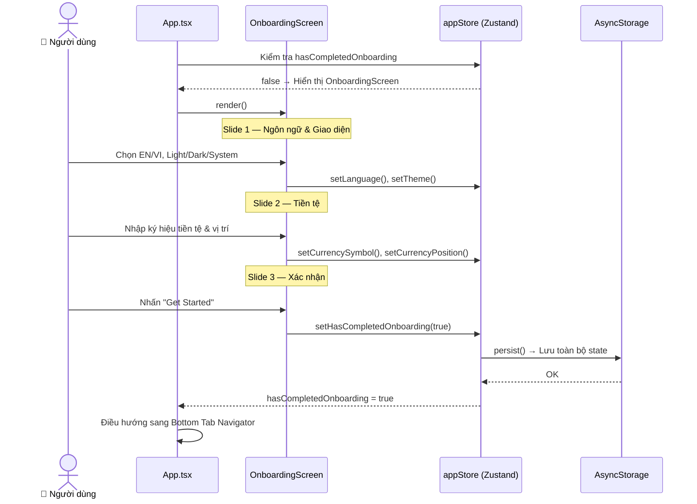
```mermaid
sequenceDiagram
    actor User as 👤 Người dùng
    participant App as App.tsx
    participant ONB as OnboardingScreen
    participant Store as appStore (Zustand)
    participant AS as AsyncStorage

    App->>Store: Kiểm tra hasCompletedOnboarding
    Store-->>App: false → Hiển thị OnboardingScreen
    App->>ONB: render()

    Note over ONB: Slide 1 — Ngôn ngữ & Giao diện
    User->>ONB: Chọn EN/VI, Light/Dark/System
    ONB->>Store: setLanguage(), setTheme()

    Note over ONB: Slide 2 — Tiền tệ
    User->>ONB: Nhập ký hiệu tiền tệ & vị trí
    ONB->>Store: setCurrencySymbol(), setCurrencyPosition()

    Note over ONB: Slide 3 — Xác nhận
    User->>ONB: Nhấn "Get Started"
    ONB->>Store: setHasCompletedOnboarding(true)
    Store->>AS: persist() → Lưu toàn bộ state
    AS-->>Store: OK
    Store-->>App: hasCompletedOnboarding = true
    App->>App: Điều hướng sang Bottom Tab Navigator
```

---

#### UC02 — Xác thực Sinh trắc học

| Mục | Nội dung |
|---|---|
| **Độ quan trọng** | 🟡 Quan trọng |
| **Tác nhân** | Người dùng |
| **Điều kiện kích hoạt** | `isBiometricEnabled == true` và ứng dụng vừa được mở (chưa `isUnlocked`) |
| **Luồng chính** | 1. Màn hình `BiometricLockScreen` hiển thị với nút "Unlock". 2. Người dùng nhấn "Unlock" → Hệ thống gọi `expo-local-authentication`. 3. Thiết bị yêu cầu xác thực Face ID / Vân tay / Passcode. 4. Xác thực thành công → `setIsUnlocked(true)` → Hiển thị màn hình chính. |
| **Luồng ngoại lệ** | Xác thực thất bại → Hiển thị thông báo lỗi, màn hình khóa vẫn hiển thị. |
| **Hậu điều kiện** | Người dùng có quyền truy cập toàn bộ chức năng ứng dụng. |

**Sơ đồ luồng UC02:**

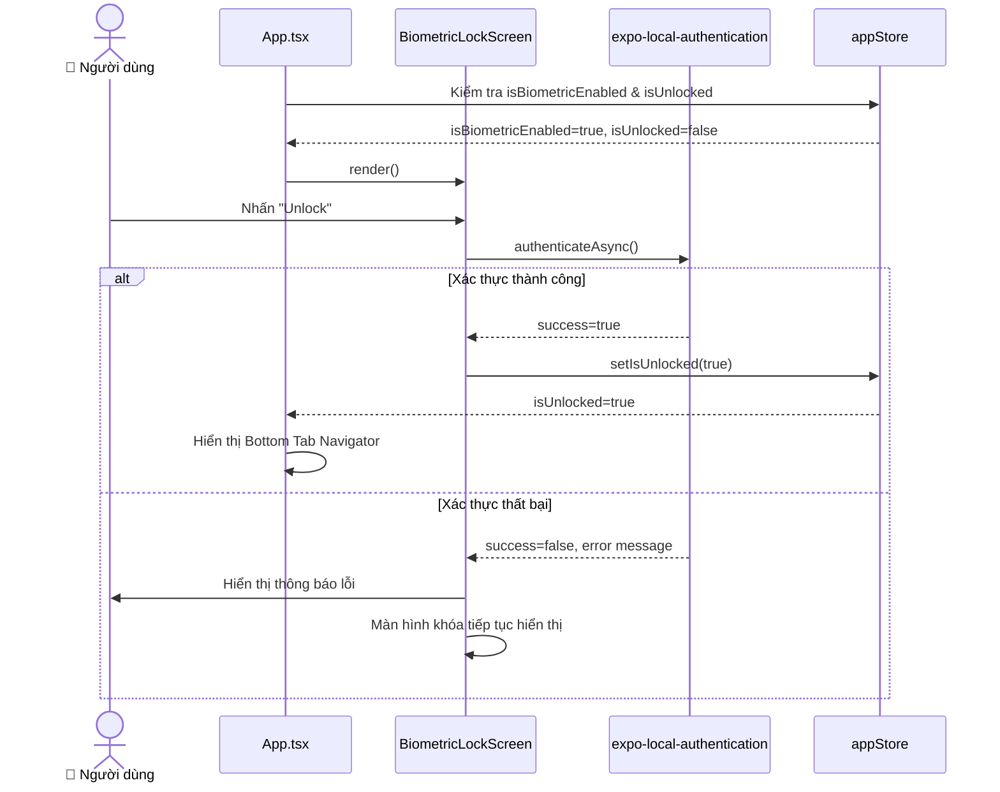
```mermaid
sequenceDiagram
    actor User as 👤 Người dùng
    participant App as App.tsx
    participant BLS as BiometricLockScreen
    participant ELA as expo-local-authentication
    participant Store as appStore

    App->>Store: Kiểm tra isBiometricEnabled & isUnlocked
    Store-->>App: isBiometricEnabled=true, isUnlocked=false
    App->>BLS: render()
    User->>BLS: Nhấn "Unlock"
    BLS->>ELA: authenticateAsync()

    alt Xác thực thành công
        ELA-->>BLS: success=true
        BLS->>Store: setIsUnlocked(true)
        Store-->>App: isUnlocked=true
        App->>App: Hiển thị Bottom Tab Navigator
    else Xác thực thất bại
        ELA-->>BLS: success=false, error message
        BLS->>User: Hiển thị thông báo lỗi
        BLS->>BLS: Màn hình khóa tiếp tục hiển thị
    end
```

---

#### UC03 — Xem Báo Cáo Tài Chính Tổng Quan (Dashboard)

| Mục | Nội dung |
|---|---|
| **Độ quan trọng** | 🔴 Thiết yếu |
| **Tác nhân** | Người dùng |
| **Điều kiện kích hoạt** | Mở tab "Home" hoặc pull-to-refresh |
| **Luồng chính** | 1. `DashboardScreen` gọi `AccountController.getActiveAccounts()` và `TransactionController.getTransactions()`. 2. Hiển thị `NetWorthCard` với `netWorth = Σ(Assets) - Σ(Liabilities)`. 3. Gọi `ReportFacade.getDailyExpenseTrend(7)` để lấy dữ liệu Bar Chart 7 ngày gần nhất. 4. Gọi `ReportFacade.getExpensesByCategory(startOfMonth, endOfMonth)` để lấy dữ liệu Pie Chart tháng hiện tại. 5. Hiển thị danh sách 5 giao dịch gần nhất. |
| **Hậu điều kiện** | Người dùng thấy tổng tài sản ròng và xu hướng chi tiêu được cập nhật thực thời. |

**Sơ đồ luồng UC03:**

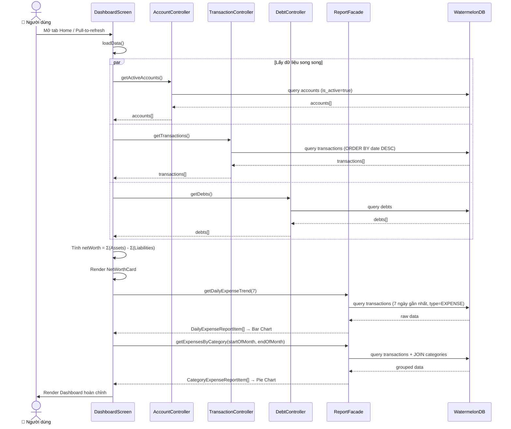
```mermaid
sequenceDiagram
    actor User as 👤 Người dùng
    participant DS as DashboardScreen
    participant AC as AccountController
    participant TC as TransactionController
    participant DC as DebtController
    participant RF as ReportFacade
    participant DB as WatermelonDB

    User->>DS: Mở tab Home / Pull-to-refresh
    DS->>DS: loadData()

    par Lấy dữ liệu song song
        DS->>AC: getActiveAccounts()
        AC->>DB: query accounts (is_active=true)
        DB-->>AC: accounts[]
        AC-->>DS: accounts[]
    and
        DS->>TC: getTransactions()
        TC->>DB: query transactions (ORDER BY date DESC)
        DB-->>TC: transactions[]
        TC-->>DS: transactions[]
    and
        DS->>DC: getDebts()
        DC->>DB: query debts
        DB-->>DC: debts[]
        DC-->>DS: debts[]
    end

    DS->>DS: Tính netWorth = Σ(Assets) - Σ(Liabilities)
    DS->>DS: Render NetWorthCard

    DS->>RF: getDailyExpenseTrend(7)
    RF->>DB: query transactions (7 ngày gần nhất, type=EXPENSE)
    DB-->>RF: raw data
    RF-->>DS: DailyExpenseReportItem[] → Bar Chart

    DS->>RF: getExpensesByCategory(startOfMonth, endOfMonth)
    RF->>DB: query transactions + JOIN categories
    DB-->>RF: grouped data
    RF-->>DS: CategoryExpenseReportItem[] → Pie Chart

    DS->>User: Render Dashboard hoàn chỉnh
```

---

#### UC04 — Quản Lý Tài Khoản / Ví

| Mục | Nội dung |
|---|---|
| **Độ quan trọng** | 🔴 Thiết yếu |
| **Tác nhân** | Người dùng |
| **Điều kiện kích hoạt** | Nhấn nút "+" trên phần "My Wallets" hoặc "Add Account" trong Action Center |
| **Luồng chính** | 1. Mở `AddAccountModal`. 2. Người dùng chọn loại tài khoản: **Asset** (Tài sản: Ví tiền mặt, Ngân hàng) hoặc **Liability** (Nợ phải trả: Thẻ tín dụng). 3. Nhập tên tài khoản và số dư ban đầu. 4. Nhấn "Save" → Controller xác thực → `AccountController.createAccount()`. 5. Nếu số dư ban đầu > 0, hệ thống tự động tạo giao dịch điều chỉnh (adjustment transaction) để duy trì tính toàn vẹn kế toán. |
| **Validation** | Tên không được rỗng; Số dư phải là số hợp lệ (≥ 0). |
| **Luồng ngoại lệ** | Tên rỗng → Alert "Account name is required". Số dư không hợp lệ → Alert "Invalid balance amount". |
| **Quy tắc xóa** | Tài khoản **không được xóa cứng**. Hệ thống chỉ thực hiện **Soft Delete** (`is_active = false`) để bảo toàn lịch sử giao dịch. |

**Sơ đồ luồng UC04:**

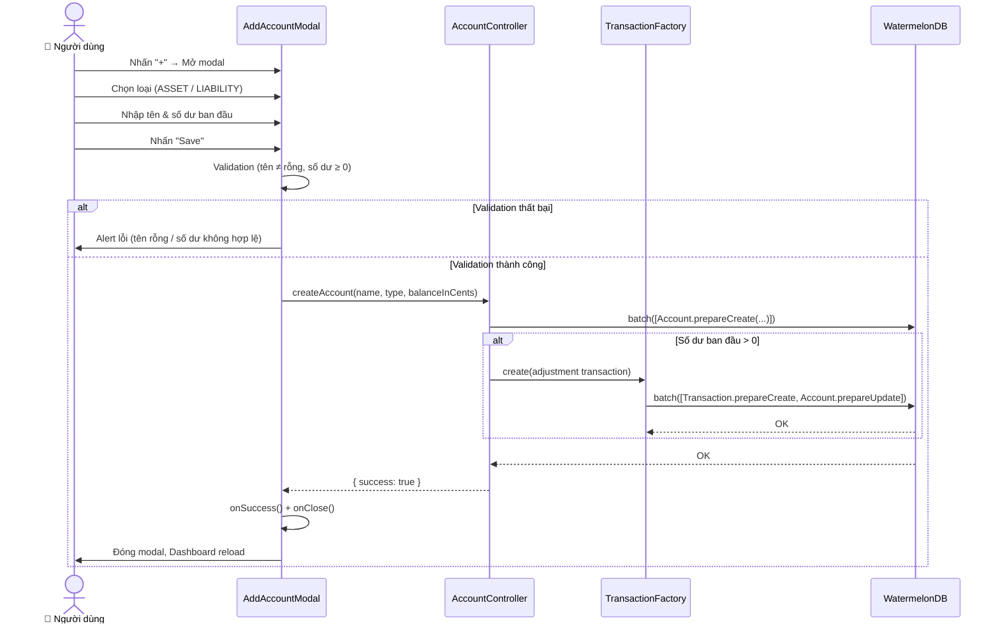
```mermaid
sequenceDiagram
    actor User as 👤 Người dùng
    participant AAM as AddAccountModal
    participant AC as AccountController
    participant TF as TransactionFactory
    participant DB as WatermelonDB

    User->>AAM: Nhấn "+" → Mở modal
    User->>AAM: Chọn loại (ASSET / LIABILITY)
    User->>AAM: Nhập tên & số dư ban đầu
    User->>AAM: Nhấn "Save"

    AAM->>AAM: Validation (tên ≠ rỗng, số dư ≥ 0)

    alt Validation thất bại
        AAM->>User: Alert lỗi (tên rỗng / số dư không hợp lệ)
    else Validation thành công
        AAM->>AC: createAccount(name, type, balanceInCents)
        AC->>DB: batch([Account.prepareCreate(...)])

        alt Số dư ban đầu > 0
            AC->>TF: create(adjustment transaction)
            TF->>DB: batch([Transaction.prepareCreate, Account.prepareUpdate])
            DB-->>TF: OK
        end

        DB-->>AC: OK
        AC-->>AAM: { success: true }
        AAM->>AAM: onSuccess() + onClose()
        AAM->>User: Đóng modal, Dashboard reload
    end
```

---

#### UC05 — Thêm Giao Dịch Mới

| Mục | Nội dung |
|---|---|
| **Độ quan trọng** | 🔴 Thiết yếu |
| **Tác nhân** | Người dùng |
| **Điều kiện kích hoạt** | Nhấn nút "Add Transaction" trên Dashboard (chỉ hiện khi đã có ít nhất 1 tài khoản) |
| **Luồng chính** | 1. Mở `AddTransactionModal`. 2. Người dùng chọn loại giao dịch: **EXPENSE** (Chi tiêu) / **INCOME** (Thu nhập) / **TRANSFER** (Chuyển khoản). 3. Nhập số tiền, ghi chú (tùy chọn), chọn tài khoản nguồn và danh mục. 4. Với loại TRANSFER, người dùng chọn thêm tài khoản đích. 5. Nhấn "Save" → `TransactionController.createTransaction()` → `TransactionFactory.create()` → Thực thi `database.batch()` nguyên tử gồm: ghi Transaction + cập nhật Account balance qua `AccountObserver`. |
| **Validation** | Số tiền > 0; Phải chọn tài khoản nguồn; Phải chọn danh mục (trừ loại TRANSFER). |
| **Hậu điều kiện** | Số dư tài khoản liên quan được cập nhật tức thì; Net Worth thay đổi tương ứng; Dashboard tự reload. |

**Sơ đồ luồng UC05:**

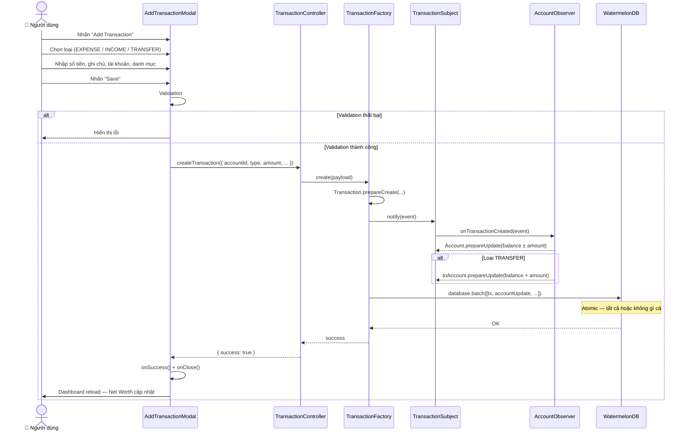
```mermaid
sequenceDiagram
    actor User as 👤 Người dùng
    participant ATM as AddTransactionModal
    participant TC as TransactionController
    participant TF as TransactionFactory
    participant TS as TransactionSubject
    participant AO as AccountObserver
    participant DB as WatermelonDB

    User->>ATM: Nhấn "Add Transaction"
    User->>ATM: Chọn loại (EXPENSE / INCOME / TRANSFER)
    User->>ATM: Nhập số tiền, ghi chú, tài khoản, danh mục
    User->>ATM: Nhấn "Save"

    ATM->>ATM: Validation
    alt Validation thất bại
        ATM->>User: Hiển thị lỗi
    else Validation thành công
        ATM->>TC: createTransaction({ accountId, type, amount, ... })
        TC->>TF: create(payload)
        TF->>TF: Transaction.prepareCreate(...)
        TF->>TS: notify(event)
        TS->>AO: onTransactionCreated(event)
        AO-->>TS: Account.prepareUpdate(balance ± amount)

        alt Loại TRANSFER
            AO-->>TS: toAccount.prepareUpdate(balance + amount)
        end

        TF->>DB: database.batch([tx, accountUpdate, ...])
        Note over DB: Atomic — tất cả hoặc không gì cả
        DB-->>TF: OK
        TF-->>TC: success
        TC-->>ATM: { success: true }
        ATM->>ATM: onSuccess() + onClose()
        ATM->>User: Dashboard reload — Net Worth cập nhật
    end
```

---

#### UC06 — Xem Lịch Sử & Chi Tiết Giao Dịch

| Mục | Nội dung |
|---|---|
| **Độ quan trọng** | 🔴 Thiết yếu |
| **Tác nhân** | Người dùng |
| **Điều kiện kích hoạt** | Nhấn "See All" trên Dashboard hoặc nhấn vào một giao dịch trong danh sách gần đây |
| **Luồng chính (Lịch sử)** | 1. Mở `TransactionHistoryModal` (pageSheet style). 2. Gọi `TransactionController.getTransactions()`. 3. Render danh sách hiệu suất cao qua `@shopify/flash-list`. 4. Nhấn vào một mục → Mở `TransactionDetailsModal` (lồng bên trong, tránh xung đột iOS multi-modal). |
| **Luồng chính (Chi tiết)** | 1. `TransactionDetailsModal` nhận prop `transaction`. 2. Truy vấn WatermelonDB để lấy thông tin `Account` và `Category` liên kết. 3. Hiển thị banner màu (Đỏ = Chi tiêu, Xanh = Thu nhập) cùng đầy đủ thông tin: Số tiền, Ghi chú, Ngày, Tài khoản, Danh mục. |

**Sơ đồ luồng UC06:**

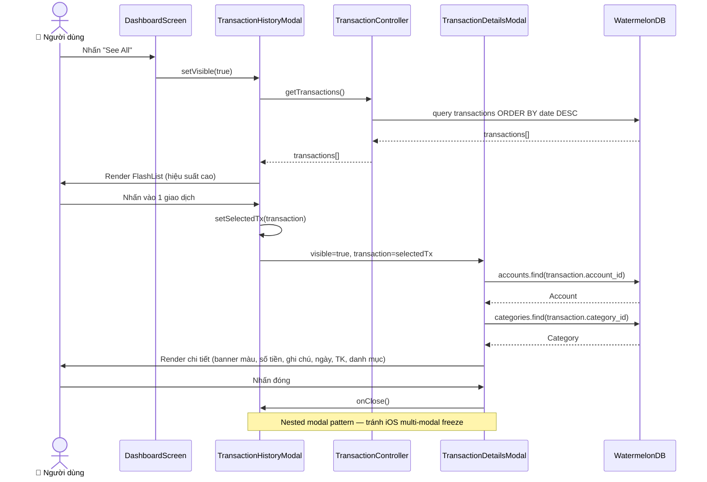
```mermaid
sequenceDiagram
    actor User as 👤 Người dùng
    participant DS as DashboardScreen
    participant THM as TransactionHistoryModal
    participant TC as TransactionController
    participant TDM as TransactionDetailsModal
    participant DB as WatermelonDB

    User->>DS: Nhấn "See All"
    DS->>THM: setVisible(true)
    THM->>TC: getTransactions()
    TC->>DB: query transactions ORDER BY date DESC
    DB-->>TC: transactions[]
    TC-->>THM: transactions[]
    THM->>User: Render FlashList (hiệu suất cao)

    User->>THM: Nhấn vào 1 giao dịch
    THM->>THM: setSelectedTx(transaction)
    THM->>TDM: visible=true, transaction=selectedTx

    TDM->>DB: accounts.find(transaction.account_id)
    DB-->>TDM: Account
    TDM->>DB: categories.find(transaction.category_id)
    DB-->>TDM: Category

    TDM->>User: Render chi tiết (banner màu, số tiền, ghi chú, ngày, TK, danh mục)
    User->>TDM: Nhấn đóng
    TDM->>THM: onClose()
    Note over THM,TDM: Nested modal pattern — tránh iOS multi-modal freeze
```

---

#### UC07 — Quản Lý Danh Mục (Categories)

| Mục | Nội dung |
|---|---|
| **Độ quan trọng** | 🟡 Quan trọng |
| **Tác nhân** | Người dùng |
| **Điều kiện kích hoạt** | Nhấn icon Tag trên SmartBudgetScreen |
| **Luồng chính — Thêm** | 1. Mở `CategoryManagerModal`. 2. Nhập tên, chọn loại (EXPENSE/INCOME), chọn màu. 3. Nhấn "Add Category" → `CategoryController.createCategory()`. |
| **Luồng chính — Xóa** | 1. Nhấn icon Thùng rác → Alert xác nhận. 2. Xác nhận → `CategoryController.deleteCategory()` → Soft Delete (`is_active = false`). |
| **Quy tắc bất biến** | Danh mục đã gắn với giao dịch chỉ được xóa mềm, không bao giờ xóa cứng. |

**Sơ đồ luồng UC07:**

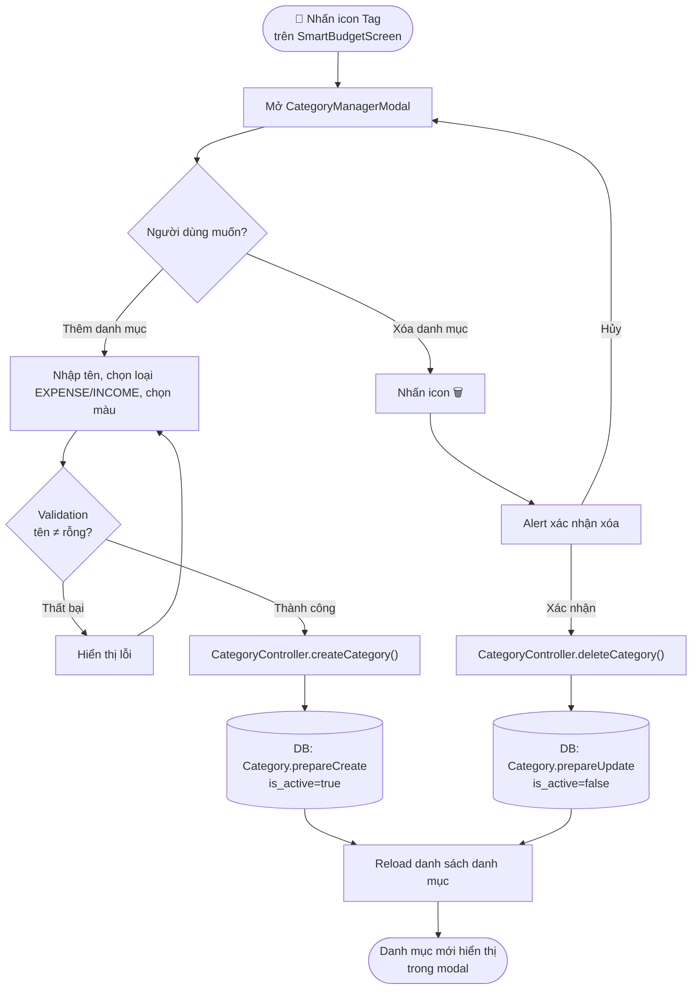
```mermaid
flowchart TD
    A(["👤 Nhấn icon Tag\ntrên SmartBudgetScreen"]) --> B["Mở CategoryManagerModal"]
    B --> C{"Người dùng muốn?"}

    C -->|"Thêm danh mục"| D["Nhập tên, chọn loại EXPENSE/INCOME, chọn màu"]
    D --> E{"Validation\ntên ≠ rỗng?"}
    E -->|"Thất bại"| F["Hiển thị lỗi"]
    F --> D
    E -->|"Thành công"| G["CategoryController.createCategory()"]
    G --> H[("DB: Category.prepareCreate\nis_active=true")]
    H --> I["Reload danh sách danh mục"]

    C -->|"Xóa danh mục"| J["Nhấn icon 🗑️"]
    J --> K["Alert xác nhận xóa"]
    K -->|"Hủy"| B
    K -->|"Xác nhận"| L["CategoryController.deleteCategory()"]
    L --> M[("DB: Category.prepareUpdate\nis_active=false")]
    M --> I
    I --> N(["Danh mục mới hiển thị\ntrong modal"])
```

---

#### UC08 — Thiết Lập Ngân Sách Mục Tiêu

| Mục | Nội dung |
|---|---|
| **Độ quan trọng** | 🟡 Quan trọng |
| **Tác nhân** | Người dùng |
| **Điều kiện kích hoạt** | Nhấn "Add Budget" trên SmartBudgetScreen |
| **Luồng chính** | 1. Mở modal tạo ngân sách. 2. Nhập: Tên, Số tiền giới hạn, Chu kỳ (WEEKLY/MONTHLY), Ngày neo (anchor day), Danh mục liên kết (tùy chọn). 3. `BudgetController.createBudget()` → `BudgetStrategyResolver` chọn đúng chiến lược (Weekly/Monthly). 4. Chiến lược tính `startDate` và `endDate` của chu kỳ hiện tại và lưu vào DB. |
| **Xử lý edge case** | Ngày neo 31 ở tháng 2 → Tự động clamp về ngày cuối tháng (28 hoặc 29 cho năm nhuận). |
| **Hậu điều kiện** | Ngân sách mới xuất hiện trên SmartBudgetScreen với tiến độ ban đầu là 0%. |

**Sơ đồ luồng UC08:**

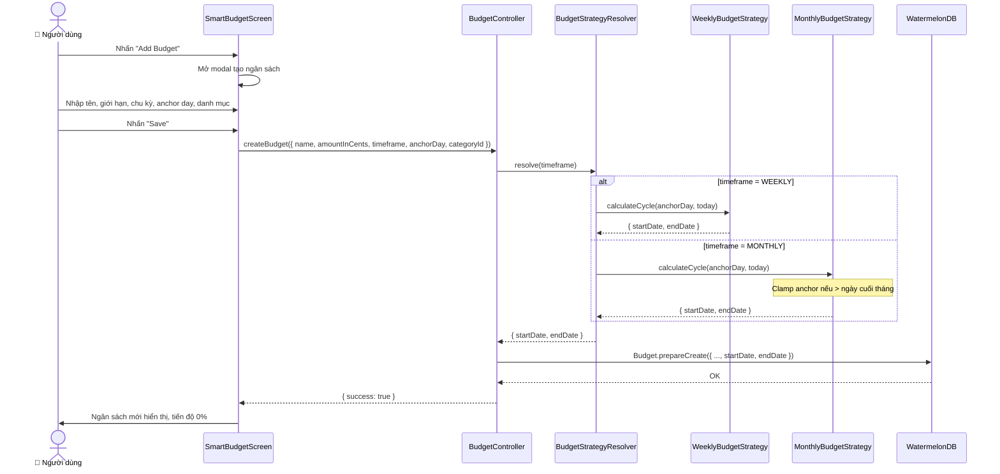
```mermaid
sequenceDiagram
    actor User as 👤 Người dùng
    participant SBS as SmartBudgetScreen
    participant BC as BudgetController
    participant BSR as BudgetStrategyResolver
    participant WBS as WeeklyBudgetStrategy
    participant MBS as MonthlyBudgetStrategy
    participant DB as WatermelonDB

    User->>SBS: Nhấn "Add Budget"
    SBS->>SBS: Mở modal tạo ngân sách
    User->>SBS: Nhập tên, giới hạn, chu kỳ, anchor day, danh mục
    User->>SBS: Nhấn "Save"

    SBS->>BC: createBudget({ name, amountInCents, timeframe, anchorDay, categoryId })
    BC->>BSR: resolve(timeframe)

    alt timeframe = WEEKLY
        BSR->>WBS: calculateCycle(anchorDay, today)
        WBS-->>BSR: { startDate, endDate }
    else timeframe = MONTHLY
        BSR->>MBS: calculateCycle(anchorDay, today)
        Note over MBS: Clamp anchor nếu > ngày cuối tháng
        MBS-->>BSR: { startDate, endDate }
    end

    BSR-->>BC: { startDate, endDate }
    BC->>DB: Budget.prepareCreate({ ..., startDate, endDate })
    DB-->>BC: OK
    BC-->>SBS: { success: true }
    SBS->>User: Ngân sách mới hiển thị, tiến độ 0%
```

---

#### UC09 — Theo Dõi Tiến Độ Chi Tiêu

| Mục | Nội dung |
|---|---|
| **Độ quan trọng** | 🟡 Quan trọng |
| **Tác nhân** | Hệ thống (tự động khi người dùng mở tab Budgets) |
| **Luồng chính** | 1. `BudgetController.getBudgetsProgress()` được gọi. 2. Với từng ngân sách, hệ thống tính tổng giao dịch EXPENSE trong chu kỳ hiện tại (lọc theo `category_id` nếu có). 3. Tính `progressPercent = (spentAmount / limitAmount) * 100`. |
| **Hiển thị cảnh báo** | `< 80%` → Thanh xanh + trạng thái "Within Budget". `80–99%` → Thanh vàng + icon ⚠️ "Approaching Limit". `≥ 100%` → Thanh đỏ + icon ⚠️ "Budget Exceeded". |

**Sơ đồ luồng UC09:**

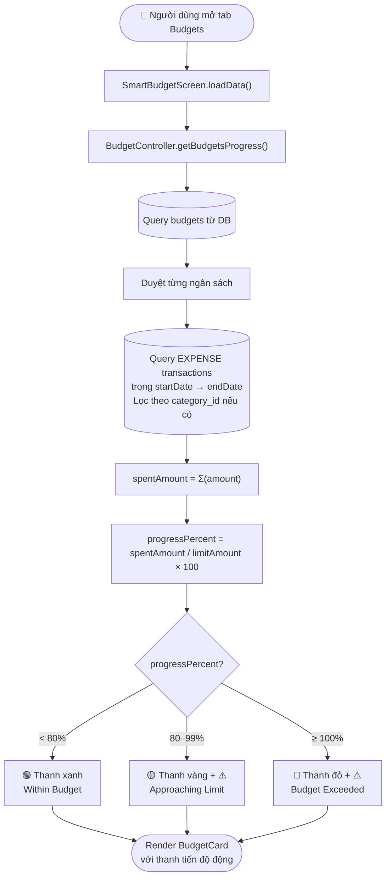
```mermaid
flowchart TD
    A(["👤 Người dùng mở tab Budgets"]) --> B["SmartBudgetScreen.loadData()"]
    B --> C["BudgetController.getBudgetsProgress()"]
    C --> D[("Query budgets từ DB")]
    D --> E["Duyệt từng ngân sách"]

    E --> F[("Query EXPENSE transactions\ntrong startDate → endDate\nLọc theo category_id nếu có")]
    F --> G["spentAmount = Σ(amount)"]
    G --> H["progressPercent = spentAmount / limitAmount × 100"]

    H --> I{"progressPercent?"}
    I -->|"< 80%"| J["🟢 Thanh xanh\nWithin Budget"]
    I -->|"80–99%"| K["🟡 Thanh vàng + ⚠️\nApproaching Limit"]
    I -->|"≥ 100%"| L["🔴 Thanh đỏ + ⚠️\nBudget Exceeded"]

    J & K & L --> M(["Render BudgetCard\nvới thanh tiến độ động"])
```

---

#### UC10 — Ghi Chép Khoản Vay / Cho Vay

| Mục | Nội dung |
|---|---|
| **Độ quan trọng** | 🟡 Quan trọng |
| **Tác nhân** | Người dùng |
| **Điều kiện kích hoạt** | Nhấn "Add" trên DebtLedgerScreen |
| **Luồng chính** | 1. Mở modal tạo nợ. 2. Nhập: Tên người, Số tiền, Loại (LENT/BORROWED), Ngày đến hạn (tính bằng số ngày từ hôm nay), Ví liên kết. 3. Tùy chọn "Deduct/Add from wallet" — nếu bật: hệ thống tự động tạo giao dịch để trừ/cộng ví tương ứng. 4. `DebtController.createDebt()` → Lưu khoản nợ với `status = OPEN`, `remaining_amount = total_amount`. |
| **Hậu điều kiện** | Khoản nợ xuất hiện trên tab "Active"; Số dư ví được cập nhật nếu đã chọn liên kết. |

**Sơ đồ luồng UC10:**

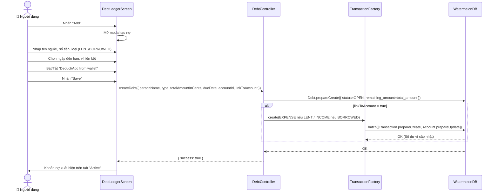
```mermaid
sequenceDiagram
    actor User as 👤 Người dùng
    participant DLS as DebtLedgerScreen
    participant DC as DebtController
    participant TF as TransactionFactory
    participant DB as WatermelonDB

    User->>DLS: Nhấn "Add"
    DLS->>DLS: Mở modal tạo nợ
    User->>DLS: Nhập tên người, số tiền, loại (LENT/BORROWED)
    User->>DLS: Chọn ngày đến hạn, ví liên kết
    User->>DLS: Bật/Tắt "Deduct/Add from wallet"
    User->>DLS: Nhấn "Save"

    DLS->>DC: createDebt({ personName, type, totalAmountInCents, dueDate, accountId, linkToAccount })

    DC->>DB: Debt.prepareCreate({ status=OPEN, remaining_amount=total_amount })

    alt linkToAccount = true
        DC->>TF: create(EXPENSE nếu LENT / INCOME nếu BORROWED)
        TF->>DB: batch([Transaction.prepareCreate, Account.prepareUpdate])
        DB-->>TF: OK (Số dư ví cập nhật)
    end

    DB-->>DC: OK
    DC-->>DLS: { success: true }
    DLS->>User: Khoản nợ xuất hiện trên tab "Active"
```

---

#### UC11 — Cập Nhật Trạng Thái Trả Nợ

| Mục | Nội dung |
|---|---|
| **Độ quan trọng** | 🟡 Quan trọng |
| **Tác nhân** | Người dùng |
| **Điều kiện kích hoạt** | Nhấn "Record Payment" trên một thẻ nợ đang mở |
| **Luồng chính** | 1. Mở modal ghi thanh toán với số tiền mặc định là toàn bộ số còn lại. 2. Người dùng điều chỉnh số tiền thanh toán và chọn ví. 3. `DebtController.recordRepayment()` → Tạo giao dịch tương ứng + cập nhật `remaining_amount`. 4. Nếu `remaining_amount == 0` → Tự động chuyển `status = SETTLED`. |
| **Hậu điều kiện** | Khoản nợ tất toán tự động chuyển sang tab "Settled". Số dư ví được cập nhật. |

**Sơ đồ luồng UC11:**

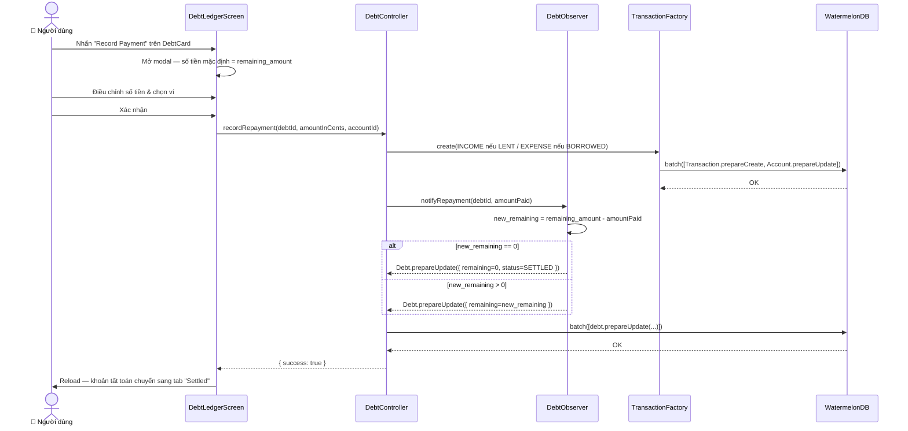
```mermaid
sequenceDiagram
    actor User as 👤 Người dùng
    participant DLS as DebtLedgerScreen
    participant DC as DebtController
    participant DO as DebtObserver
    participant TF as TransactionFactory
    participant DB as WatermelonDB

    User->>DLS: Nhấn "Record Payment" trên DebtCard
    DLS->>DLS: Mở modal — số tiền mặc định = remaining_amount
    User->>DLS: Điều chỉnh số tiền & chọn ví
    User->>DLS: Xác nhận

    DLS->>DC: recordRepayment(debtId, amountInCents, accountId)
    DC->>TF: create(INCOME nếu LENT / EXPENSE nếu BORROWED)
    TF->>DB: batch([Transaction.prepareCreate, Account.prepareUpdate])
    DB-->>TF: OK

    DC->>DO: notifyRepayment(debtId, amountPaid)
    DO->>DO: new_remaining = remaining_amount - amountPaid

    alt new_remaining == 0
        DO-->>DC: Debt.prepareUpdate({ remaining=0, status=SETTLED })
    else new_remaining > 0
        DO-->>DC: Debt.prepareUpdate({ remaining=new_remaining })
    end

    DC->>DB: batch([debt.prepareUpdate(...)])
    DB-->>DC: OK
    DC-->>DLS: { success: true }
    DLS->>User: Reload — khoản tất toán chuyển sang tab "Settled"
```

---

#### UC12 — Cài Đặt Ứng Dụng

| Mục | Nội dung |
|---|---|
| **Độ quan trọng** | 🟢 Hỗ trợ |
| **Tác nhân** | Người dùng |
| **Điều kiện kích hoạt** | Mở tab "Settings" |
| **Chức năng con** | **Giao diện:** Chọn Light / Dark / System. **Tiền tệ:** Tùy chỉnh ký hiệu (tối đa 6 ký tự) và vị trí (tiền tố/hậu tố). **Ngôn ngữ:** EN / VI. **Thời gian:** Chọn ngày đầu tuần (CN/T2); Bật/Tắt đồng bộ giờ mạng (WorldTimeAPI). **Bảo mật:** Bật/Tắt khóa sinh trắc học (yêu cầu xác thực trước khi bật). **Danger Zone:** Xóa toàn bộ dữ liệu (Reset Database) với 2 bước xác nhận. |
| **Hậu điều kiện** | Tất cả thay đổi được lưu vào AsyncStorage qua Zustand persist và áp dụng ngay lập tức. |

**Sơ đồ luồng UC12:**

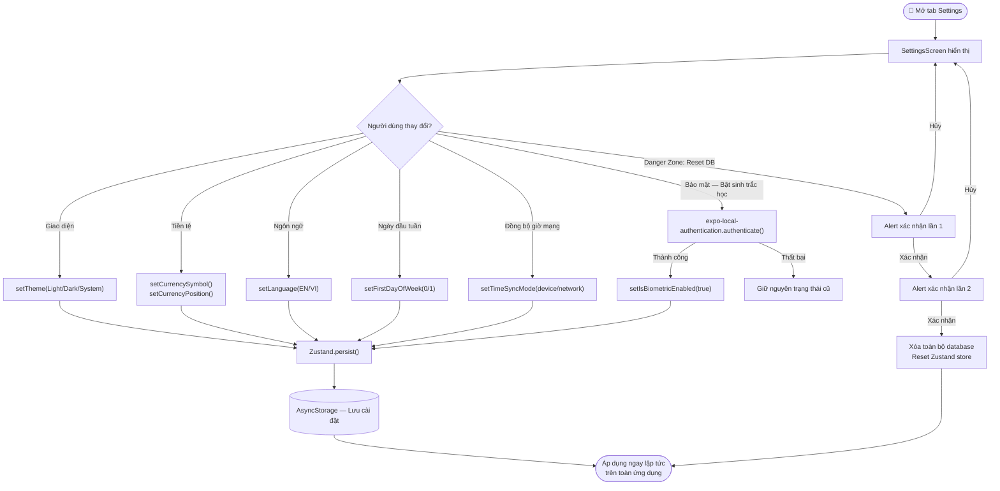
```mermaid
flowchart TD
    A(["👤 Mở tab Settings"]) --> B["SettingsScreen hiển thị"]

    B --> C{"Người dùng thay đổi?"}

    C -->|"Giao diện"| D["setTheme(Light/Dark/System)"]
    C -->|"Tiền tệ"| E["setCurrencySymbol()\nsetCurrencyPosition()"]
    C -->|"Ngôn ngữ"| F["setLanguage(EN/VI)"]
    C -->|"Ngày đầu tuần"| G["setFirstDayOfWeek(0/1)"]
    C -->|"Đồng bộ giờ mạng"| H["setTimeSyncMode(device/network)"]

    C -->|"Bảo mật — Bật sinh trắc học"| I["expo-local-authentication.authenticate()"]
    I -->|"Thành công"| J["setIsBiometricEnabled(true)"]
    I -->|"Thất bại"| K["Giữ nguyên trạng thái cũ"]

    C -->|"Danger Zone: Reset DB"| L["Alert xác nhận lần 1"]
    L -->|"Xác nhận"| M["Alert xác nhận lần 2"]
    M -->|"Xác nhận"| N["Xóa toàn bộ database\nReset Zustand store"]
    M -->|"Hủy"| B
    L -->|"Hủy"| B

    D & E & F & G & H & J --> O["Zustand.persist()"]
    O --> P[("AsyncStorage — Lưu cài đặt")]
    P --> Q(["Áp dụng ngay lập tức\ntrên toàn ứng dụng"])
    N --> Q
```

---

### 3.2. Đặc Tả Module Sử Dụng

Phần này mô tả chi tiết từng module trong ứng dụng theo các tầng kiến trúc: **Màn hình (Screens)**, **Thành phần UI (Components)**, **Điều phối (Controllers)**, **Nghiệp vụ (Patterns)**, **Dịch vụ (Services)**, **Trạng thái (Store)**, **Tiện ích (Utils)** và **Dữ liệu (Database)**.

---

#### 3.2.1. Tầng Màn Hình — `src/screens/`

##### Module: `DashboardScreen`

| Thuộc tính | Nội dung |
|---|---|
| **File** | [`DashboardScreen.tsx`](src/screens/DashboardScreen.tsx) |
| **Loại** | Smart Screen (View chính) |
| **Vai trò** | Màn hình tổng quan tài chính — trung tâm thông tin chính của ứng dụng. Tổng hợp và hiển thị Net Worth, danh sách ví, giao dịch gần đây, và biểu đồ phân tích. |
| **Props / Params** | Không có props (Screen độc lập trong Bottom Tab) |
| **State nội bộ** | `accounts[]`, `transactions[]`, `dailyTrend[]`, `categoryExpenses[]`, `chartTab`, `refreshing`, `selectedTx`, modal visibility flags |
| **Phụ thuộc** | `AccountController`, `TransactionController`, `DebtController`, `ReportFacade`, `TimeService`, `NetWorthCard`, `AddAccountModal`, `AddTransactionModal`, `TransactionHistoryModal`, `TransactionDetailsModal` |
| **Đầu ra / Tác dụng** | Render toàn bộ giao diện Dashboard; Trigger loadData() khi mount và khi pull-to-refresh |
| **Ghi chú** | Gọi `seedDefaultCategories()` tự động khi khởi tạo lần đầu; Lời chào thay đổi mỗi 60 giây theo giờ hệ thống |

---

##### Module: `SmartBudgetScreen`

| Thuộc tính | Nội dung |
|---|---|
| **File** | [`SmartBudgetScreen.tsx`](src/screens/SmartBudgetScreen.tsx) |
| **Loại** | Smart Screen |
| **Vai trò** | Màn hình quản lý ngân sách theo chu kỳ. Cho phép tạo, xem tiến độ và xóa ngân sách. Tích hợp quản lý danh mục. |
| **Props / Params** | Không có props |
| **State nội bộ** | `budgets[]`, `categories[]`, `isModalOpen`, `timeframe`, `anchorDayStr`, `selectedCategoryId`, `isCategoryManagerVisible`, `nameRef (useRef)` |
| **Phụ thuộc** | `BudgetController`, `CategoryManagerModal`, `database` (trực tiếp để query categories) |
| **Đầu ra / Tác dụng** | Render danh sách BudgetCard với thanh tiến độ màu động; Hiển thị modal tạo ngân sách |

---

##### Module: `DebtLedgerScreen`

| Thuộc tính | Nội dung |
|---|---|
| **File** | [`DebtLedgerScreen.tsx`](src/screens/DebtLedgerScreen.tsx) |
| **Loại** | Smart Screen |
| **Vai trò** | Màn hình sổ nợ — quản lý toàn bộ vòng đời khoản nợ ngang hàng (tạo → theo dõi → tất toán). |
| **Props / Params** | Không có props |
| **State nội bộ** | `debts[]`, `accounts[]`, `activeSegment ('OPEN'|'SETTLED')`, modal visibility flags, repayment state |
| **Phụ thuộc** | `DebtController`, `AccountController` |
| **Đầu ra / Tác dụng** | Render DebtCard theo tab Active/Settled; Phát hiện và tô màu đỏ các khoản quá hạn |

---

##### Module: `SettingsScreen`

| Thuộc tính | Nội dung |
|---|---|
| **File** | [`SettingsScreen.tsx`](src/screens/SettingsScreen.tsx) |
| **Loại** | Smart Screen |
| **Vai trò** | Màn hình cấu hình toàn bộ tùy chọn ứng dụng: giao diện, tiền tệ, ngôn ngữ, thời gian, bảo mật và reset DB. |
| **Props / Params** | Không có props |
| **Phụ thuộc** | `useAppStore` (Zustand), `TimeService`, `expo-local-authentication`, `database` |
| **Đầu ra / Tác dụng** | Tất cả thay đổi lưu vào Zustand persist (AsyncStorage) và áp dụng ngay lập tức |

---

##### Module: `OnboardingScreen`

| Thuộc tính | Nội dung |
|---|---|
| **File** | [`OnboardingScreen.tsx`](src/screens/OnboardingScreen.tsx) |
| **Loại** | Full-screen Flow (3 slides) |
| **Vai trò** | Màn hình thiết lập ban đầu — chỉ hiển thị một lần khi `hasCompletedOnboarding == false`. |
| **Props / Params** | Không có props |
| **State nội bộ** | `currentSlide (0|1|2)`, `customSymbol` |
| **Phụ thuộc** | `useAppStore` |
| **Đầu ra / Tác dụng** | Gọi `setHasCompletedOnboarding(true)` khi hoàn tất → App tự chuyển sang Bottom Tab |

---

##### Module: `BiometricLockScreen`

| Thuộc tính | Nội dung |
|---|---|
| **File** | [`BiometricLockScreen.tsx`](src/screens/BiometricLockScreen.tsx) |
| **Loại** | Security Gate Screen |
| **Vai trò** | Màn hình khóa sinh trắc học — gate keeper bảo vệ toàn bộ dữ liệu tài chính. |
| **Props** | `onUnlock: () => void` |
| **Phụ thuộc** | `expo-local-authentication` |
| **Đầu ra / Tác dụng** | Gọi `onUnlock()` sau khi xác thực thành công (Face ID / Touch ID / Passcode) |

---

#### 3.2.2. Tầng Thành Phần UI — `src/components/`

##### Module: `NetWorthCard`

| Thuộc tính | Nội dung |
|---|---|
| **File** | [`NetWorthCard.tsx`](src/components/NetWorthCard.tsx) |
| **Loại** | Presentational Component (Pure UI) |
| **Vai trò** | Thẻ tổng hợp tài sản ròng — trái tim hiển thị của Dashboard. Tính và hiển thị `netWorth = totalAssets - totalLiabilities`. |
| **Props** | `totalAssets: number (cents)`, `totalLiabilities: number (cents)` |
| **Phụ thuộc** | `formatCurrency`, `useAppStore`, `useThemeColors` |
| **Đầu ra** | Render card với SVG Gradient background, hiển thị Net Worth, Tổng Tài sản, Tổng Nợ phải trả |
| **Ghi chú** | Component thuần túy — không có side effect, không gọi DB hay Controller |

---

##### Module: `AddTransactionModal`

| Thuộc tính | Nội dung |
|---|---|
| **File** | [`AddTransactionModal.tsx`](src/components/AddTransactionModal.tsx) |
| **Loại** | Modal Component (Bottom Sheet style) |
| **Vai trò** | Giao diện nhập liệu giao dịch nhanh. Hỗ trợ 3 loại: EXPENSE, INCOME, TRANSFER. |
| **Props** | `visible: boolean`, `onClose: () => void`, `onSuccess: () => void` |
| **State nội bộ** | `type (TransactionType)`, `amount (string)`, `descRef (useRef)`, `selectedAccountId`, `selectedCategoryId`, `accounts[]`, `categories[]`, `loading`, `error` |
| **Phụ thuộc** | `TransactionController`, `database` (truy vấn accounts & categories), `toCents`, `useAppStore` |
| **Validation** | Số tiền > 0 và là số hợp lệ; Phải chọn tài khoản; Phải chọn danh mục (trừ TRANSFER) |
| **Đầu ra / Tác dụng** | Gọi `TransactionController.createTransaction()` → Gọi `onSuccess()` + `onClose()` khi thành công |
| **Ghi chú** | `descRef` là `useRef` (không phải `useState`) để tránh lỗi Telex IME trên iOS |

---

##### Module: `AddAccountModal`

| Thuộc tính | Nội dung |
|---|---|
| **File** | [`AddAccountModal.tsx`](src/components/AddAccountModal.tsx) |
| **Loại** | Modal Component |
| **Vai trò** | Giao diện tạo tài khoản tài chính mới (Ví/Ngân hàng = ASSET; Thẻ tín dụng = LIABILITY). |
| **Props** | `visible: boolean`, `onClose: () => void`, `onSuccess: () => void` |
| **State nội bộ** | `nameRef (useRef)`, `balanceStr (string)`, `accountType (AccountType)` |
| **Phụ thuộc** | `AccountController` |
| **Validation** | Tên không được rỗng; Số dư phải là số hợp lệ ≥ 0; Input tự động lọc ký tự phi số |
| **Đầu ra / Tác dụng** | Gọi `AccountController.createAccount(name, type, balanceInCents)` |

---

##### Module: `TransactionHistoryModal`

| Thuộc tính | Nội dung |
|---|---|
| **File** | [`TransactionHistoryModal.tsx`](src/components/TransactionHistoryModal.tsx) |
| **Loại** | Modal Component (pageSheet style) |
| **Vai trò** | Danh sách toàn bộ lịch sử giao dịch hiệu suất cao, sử dụng `FlashList` để xử lý số lượng lớn records. |
| **Props** | `visible: boolean`, `onClose: () => void` |
| **State nội bộ** | `transactions[]`, `selectedTx (Transaction | null)` |
| **Phụ thuộc** | `TransactionController`, `@shopify/flash-list`, `TransactionDetailsModal` (lồng bên trong) |
| **Đầu ra** | Render danh sách giao dịch có thể nhấn; Nhấn một mục → hiển thị `TransactionDetailsModal` lồng bên trong |
| **Ghi chú** | `TransactionDetailsModal` được render **trong** component này để tránh lỗi iOS multi-modal stack (silent freeze) |

---

##### Module: `TransactionDetailsModal`

| Thuộc tính | Nội dung |
|---|---|
| **File** | [`TransactionDetailsModal.tsx`](src/components/TransactionDetailsModal.tsx) |
| **Loại** | Modal Component (transparent overlay, slide animation) |
| **Vai trò** | Hiển thị đầy đủ chi tiết một giao dịch: số tiền, ghi chú, ngày, tài khoản liên kết, danh mục liên kết. |
| **Props** | `visible: boolean`, `transaction: Transaction | null`, `onClose: () => void` |
| **State nội bộ** | `account (Account | null)`, `category (Category | null)` |
| **Phụ thuộc** | `database.get('accounts').find()`, `database.get('categories').find()`, `formatCurrency` |
| **Đầu ra** | Render modal với banner màu (Đỏ = EXPENSE, Xanh = INCOME), thông tin chi tiết đầy đủ |
| **Ghi chú** | Return `null` nếu `visible == false` hoặc `transaction == null` để tránh render thừa |

---

##### Module: `CategoryManagerModal`

| Thuộc tính | Nội dung |
|---|---|
| **File** | [`CategoryManagerModal.tsx`](src/components/CategoryManagerModal.tsx) |
| **Loại** | Modal Component |
| **Vai trò** | Giao diện CRUD danh mục chi tiêu/thu nhập — thêm mới và xóa mềm (soft delete). |
| **Props** | `visible: boolean`, `onClose: () => void` |
| **State nội bộ** | `categories[]`, `nameRef (useRef)`, `selectedType (CategoryType)`, `selectedColor (string)` |
| **Phụ thuộc** | `CategoryController` |
| **Đầu ra / Tác dụng** | Gọi `CategoryController.createCategory()` hoặc `deleteCategory()` → Reload danh sách |
| **Ghi chú** | Xóa danh mục là soft delete (`is_active = false`); Màu danh mục được chọn từ bảng màu định sẵn |

---

#### 3.2.3. Tầng Điều Phối — `src/controllers/`

##### Module: `AccountController`

| Thuộc tính | Nội dung |
|---|---|
| **File** | [`AccountController.ts`](src/controllers/AccountController.ts) |
| **Vai trò** | Trung gian giữa UI và database cho thực thể Account. Xác thực input và điều phối ghi dữ liệu. |
| **Phương thức chính** | `createAccount(name, type, balanceInCents)` — Tạo tài khoản mới; Tự động tạo giao dịch điều chỉnh nếu balance > 0 |
| | `getActiveAccounts()` — Trả về danh sách tài khoản đang hoạt động (`is_active = true`) |
| | `softDeleteAccount(id)` — Đặt `is_active = false`, không xóa cứng |
| **Kiểu trả về** | `{ success: boolean, data?: T, error?: string }` |

---

##### Module: `TransactionController`

| Thuộc tính | Nội dung |
|---|---|
| **File** | [`TransactionController.ts`](src/controllers/TransactionController.ts) |
| **Vai trò** | Điều phối toàn bộ vòng đời giao dịch. Xác thực input, sau đó ủy quyền cho `TransactionFactory` thực thi. |
| **Phương thức chính** | `createTransaction({ accountId, type, amount, description, date, categoryId?, toAccountId? })` — Gọi `TransactionFactory.create()` |
| | `getTransactions()` — Truy vấn tất cả giao dịch, sắp xếp theo ngày giảm dần |
| | `deleteTransaction(id)` — Xóa giao dịch (hard delete, vì transaction là dữ liệu giao dịch, không phải master data) |
| **Ghi chú** | UI **không bao giờ** gọi `TransactionFactory` trực tiếp; phải qua Controller này |

---

##### Module: `DebtController`

| Thuộc tính | Nội dung |
|---|---|
| **File** | [`DebtController.ts`](src/controllers/DebtController.ts) |
| **Vai trò** | Quản lý vòng đời khoản nợ: tạo mới, ghi thanh toán và tự động tất toán. |
| **Phương thức chính** | `createDebt({ personName, type, totalAmountInCents, dueDate, accountId, linkToAccount })` — Tạo khoản nợ; Nếu `linkToAccount=true` → tạo giao dịch EXPENSE/INCOME tương ứng |
| | `recordRepayment(debtId, amountInCents, accountId)` — Ghi thanh toán qua `DebtObserver`; Nếu `remaining == 0` → set `status = SETTLED` |
| | `getDebts()` — Trả về tất cả khoản nợ |

---

##### Module: `BudgetController`

| Thuộc tính | Nội dung |
|---|---|
| **File** | [`BudgetController.ts`](src/controllers/BudgetController.ts) |
| **Vai trò** | Tạo ngân sách và tính toán tiến độ chi tiêu trong chu kỳ hiện tại. |
| **Phương thức chính** | `createBudget({ name, amountInCents, timeframe, anchorDay, categoryId? })` — Dùng `BudgetStrategyResolver` để tính `startDate`/`endDate` |
| | `getBudgetsProgress()` — Trả về `BudgetProgress[]` gồm `spentAmount`, `remainingAmount`, `progressPercent` |
| | `deleteBudget(id)` — Xóa cứng ngân sách (không phải master data) |
| **Ghi chú** | Lọc giao dịch theo `category_id` nếu ngân sách được gắn với danh mục cụ thể |

---

##### Module: `CategoryController`

| Thuộc tính | Nội dung |
|---|---|
| **File** | [`CategoryController.ts`](src/controllers/CategoryController.ts) |
| **Vai trò** | Quản lý CRUD danh mục chi tiêu/thu nhập với chính sách soft delete. |
| **Phương thức chính** | `createCategory(name, type, color, icon)` — Tạo danh mục mới với `is_active = true` |
| | `getActiveCategories()` — Lấy danh sách danh mục đang hoạt động |
| | `deleteCategory(id)` — Soft delete: đặt `is_active = false` |

---

#### 3.2.4. Tầng Nghiệp Vụ — `src/patterns/`

##### Module: `TransactionFactory` *(Factory Pattern)*

| Thuộc tính | Nội dung |
|---|---|
| **File** | [`TransactionFactory.ts`](src/patterns/TransactionFactory.ts) |
| **Vai trò** | Orchestrator (Nhạc trưởng) — tạo giao dịch và tổng hợp toàn bộ cập nhật liên kết thành một `database.batch()` nguyên tử duy nhất. |
| **Cách hoạt động** | 1. Chuẩn hóa dữ liệu đầu vào (validate amount > 0, type hợp lệ). 2. Tạo record Transaction (`prepareCreate`). 3. Thông báo cho `TransactionSubject` → Các Observer trả về `prepareUpdate[]`. 4. Gom tất cả vào `database.batch([...prepared])`. |
| **Phụ thuộc** | `TransactionSubject`, `AccountObserver`, `DebtObserver` |
| **Ghi chú** | Giải quyết lỗi WatermelonDB "ActionQueue locking" bằng cách thực thi trong một lệnh batch nguyên tử duy nhất |

---

##### Module: `TransactionSubject` + `AccountObserver` + `DebtObserver` *(Observer Pattern)*

| Module | Vai trò |
|---|---|
| **TransactionSubject** | Publisher — Quản lý danh sách observer, phát sự kiện khi có giao dịch mới. Sử dụng **Lazy Initialization** (`getObservers()`) để sống sót qua Expo Fast Refresh. |
| **AccountObserver** | Subscriber — Lắng nghe sự kiện giao dịch, tính toán lại số dư tài khoản (`+amount` cho INCOME, `-amount` cho EXPENSE), trả về `Account.prepareUpdate()`. |
| **DebtObserver** | Subscriber — Lắng nghe sự kiện thanh toán nợ, tính toán `remaining_amount` mới, set `status = SETTLED` nếu về 0, trả về `Debt.prepareUpdate()`. |

---

##### Module: `WeeklyBudgetStrategy` + `MonthlyBudgetStrategy` + `BudgetStrategyResolver` *(Strategy Pattern)*

| Module | Vai trò |
|---|---|
| **BudgetTimeframeStrategy** | Interface định nghĩa phương thức `calculateCycle(anchorDay, refDate): { startDate, endDate }` |
| **WeeklyBudgetStrategy** | Tính chu kỳ 7 ngày bắt đầu từ `anchorDay` (0=CN, 1=T2...6=T7) chứa `refDate` |
| **MonthlyBudgetStrategy** | Tính chu kỳ tháng từ `anchorDay` của tháng này/trước đến `anchorDay-1` của tháng sau. Tự động **clamp** anchor về ngày cuối tháng cho tháng ngắn |
| **BudgetStrategyResolver** | Factory nhỏ — chọn đúng Strategy dựa trên `BudgetTimeframe` enum rồi gọi `calculate()` |

---

##### Module: `ReportFacade` *(Facade Pattern)*

| Thuộc tính | Nội dung |
|---|---|
| **File** | [`ReportFacade.ts`](src/patterns/ReportFacade.ts) |
| **Vai trò** | Facade đơn giản hóa việc truy vấn phức tạp để vẽ biểu đồ — ẩn hoàn toàn logic SQL và vòng lặp xử lý khỏi DashboardScreen. |
| **Phương thức chính** | `getExpensesByCategory(startTs, endTs): CategoryExpenseReportItem[]` — Nhóm chi tiêu theo danh mục trong khoảng thời gian → Dữ liệu Pie Chart |
| | `getDailyExpenseTrend(days): DailyExpenseReportItem[]` — Tổng chi tiêu theo ngày trong N ngày gần nhất → Dữ liệu Bar Chart |
| **Phụ thuộc** | `database` (truy vấn transactions + categories) |

---

#### 3.2.5. Tầng Dịch Vụ — `src/services/`

##### Module: `TimeService`

| Thuộc tính | Nội dung |
|---|---|
| **File** | [`TimeService.ts`](src/services/TimeService.ts) |
| **Vai trò** | Cung cấp giờ đáng tin cậy cho toàn bộ hệ thống — có thể dùng giờ thiết bị hoặc đồng bộ từ WorldTimeAPI. |
| **Phương thức chính** | `init()` — Khởi tạo, đọc `timeSyncMode` từ AsyncStorage, nếu `'network'` thì fetch giờ từ WorldTimeAPI |
| | `getNow(): Date` — Trả về thời điểm hiện tại (đã bù offset nếu đang dùng network time) |
| **Phụ thuộc** | `AsyncStorage` (đọc `timeSyncMode`), WorldTimeAPI (HTTP fetch) |
| **Ghi chú** | Được dùng bởi: DashboardScreen (lời chào), WeeklyBudgetStrategy, MonthlyBudgetStrategy, ReportFacade |

---

#### 3.2.6. Tầng Trạng Thái Toàn Cục — `src/store/`

##### Module: `appStore` (Zustand)

| Thuộc tính | Nội dung |
|---|---|
| **File** | [`appStore.ts`](src/store/appStore.ts) |
| **Vai trò** | Quản lý toàn bộ cài đặt ứng dụng theo cơ chế Zustand + AsyncStorage persist. |
| **State fields** | `theme: 'light'|'dark'|'system'`, `currencySymbol: string`, `currencyPosition: 'prefix'|'suffix'`, `language: 'en'|'vi'`, `hasCompletedOnboarding: boolean`, `isBiometricEnabled: boolean`, `firstDayOfWeek: 0|1`, `timeSyncMode: 'device'|'network'`, `networkTimezone: string` |
| **Actions** | `setTheme`, `setCurrencySymbol`, `setCurrencyPosition`, `setLanguage`, `setHasCompletedOnboarding`, `setIsBiometricEnabled`, `setFirstDayOfWeek`, `setTimeSyncMode` |
| **Lưu trữ** | Tất cả state được persist vào **AsyncStorage** qua Zustand middleware; khôi phục tự động khi khởi động lại ứng dụng |
| **Ghi chú** | Chỉ dành cho metadata ứng dụng. **Không** lưu dữ liệu tài chính tại đây |

---

#### 3.2.7. Tầng Tiện Ích — `src/utils/`

| Module | File | Vai trò |
|---|---|---|
| **currencyFormatter** | `currencyFormatter.ts` | `toCents(float): int` — Chuyển số thực thành cents (nhân 100, làm tròn); `fromCents(int): float` — Chuyển ngược; `formatCurrency(cents, symbol, position): string` — Định dạng hiển thị với dấu phẩy ngàn |
| **dateHelpers** | `dateHelpers.ts` | `toTimestamp(Date): number` — Chuyển Date thành Unix timestamp (giây); `fromTimestamp(number): Date` — Chuyển ngược |
| **theme** | `theme.ts` | `useThemeColors()` — React Hook trả về bộ màu semantic tokens theo theme hiện tại (light/dark/system) |
| **i18n** | `i18n.ts` | `useTranslation()` — React Hook trả về hàm `t(key)` để tra cứu chuỗi theo ngôn ngữ (`language` từ Zustand) |
| **seedCategories** | `seedCategories.ts` | `seedDefaultCategories()` — Tạo sẵn bộ danh mục mặc định (Food, Transport, Salary...) nếu chưa có trong DB |

---

#### 3.2.8. Tầng Dữ Liệu — `src/database/`

| Module | File | Vai trò |
|---|---|---|
| **Database Init** | `index.ts` | Khởi tạo instance WatermelonDB với SQLite adapter; Export singleton `database` dùng toàn ứng dụng |
| **Schema** | `schema.ts` (v2) | Định nghĩa cấu trúc 5 bảng: `accounts`, `transactions`, `debts`, `budgets`, `categories` |
| **Migrations** | `migrations.ts` | Script nâng cấp schema từ v1 lên v2 (thêm `category_id` vào bảng `budgets`) mà không mất dữ liệu |
| **Account** | `models/Account.ts` | WatermelonDB Model — `@field name`, `@field account_type`, `@field current_balance`, `@field is_active` |
| **Transaction** | `models/Transaction.ts` | WatermelonDB Model — `@field account_id`, `@field type`, `@field amount`, `@field description`, `@field date`, `@field category_id`, `@field to_account_id` |
| **Debt** | `models/Debt.ts` | WatermelonDB Model — `@field person_name`, `@field type`, `@field total_amount`, `@field remaining_amount`, `@field due_date`, `@field status` |
| **Budget** | `models/Budget.ts` | WatermelonDB Model — `@field name`, `@field category_id`, `@field amount`, `@field timeframe`, `@field anchor_day`, `@field start_date`, `@field end_date` |
| **Category** | `models/Category.ts` | WatermelonDB Model — `@field name`, `@field type`, `@field color`, `@field icon`, `@field is_active` |

> [!NOTE]
> Tất cả các trường tiền tệ (`current_balance`, `amount`, `total_amount`, `remaining_amount`) đều được khai báo kiểu `number` nhưng **thực tế chỉ lưu số nguyên (cents)**. Quy tắc này được thực thi bởi Controllers và TransactionFactory, không phải bởi schema.

---

## 4. YÊU CẦU PHI CHỨC NĂNG

### 4.1. Hiệu Năng

| Yêu cầu | Mức mục tiêu |
|---|---|
| **Tốc độ nhập giao dịch** | Người dùng có thể ghi một giao dịch trong **dưới 3 giây** kể từ lần nhấn đầu tiên |
| **Tốc độ render danh sách** | Sử dụng `@shopify/flash-list` để render danh sách giao dịch lớn mà **không block UI thread** |
| **Tốc độ animation** | Tất cả animation đạt **60fps** nhờ `react-native-reanimated` chạy trên native UI thread |
| **Thời gian khởi động** | Ứng dụng khởi động nhanh — Theme và Currency được load từ AsyncStorage ngay trước khi render, không có hiện tượng "flash" giao diện sai |

### 4.2. Độ Chính Xác Tài Chính

| Yêu cầu | Giải pháp |
|---|---|
| **Không có sai số làm tròn** | Tất cả giá trị tiền tệ lưu dưới dạng **số nguyên (cents)** trong SQLite. Ví dụ: `$10.50` → lưu `1050` |
| **Tính toán Net Worth** | `netWorth = Σ(account.current_balance where type=ASSET) - Σ(account.current_balance where type=LIABILITY)` — Không bao giờ tính trực tiếp từ danh sách giao dịch |
| **Nhất quán kép** | Mọi mutation dữ liệu đều thực thi trong một `database.batch()` nguyên tử duy nhất — hoặc tất cả thành công, hoặc toàn bộ rollback |

### 4.3. Bảo Mật & Quyền Riêng Tư

| Yêu cầu | Mô tả |
|---|---|
| **Offline-first** | Toàn bộ dữ liệu lưu cục bộ trên thiết bị. Không có backend, không có cloud sync, không có tài khoản người dùng |
| **Biometric Lock** | Hỗ trợ Face ID / Touch ID / Passcode qua `expo-local-authentication`. Xác thực trước khi enable; yêu cầu unlock mỗi lần khởi động ứng dụng |
| **Soft Delete** | Tài khoản và danh mục không bao giờ bị xóa cứng. `is_active = false` để bảo toàn lịch sử tài chính và tính toán Net Worth chính xác |
| **Zero-login** | Không yêu cầu đăng ký hay đăng nhập, loại bỏ hoàn toàn ma sát onboarding |

### 4.4. Khả Năng Sử Dụng (Usability)

| Yêu cầu | Mô tả |
|---|---|
| **Đa ngôn ngữ** | Hỗ trợ Tiếng Anh (EN) và Tiếng Việt (VI) thông qua hệ thống i18n tùy chỉnh |
| **Đa giao diện** | Hỗ trợ Light Mode, Dark Mode và System Default (tự động theo hệ điều hành) |
| **Tùy chỉnh tiền tệ** | Ký hiệu tiền tệ tùy chỉnh (VNĐ, đ, $, €...) và vị trí linh hoạt (tiền tố/hậu tố) |
| **Lời chào động** | Thay đổi theo giờ trong ngày (Sáng/Chiều/Tối/Đêm) để tăng tính cá nhân hóa |
| **Input tiếng Việt** | Sử dụng `uncontrolled TextInput` với `useRef` để tránh lỗi "Nuốt chữ" của bộ gõ Telex trên iOS |

### 4.5. Độ Tin Cậy & Tính Toàn Vẹn Dữ Liệu

| Yêu cầu | Mô tả |
|---|---|
| **Atomic Operations** | Observer Pattern trả về `prepareUpdate()` thay vì ghi trực tiếp; TransactionFactory gom thành một `batch()` duy nhất để tránh ActionQueue locking |
| **Thời gian đồng bộ** | Hỗ trợ đồng bộ giờ qua WorldTimeAPI để tránh sai lệch do người dùng chỉnh sai giờ thiết bị; TimeService sử dụng **Lazy Initialization** để sống sót qua Fast Refresh |
| **Xử lý tháng ngắn** | Ngân sách tháng với anchor day 31 tự động clamp về ngày cuối tháng thực tế (28/29/30 tùy năm) |

### 4.6. Khả Năng Bảo Trì & Mở Rộng

| Yêu cầu | Mô tả |
|---|---|
| **Kiến trúc MVC + 4 Patterns** | Factory, Observer, Strategy, Facade — đảm bảo tách bạch hoàn toàn Business Logic khỏi UI |
| **TypeScript Strict Mode** | `strict: true` trong tsconfig; Không sử dụng `any`; Enum cho tất cả hằng số phân loại |
| **Database Migration** | WatermelonDB schema có cơ chế migration (`migrations.ts`) để nâng cấp cấu trúc DB mà không mất dữ liệu người dùng |
| **Tách biệt lưu trữ** | SQLite (WatermelonDB) cho dữ liệu tài chính; AsyncStorage (Zustand persist) chỉ cho cài đặt ứng dụng |

---

## 5. KIỂM THỬ VÀ KẾT QUẢ

## 5. KIỂM THỬ VÀ KẾT QUẢ

### 5.1. Mục tiêu kiểm thử
**Kiểm thử nhằm xác nhận chức năng nào?**
- Xác nhận tính chính xác của các quy tắc định dạng tiền tệ (chuyển đổi cents/float không bị sai số).
- Xác nhận logic tính toán chu kỳ ngân sách phức tạp (tuần, tháng, năm nhuận, tháng thiếu ngày).
- Xác nhận các thao tác tạo, sửa, hiển thị trên giao diện người dùng (Thêm giao dịch, Quản lý tài khoản/danh mục).

**Kiểm thử tập trung vào layer nào?**
- Phần lớn test tập trung vào **Domain/Service Layer** (các lớp xử lý logic nghiệp vụ và Pattern) và một phần ở **UI/Component Layer**.

**Vì sao phần lớn test nên nằm ở domain/service layer?**
- Domain/Service layer chứa các quy tắc nghiệp vụ cốt lõi của ứng dụng. Bằng cách viết unit test ở đây, ta có thể chạy test cực kỳ nhanh, cô lập hoàn toàn khỏi môi trường UI (không cần render DOM/Native views), và đảm bảo rằng dù UI có thay đổi thì logic kinh doanh cốt lõi vẫn chính xác.

**Những phần nào chưa kiểm thử được và lý do?**
- **E2E Test toàn luồng:** Chưa thực hiện tự động hóa test end-to-end (từ lúc mở app đến khi hoàn thành một quy trình dài) do hạn chế về thời gian thiết lập CI/CD với thiết bị thật/emulator trên Playwright/Detox. Hiện tại phần này đang được test thủ công.
- **Integration Test với Database:** Các test hiện tại mock WatermelonDB để chạy nhanh. Test tích hợp ghi DB thực tế chưa cấu hình tự động.

### 5.2. Công cụ kiểm thử

| Loại kiểm thử | Công cụ | Lệnh chạy | Ghi chú |
|---|---|---|---|
| Unit test | Jest, React Native Testing Library | `npm test` | Mock WatermelonDB & AsyncStorage |
| Integration test | - | - | |
| Coverage | Jest Coverage | `npm run test -- --coverage` | |
| UI/E2E test | Detox / Appium | - | Dự kiến tích hợp trong tương lai |

### 5.3. Danh sách test case

Tổng số 23 test case, phần lớn nằm ở tầng Domain/Service.

| TC ID | Tên test case | Layer | Hàm/lớp được test | Dữ liệu vào | Kết quả mong đợi | Người phụ trách | Trạng thái |
|---|---|---|---|---|---|---|---|
| TC01 | Convert float to cents | Domain/Utility | `currencyFormatter.toCents` | `10.50`, `0.99`, `100` | `1050`, `99`, `10000` | | Pass |
| TC02 | Eliminate precision issues | Domain/Utility | `currencyFormatter.toCents` | `0.1 + 0.2` | `30` (không phải `30.0...04`) | | Pass |
| TC03 | Handle zero correctly | Domain/Utility | `currencyFormatter.toCents` | `0` | `0` | | Pass |
| TC04 | Convert cents to float | Domain/Utility | `currencyFormatter.fromCents` | `1050`, `99` | `10.50`, `0.99` | | Pass |
| TC05 | Format with prefix | Domain/Utility | `currencyFormatter.formatCurrency` | `100000`, `'$'`, `'prefix'` | `'$1,000.00'` | | Pass |
| TC06 | Format with suffix | Domain/Utility | `currencyFormatter.formatCurrency` | `1050`, `'VNĐ'`, `'suffix'` | `'10.50 VNĐ'` | | Pass |
| TC07 | Handle negative cents | Domain/Utility | `currencyFormatter.formatCurrency` | `-1050`, `'$'`, `'prefix'` | `'-$10.50'` | | Pass |
| TC08 | Weekly: cycle starts Monday | Domain/Pattern | `WeeklyBudgetStrategy.calculateCycle` | Ref: Tue 02/06, Anchor: 1 | Start: 01/06, End: 07/06 | | Pass |
| TC09 | Weekly: cycle starts Wednesday | Domain/Pattern | `WeeklyBudgetStrategy.calculateCycle` | Ref: Tue 02/06, Anchor: 3 | Start: 27/05, End: 02/06 | | Pass |
| TC10 | Monthly: prev month if ref < anchor | Domain/Pattern | `MonthlyBudgetStrategy.calculateCycle` | Ref: 02/06, Anchor: 5 | Start: 05/05, End: 04/06 | | Pass |
| TC11 | Monthly: current month if ref >= anchor| Domain/Pattern | `MonthlyBudgetStrategy.calculateCycle` | Ref: 06/06, Anchor: 5 | Start: 05/06, End: 04/07 | | Pass |
| TC12 | Monthly: clamp non-leap Feb | Domain/Pattern | `MonthlyBudgetStrategy.calculateCycle` | Ref: 02/03/2026, Anchor: 31 | Start: 28/02, End: 30/03 | | Pass |
| TC13 | Monthly: clamp leap Feb | Domain/Pattern | `MonthlyBudgetStrategy.calculateCycle` | Ref: 02/03/2028, Anchor: 31 | Start: 29/02, End: 30/03 | | Pass |
| TC14 | Add Wallet Account | UI/Component | `AddAccountModal` | Name: "Ví", Type: ASSET | Gọi `createAccount` | | Pass |
| TC15 | Add Credit Card Account | UI/Component | `AddAccountModal` | Name: "Thẻ", Type: LIABILITY | Gọi `createAccount` | | Pass |
| TC16 | Filter Account Balance text | UI/Component | `AddAccountModal` | Input: `'100abc.50xyz'` | Value lọc thành `'100.50'` | | Pass |
| TC17 | Add Category | UI/Component | `CategoryManagerModal` | Name, Type, Icon, Color | Gọi `createCategory` | | Pass |
| TC18 | Delete Category | UI/Component | `CategoryManagerModal` | Bấm nút Xóa ở id '1' | Thực thi lệnh Xóa | | Pass |
| TC19 | Render NetWorth | UI/Component | `NetWorthCard` | Assets: 1M, Liab: 200k | Render UI hiển thị 800k | | Pass |
| TC20 | Add Expense Transaction | UI/Component | `AddTransactionModal` | `150.50`, Expense, "Lunch" | Gọi `createTransaction` | | Pass |
| TC21 | Add Income Transaction | UI/Component | `AddTransactionModal` | `2000`, Income | Gọi `createTransaction` | | Pass |
| TC22 | Render Tx Details | UI/Component | `TransactionDetailsModal` | Tx ID tx1 | Hiển thị chi tiết "Mua sắm" | | Pass |
| TC23 | Render Tx History | UI/Component | `TransactionHistoryModal` | Danh sách 1 giao dịch | Render List Item | | Pass |

### 5.4. Cấu trúc thư mục test

```
tests/
  patterns/
    budgetStrategies.spec.ts
  utils/
    currencyFormatter.spec.ts
  components/
    AccountsAndCategories.spec.tsx
    Transactions.spec.tsx
```

### 5.5. Minh chứng kết quả chạy test

*Ghi chú: Đính kèm ảnh chụp màn hình terminal (IDE) hiển thị thông báo PASS xanh lá tại đây.*

- **Tổng số test:** 23
- **Số test pass/fail:** 23 Pass / 0 Fail
- **Lệnh chạy test:** `npm test` hoặc `npx jest`
- **Thời điểm chạy test:** [Thời điểm lúc tổng hợp báo cáo]
- **Đường dẫn file test:** Nằm trong thư mục `tests/` tại root project.

### 5.6. Coverage

Chạy lệnh `npm run test -- --coverage` để xuất kết quả độ phủ code. Dưới đây là bảng tổng hợp coverage cho toàn bộ dự án từ Jest.

| Chỉ số | Kết quả |
|---|---|
| Statement coverage | 50.14% |
| Branch coverage | 38.31% |
| Function/method coverage | 43.30% |
| Line coverage | 50.32% |

*(Đính kèm ảnh chụp màn hình bảng kết quả HTML coverage của Jest tại đây)*


## 6. THIẾT KẾ LỚP / MODULE VÀ MINH CHỨNG SOLID

### 6.1. Biểu Đồ Lớp Trích Đoạn

Biểu đồ dưới đây tập trung vào **nhóm lớp xử lý giao dịch** — phần phức tạp và quan trọng nhất của hệ thống, nơi 4 design patterns hội tụ để đảm bảo tính toán tài chính không bao giờ sai lệch.

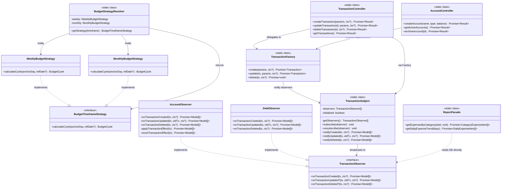
```mermaid
classDiagram
    %% ─── INTERFACE ───────────────────────────────────────────────
    class TransactionObserver {
        <<interface>>
        +onTransactionCreated(tx, ctx?) Promise~Model[]~
        +onTransactionUpdated?(tx, oldTx, ctx?) Promise~Model[]~
        +onTransactionDeleted?(tx, ctx?) Promise~Model[]~
    }

    class BudgetTimeframeStrategy {
        <<interface>>
        +calculateCycle(anchorDay, refDate?) BudgetCycle
    }

    %% ─── DOMAIN LAYER ────────────────────────────────────────────
    class TransactionFactory {
        <<static class>>
        +create(params, ctx?) Promise~Transaction~
        +update(tx, params, ctx?) Promise~Transaction~
        +delete(tx, ctx?) Promise~void~
    }

    class TransactionSubject {
        <<static class>>
        -observers: TransactionObserver[]
        -initialized: boolean
        -getObservers() TransactionObserver[]
        +subscribe(observer) void
        +unsubscribe(observer) void
        +notifyCreated(tx, ctx?) Promise~Model[]~
        +notifyUpdated(tx, oldTx, ctx?) Promise~Model[]~
        +notifyDeleted(tx, ctx?) Promise~Model[]~
    }

    class AccountObserver {
        +onTransactionCreated(tx, ctx?) Promise~Model[]~
        +onTransactionUpdated(tx, oldTx, ctx?) Promise~Model[]~
        +onTransactionDeleted(tx, ctx?) Promise~Model[]~
        -applyTransactionEffect(tx) Promise~Model[]~
        -revertTransactionEffect(tx) Promise~Model[]~
    }

    class DebtObserver {
        +onTransactionCreated(tx, ctx?) Promise~Model[]~
        +onTransactionUpdated(tx, oldTx, ctx?) Promise~Model[]~
        +onTransactionDeleted(tx, ctx?) Promise~Model[]~
    }

    class WeeklyBudgetStrategy {
        +calculateCycle(anchorDay, refDate?) BudgetCycle
    }

    class MonthlyBudgetStrategy {
        +calculateCycle(anchorDay, refDate?) BudgetCycle
    }

    class BudgetStrategyResolver {
        <<static class>>
        -weekly: WeeklyBudgetStrategy
        -monthly: MonthlyBudgetStrategy
        +getStrategy(timeframe) BudgetTimeframeStrategy
    }

    class ReportFacade {
        <<static class>>
        +getExpensesByCategory(start, end) Promise~CategoryExpenseItem[]~
        +getDailyExpenseTrend(days) Promise~DailyExpenseItem[]~
    }

    %% ─── APPLICATION LAYER ───────────────────────────────────────
    class TransactionController {
        <<static class>>
        +createTransaction(params, ctx?) Promise~Result~
        +updateTransaction(id, params, ctx?) Promise~Result~
        +deleteTransaction(id, ctx?) Promise~Result~
        +getTransactions() Promise~Result~
    }

    class AccountController {
        <<static class>>
        +createAccount(name, type, balance) Promise~Result~
        +getActiveAccounts() Promise~Result~
        +archiveAccount(id) Promise~Result~
    }

    %% ─── RELATIONSHIPS ───────────────────────────────────────────
    AccountObserver ..|> TransactionObserver : implements
    DebtObserver ..|> TransactionObserver : implements
    WeeklyBudgetStrategy ..|> BudgetTimeframeStrategy : implements
    MonthlyBudgetStrategy ..|> BudgetTimeframeStrategy : implements

    TransactionFactory --> TransactionSubject : notify observers
    TransactionSubject --> TransactionObserver : broadcasts to
    BudgetStrategyResolver --> BudgetTimeframeStrategy : returns
    BudgetStrategyResolver --> WeeklyBudgetStrategy : holds
    BudgetStrategyResolver --> MonthlyBudgetStrategy : holds

    TransactionController --> TransactionFactory : delegates to
    TransactionController --> TransactionSubject : via Factory
    AccountController --> TransactionFactory : creates adjustment tx

    ReportFacade ..> TransactionObserver : reads DB directly
```

---

### 6.2. Minh Chứng SRP — Single Responsibility Principle

> **Định nghĩa:** Mỗi lớp/module chỉ nên có **một lý do duy nhất để thay đổi** — tức là chỉ chịu trách nhiệm về một nhóm hành vi cụ thể.

| Lớp / Module | Trách nhiệm chính | Trách nhiệm đã tách ra lớp/module khác | Vì sao thể hiện SRP? |
|---|---|---|---|
| **`TransactionController`** | Nhận input từ UI, validation (amount > 0, accountId hợp lệ, transfer không trùng tài khoản), trả về `{ success, data, error }` | Không tự tạo transaction hay cập nhật số dư — ủy quyền hoàn toàn cho `TransactionFactory` | Nếu quy tắc validation thay đổi → chỉ sửa Controller. Nếu cách lưu DB thay đổi → chỉ sửa Factory. Hai lý do thay đổi ở hai lớp riêng biệt |
| **`TransactionFactory`** | Orchestrate toàn bộ quá trình ghi: chuẩn bị record, thu thập `prepareUpdate[]` từ Observers, thực thi một `database.batch()` nguyên tử | Không biết validation rules; không biết UI nào gọi; không tự tính số dư — giao cho `TransactionSubject` và Observers | Lý do duy nhất để sửa Factory: thay đổi cơ chế atomic write của WatermelonDB |
| **`AccountObserver`** | Tính toán ảnh hưởng của một giao dịch lên số dư tài khoản (apply/revert theo loại INCOME/EXPENSE/TRANSFER và AccountType) | Không quyết định giao dịch nào được tạo; không gọi `database.batch()` trực tiếp — chỉ trả về `Model[]` | Lý do duy nhất để sửa: thay đổi công thức tính số dư tài khoản |
| **`DebtObserver`** | Tính toán ảnh hưởng của thanh toán lên `remaining_amount` của khoản nợ và auto-SETTLE | Không quan tâm đến số dư ví — đó là việc của `AccountObserver` | Tách biệt hoàn toàn: hai observer xử lý hai thực thể khác nhau, không can thiệp nhau |
| **`BudgetStrategyResolver`** | Chọn đúng class chiến lược dựa trên enum `BudgetTimeframe` | Không chứa công thức tính ngày; không biết ngày đầu tuần là gì — đó là việc của từng Strategy | Lý do duy nhất để sửa: thêm một loại timeframe mới vào enum |
| **`ReportFacade`** | Tổng hợp và nhóm dữ liệu giao dịch thành format vẽ biểu đồ (Pie Chart, Bar Chart) | Không render UI; không lưu dữ liệu; không validation | DashboardScreen không cần biết SQL hay vòng lặp — Facade gói gọn trách nhiệm tổng hợp báo cáo |
| **`currencyFormatter`** | Chuyển đổi số thực ↔ cents (`toCents`, `fromCents`) và định dạng hiển thị (`formatCurrency`) | Không gọi DB; không đọc store Zustand; không render bất kỳ thứ gì | Pure functions không có side effect — lý do thay đổi duy nhất: thay đổi quy tắc định dạng tiền tệ |

---

### 6.3. Minh Chứng OCP — Open/Closed Principle

> **Định nghĩa:** Phần mềm nên **mở để mở rộng** (thêm hành vi mới) nhưng **đóng để sửa đổi** (không cần sửa code đang ổn định).

| Điểm mở rộng | Interface / Abstract liên quan | Cách thêm chức năng mới | File / Lớp minh chứng |
|---|---|---|---|
| **Thêm loại Observer mới** (ví dụ: gửi push notification khi chi tiêu vượt ngân sách) | `TransactionObserver` interface với 3 method `onCreate/Update/Delete` | Tạo `BudgetAlertObserver.ts` implement `TransactionObserver` → gọi `TransactionSubject.subscribe(new BudgetAlertObserver())` — không sửa Factory hay Subject | `src/patterns/TransactionObserver.ts`, `TransactionSubject.ts` |
| **Thêm chu kỳ ngân sách mới** (Quý / Năm) | `BudgetTimeframeStrategy` interface với method `calculateCycle(anchorDay, refDate?)` | Tạo `QuarterlyBudgetStrategy.ts` implement interface → đăng ký vào `BudgetStrategyResolver.getStrategy()` — `BudgetController` không cần sửa | `src/patterns/BudgetTimeframeStrategy.ts`, `BudgetStrategyResolver.ts` |
| **Thêm loại báo cáo mới** (ví dụ: trend tuần, phân tích theo nhãn) | `ReportFacade` là facade class với static methods | Thêm method mới vào `ReportFacade` — DashboardScreen gọi thêm 1 dòng, các method cũ không thay đổi | `src/patterns/ReportFacade.ts` |
| **Thêm loại tài khoản mới** (Tiết kiệm, Crypto) | `AccountType` enum + `AccountObserver` phân nhánh theo type | Mở rộng enum `AccountType`, thêm nhánh `if` vào `applyTransactionEffect` — Controller và Factory không thay đổi | `src/patterns/AccountObserver.ts`, `src/types/index.ts` |

**Ví dụ cụ thể — Strategy Pattern:**

Khi cần thêm chu kỳ ngân sách **Quý (Quarterly)**, nhóm chỉ cần:
```
// Tạo file mới — không sửa bất kỳ file hiện có nào
class QuarterlyBudgetStrategy implements BudgetTimeframeStrategy {
  calculateCycle(anchorDay: number, referenceDate?: Date): BudgetCycle { ... }
}

// Chỉ thêm 1 nhánh vào Resolver
static getStrategy(timeframe: BudgetTimeframe): BudgetTimeframeStrategy {
  if (timeframe === BudgetTimeframe.QUARTERLY) return this.quarterly  // ← thêm
  if (timeframe === BudgetTimeframe.WEEKLY) return this.weekly
  return this.monthly
}
```
`BudgetController`, `SmartBudgetScreen`, và tất cả test cũ **không cần sửa**.

---

### 6.4. Minh Chứng DIP — Dependency Inversion Principle

> **Định nghĩa:** Module cấp cao không phụ thuộc trực tiếp vào module cấp thấp. Cả hai phụ thuộc vào **abstraction (interface)**. Điều này cho phép swap implementation mà không phá vỡ module cấp cao.

| Module cấp cao | Abstraction phụ thuộc | Module triển khai cụ thể | Cách inject / khởi tạo | Lợi ích |
|---|---|---|---|---|
| **`TransactionSubject`** | `TransactionObserver` interface | `AccountObserver`, `DebtObserver` | Lazy Init trong `getObservers()` — tạo `[new AccountObserver(), new DebtObserver()]` | Có thể thêm/bỏ Observer mà không sửa Subject; khi test có thể inject `MockObserver` |
| **`TransactionFactory`** | `TransactionSubject` (thông qua static interface) | Toàn bộ Observer chain | Factory gọi `TransactionSubject.notifyCreated()` — không biết Observer nào đang lắng nghe | Factory không phụ thuộc vào `AccountObserver` hay `DebtObserver` trực tiếp |
| **`BudgetController`** | `BudgetTimeframeStrategy` interface | `WeeklyBudgetStrategy` / `MonthlyBudgetStrategy` | Gọi `BudgetStrategyResolver.getStrategy(timeframe)` trả về interface — không new trực tiếp | Khi test `BudgetController`, có thể inject `MockBudgetStrategy` để test logic mà không cần tính toán ngày thật |
| **`TransactionController`** | `TransactionFactory` (static class) | `WatermelonDB` (ẩn bên trong Factory) | Controller gọi `TransactionFactory.create()` — không biết DB nào ở dưới | Nếu sau này đổi ORM từ WatermelonDB sang SQLite thuần, chỉ sửa Factory — Controller không thay đổi |
| **`AccountController`** | `TransactionFactory` (static class) | `WatermelonDB` + `AccountObserver` chain | `AccountController.createAccount()` gọi `TransactionFactory.create()` cho adjustment transaction | AccountController không trực tiếp biết `AccountObserver` tồn tại — chỉ biết Factory |

**Minh chứng bằng code — TransactionSubject không phụ thuộc concrete Observer:**

```typescript
// TransactionSubject chỉ biết interface — không import AccountObserver/DebtObserver trực tiếp trong notify
static async notifyCreated(tx: Transaction, ctx?: TransactionContext): Promise<Model[]> {
  const results = await Promise.all(
    this.getObservers().map(
      (observer: TransactionObserver) =>  // ← typed as interface, not concrete class
        observer.onTransactionCreated(tx, ctx)
    )
  )
  return results.flat()
}
```

**Lợi ích khi kiểm thử:** Trong các test của `AddTransactionModal`, nhóm mock hoàn toàn `TransactionController` mà không cần WatermelonDB thật:
```typescript
// tests/components/Transactions.spec.tsx
jest.mock('../../src/controllers/TransactionController')
// → UI test chạy mà không cần DB, không cần Observer, không cần Factory thật
```

---

### 6.5. Các Nguyên Tắc SOLID Khác

| Nguyên tắc | Minh chứng trong dự án | File / Lớp liên quan |
|---|---|---|
| **LSP — Liskov Substitution Principle** | `WeeklyBudgetStrategy` và `MonthlyBudgetStrategy` đều implement `BudgetTimeframeStrategy`. `BudgetController` sử dụng biến kiểu `BudgetTimeframeStrategy` — có thể swap bất kỳ implementation nào mà code gọi vẫn hoạt động đúng, không cần biết đang dùng Weekly hay Monthly. Tương tự, `AccountObserver` và `DebtObserver` đều có thể được đặt vào `TransactionObserver[]` và `TransactionSubject` gọi mà không cần kiểm tra kiểu thực. | `src/patterns/BudgetTimeframeStrategy.ts`, `WeeklyBudgetStrategy.ts`, `MonthlyBudgetStrategy.ts`, `TransactionObserver.ts` |
| **ISP — Interface Segregation Principle** | `TransactionObserver` interface khai báo `onTransactionCreated` là bắt buộc, còn `onTransactionUpdated?` và `onTransactionDeleted?` là **tuỳ chọn** (dấu `?`). `DebtObserver` chỉ implement 3 method liên quan đến nợ — không bị ép implement các method không cần thiết. `TransactionSubject` kiểm tra `observer.onTransactionUpdated ?` trước khi gọi, đảm bảo không có class nào phải implement method trống để thỏa mãn interface. | `src/patterns/TransactionObserver.ts`, `DebtObserver.ts`, `AccountObserver.ts`, `TransactionSubject.ts` |

**Chi tiết ISP — Interface được thiết kế tối giản:**

```typescript
// TransactionObserver.ts — Interface nhỏ, method tuỳ chọn tránh "fat interface"
export interface TransactionObserver {
  onTransactionCreated(tx: Transaction, ctx?: TransactionContext): Promise<Model[]>   // bắt buộc
  onTransactionUpdated?(tx, oldTx, ctx?): Promise<Model[]>    // tuỳ chọn — dấu ?
  onTransactionDeleted?(tx, ctx?): Promise<Model[]>           // tuỳ chọn — dấu ?
}

// TransactionSubject.ts — Kiểm tra trước khi gọi method tuỳ chọn
observer.onTransactionUpdated
  ? observer.onTransactionUpdated(tx, oldTx, ctx)
  : Promise.resolve([])   // không ép implement — tránh vi phạm ISP
```

---

## 7. DESIGN PATTERN

### 7.1. Tổng Hợp Pattern Đã Dùng

| STT | Pattern | Nhóm | Vị trí trong dự án | Vấn đề cần giải quyết | Lý do chọn |
|---|---|---|---|---|---|
| 1 | **Factory** | Creational | `src/patterns/TransactionFactory.ts` | Mỗi giao dịch kéo theo nhiều cập nhật liên kết (số dư ví, trạng thái nợ) — nếu ghi lần lượt, một lỗi giữa chừng sẽ phá vỡ tính toàn vẹn dữ liệu | Factory đóng vai trò Orchestrator: chuẩn hóa input, thu gom toàn bộ `prepareUpdate[]` từ Observer, thực thi một `database.batch()` duy nhất — nguyên tử hoàn toàn |
| 2 | **Observer** | Behavioral | `TransactionSubject.ts`, `AccountObserver.ts`, `DebtObserver.ts`, `TransactionObserver.ts` | Khi một giao dịch được tạo, số dư tài khoản và khoản nợ liên quan phải cập nhật đồng bộ — nhưng Factory không nên biết chi tiết cách tính số dư | Observer tách logic cập nhật từng thực thể ra class riêng; Factory chỉ phát sự kiện, không biết có bao nhiêu subscriber hay họ làm gì |
| 3 | **Strategy** | Behavioral | `BudgetTimeframeStrategy.ts`, `WeeklyBudgetStrategy.ts`, `MonthlyBudgetStrategy.ts`, `BudgetStrategyResolver.ts` | Ngân sách tuần và tháng có công thức tính chu kỳ hoàn toàn khác nhau (và cả edge case như năm nhuận, tháng 28/30/31 ngày) — nhồi hết vào một hàm tạo ra code khó test và khó mở rộng | Mỗi thuật toán là một class riêng implement cùng interface; `BudgetController` không cần biết đang dùng Strategy nào — Resolver quyết định |
| 4 | **Facade** | Structural | `src/patterns/ReportFacade.ts` | `DashboardScreen` cần dữ liệu vẽ biểu đồ (Pie Chart theo danh mục, Bar Chart theo ngày) — nhưng để lấy được cần query nhiều bảng, lọc, nhóm, tính tổng, sort | Facade đóng gói toàn bộ complexity thành 2 method: `getExpensesByCategory()` và `getDailyExpenseTrend()` — Screen chỉ gọi 1 dòng |

---

### 7.2. Pattern 1: Factory Pattern

#### Vấn đề trước khi dùng pattern

**Mô tả vấn đề thiết kế:**

Trong ứng dụng tài chính, mỗi khi người dùng tạo một giao dịch, hệ thống phải thực hiện **nhiều thao tác ghi liên kết** vào database:
1. Ghi bản ghi giao dịch mới vào bảng `transactions`
2. Cập nhật `currentBalance` của tài khoản nguồn
3. Nếu là TRANSFER: cập nhật thêm `currentBalance` của tài khoản đích
4. Nếu là thanh toán nợ: cập nhật `remainingAmount` và `status` của khoản nợ

**Nếu không có Factory:**
- UI (Screen/Modal) phải tự gọi lần lượt từng thao tác → nếu bước 2 lỗi sau khi bước 1 đã commit, database rơi vào trạng thái không nhất quán (giao dịch tồn tại nhưng số dư không thay đổi)
- Code ghi DB bị lặp ở mọi nơi cần tạo giao dịch: `AddTransactionModal`, `AccountController`, `DebtController`
- `DashboardScreen` phụ thuộc chặt vào WatermelonDB API — thay đổi ORM yêu cầu sửa nhiều file
- WatermelonDB có cơ chế **ActionQueue locking** — gọi nhiều `database.write()` lồng nhau gây deadlock silent

#### Cách áp dụng trong dự án

**File / lớp liên quan:**

| Vai trò | File |
|---|---|
| **Factory (Orchestrator)** | `src/patterns/TransactionFactory.ts` |
| **Input type** | `CreateTransactionParams` (interface trong cùng file) |
| **Subject (Pub/Sub)** | `src/patterns/TransactionSubject.ts` |
| **Consumers** | `TransactionController`, `AccountController`, `DebtController` |
| **Infrastructure** | WatermelonDB `database.batch()` |

**Mô tả vai trò các lớp:**

- **`TransactionFactory`** (Factory / Orchestrator): Nhận `CreateTransactionParams`, chuẩn hóa dữ liệu, `prepareCreate` bản ghi giao dịch, gọi `TransactionSubject.notifyCreated()` để thu thập tất cả `Model[]` cần cập nhật từ Observer, rồi gọi một lệnh `database.batch()` duy nhất.
- **`CreateTransactionParams`** (Product spec): Interface định nghĩa đầu vào chuẩn hóa cho mọi giao dịch — giúp tất cả caller dùng cùng một schema.
- **`TransactionSubject`**: Pub/Sub mediator — Factory không biết Observer nào đang lắng nghe.
- **`TransactionController`, `AccountController`, `DebtController`**: Các Concrete Consumer — gọi `TransactionFactory.create/update/delete()`, không bao giờ gọi `database.write()` trực tiếp.

**Luồng hoạt động:**

```
UI → TransactionController.createTransaction(params)
       ↓ validation
     TransactionFactory.create(params, ctx)
       ↓ database.write() bắt đầu
     Transaction.prepareCreate(...)         ← chuẩn bị ghi giao dịch
     TransactionSubject.notifyCreated(tx)   ← phát sự kiện
       ↓ returns Model[] từ AccountObserver + DebtObserver
     database.batch([tx, ...observerModels]) ← một lệnh duy nhất, nguyên tử
       ↓ commit
     return Transaction
```

#### Sơ đồ minh họa

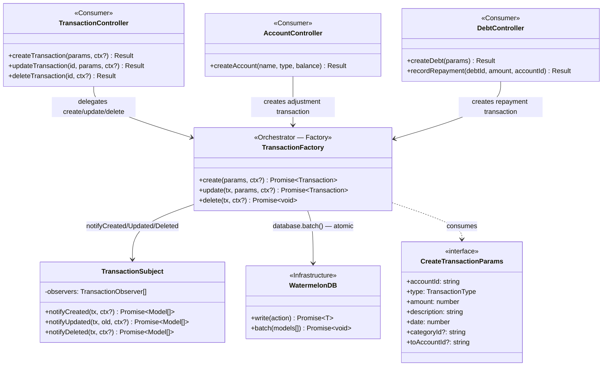
```mermaid
classDiagram
    class CreateTransactionParams {
        <<interface>>
        +accountId: string
        +type: TransactionType
        +amount: number
        +description: string
        +date: number
        +categoryId?: string
        +toAccountId?: string
    }

    class TransactionFactory {
        <<Orchestrator — Factory>>
        +create(params, ctx?) Promise~Transaction~
        +update(tx, params, ctx?) Promise~Transaction~
        +delete(tx, ctx?) Promise~void~
    }

    class TransactionSubject {
        -observers: TransactionObserver[]
        +notifyCreated(tx, ctx?) Promise~Model[]~
        +notifyUpdated(tx, old, ctx?) Promise~Model[]~
        +notifyDeleted(tx, ctx?) Promise~Model[]~
    }

    class TransactionController {
        <<Consumer>>
        +createTransaction(params, ctx?) Result
        +updateTransaction(id, params, ctx?) Result
        +deleteTransaction(id, ctx?) Result
    }

    class AccountController {
        <<Consumer>>
        +createAccount(name, type, balance) Result
    }

    class DebtController {
        <<Consumer>>
        +createDebt(params) Result
        +recordRepayment(debtId, amount, accountId) Result
    }

    class WatermelonDB {
        <<Infrastructure>>
        +write(action) Promise~T~
        +batch(models[]) Promise~void~
    }

    TransactionFactory --> TransactionSubject : notifyCreated/Updated/Deleted
    TransactionFactory --> WatermelonDB : database.batch() — atomic
    TransactionController --> TransactionFactory : delegates create/update/delete
    AccountController --> TransactionFactory : creates adjustment transaction
    DebtController --> TransactionFactory : creates repayment transaction
    TransactionFactory ..> CreateTransactionParams : consumes
```

#### Lợi ích đạt được

| Lợi ích | Mô tả cụ thể |
|---|---|
| **Tính nguyên tử (Atomicity)** | Một lệnh `database.batch()` duy nhất — nếu một bước lỗi, toàn bộ rollback. Net Worth không bao giờ sai lệch giữa chừng |
| **Giải quyết ActionQueue deadlock** | WatermelonDB không cho phép lồng nhiều `database.write()` — Factory bọc tất cả vào một `write()` duy nhất |
| **Giảm code trùng lặp** | Logic ghi DB không còn nằm rải rác trong Screen/Modal — tập trung hoàn toàn vào Factory |
| **Dễ test** | `TransactionController` test chỉ cần mock `TransactionFactory.create` — không cần DB thật |
| **Mở rộng dễ** | Thêm Observer mới (ví dụ: ghi audit log) → chỉ register vào `TransactionSubject`, Factory không thay đổi |

#### Giới hạn và đánh đổi

| Giới hạn | Mô tả |
|---|---|
| **Static class** | `TransactionFactory` dùng static methods — không thể inject hay mock dễ dàng ở unit test (cần dùng `jest.spyOn`) |
| **Phụ thuộc WatermelonDB API** | Factory biết trực tiếp `database.batch()` — nếu đổi ORM cần sửa Factory |
| **Observer lazy-init** | Danh sách Observer được khởi tạo trong lần gọi đầu tiên — trong môi trường test cần reset `TransactionSubject.initialized` |

---

### 7.3. Pattern 2: Observer Pattern

#### Vấn đề trước khi dùng pattern

**Mô tả vấn đề thiết kế:**

Mỗi giao dịch tài chính kéo theo **cập nhật lan tỏa** đến nhiều thực thể khác nhau:
- Giao dịch **EXPENSE** → giảm số dư tài khoản nguồn
- Giao dịch **TRANSFER** → giảm tài khoản nguồn, tăng tài khoản đích
- Giao dịch **thanh toán nợ** → giảm số dư ví + giảm `remaining_amount` của khoản nợ + auto-SETTLE nếu về 0

**Nếu không có Observer:**
- `TransactionFactory` phải tự biết cách tính số dư tài khoản → vi phạm SRP (Factory vừa orchestrate vừa tính nghiệp vụ)
- `TransactionFactory` phải biết cả nghiệp vụ nợ → hai domain (Account + Debt) bị ghép chặt vào một class
- Mỗi loại "hậu quả" (consequence) thêm một `if/else` trong Factory → ngày càng phình to, khó test từng loại riêng
- Khi thêm loại hậu quả mới (ví dụ: cộng điểm thưởng) → phải sửa Factory

#### Cách áp dụng trong dự án

**File / lớp / interface liên quan:**

| Vai trò Observer Pattern | File |
|---|---|
| **Subject (Publisher)** | `src/patterns/TransactionSubject.ts` |
| **Observer Interface** | `src/patterns/TransactionObserver.ts` |
| **Concrete Observer 1** | `src/patterns/AccountObserver.ts` |
| **Concrete Observer 2** | `src/patterns/DebtObserver.ts` |
| **Event trigger** | `TransactionFactory` gọi `TransactionSubject.notify*()` |

**Mô tả vai trò các lớp:**

- **`TransactionObserver`** (Interface): Định nghĩa contract 3 event: `onTransactionCreated`, `onTransactionUpdated?`, `onTransactionDeleted?`. Method tùy chọn (dấu `?`) — Observer chỉ implement những gì nó quan tâm.
- **`TransactionSubject`** (Publisher): Quản lý danh sách Observer qua **Lazy Initialization** (tránh mất subscriber sau Expo Fast Refresh). Phát sự kiện song song (`Promise.all`) và gom kết quả.
- **`AccountObserver`** (Concrete Observer 1): Tính `currentBalance` mới sau mỗi sự kiện giao dịch. Xử lý cả INCOME/EXPENSE/TRANSFER và logic Asset vs Liability. Trả về `Account.prepareUpdate[]` — không ghi DB trực tiếp.
- **`DebtObserver`** (Concrete Observer 2): Chỉ hoạt động khi `context.debtId` có giá trị. Tính `remainingAmount` mới và tự động set `status = SETTLED` khi về 0. Trả về `Debt.prepareUpdate[]`.

**Luồng hoạt động:**

```
TransactionFactory.create(params, { debtId: 'abc' })
  ↓
TransactionSubject.notifyCreated(tx, { debtId: 'abc' })
  ↓ Promise.all([...observers.map(o => o.onTransactionCreated(tx, ctx))])
  ├── AccountObserver.onTransactionCreated(tx)
  │     → tính balance mới → return [Account.prepareUpdate(...)]
  └── DebtObserver.onTransactionCreated(tx, { debtId: 'abc' })
        → tính remaining mới → return [Debt.prepareUpdate(...)]
  ↓ results.flat() → [AccountUpdate, DebtUpdate]
TransactionFactory: database.batch([tx, AccountUpdate, DebtUpdate])
```

#### Sơ đồ minh họa

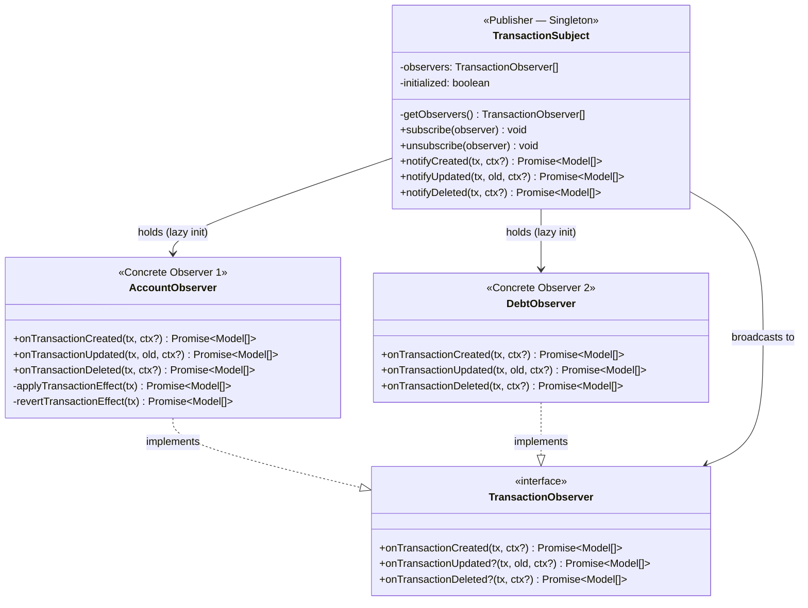
```mermaid
classDiagram
    class TransactionObserver {
        <<interface>>
        +onTransactionCreated(tx, ctx?) Promise~Model[]~
        +onTransactionUpdated?(tx, old, ctx?) Promise~Model[]~
        +onTransactionDeleted?(tx, ctx?) Promise~Model[]~
    }

    class TransactionSubject {
        <<Publisher — Singleton>>
        -observers: TransactionObserver[]
        -initialized: boolean
        -getObservers() TransactionObserver[]
        +subscribe(observer) void
        +unsubscribe(observer) void
        +notifyCreated(tx, ctx?) Promise~Model[]~
        +notifyUpdated(tx, old, ctx?) Promise~Model[]~
        +notifyDeleted(tx, ctx?) Promise~Model[]~
    }

    class AccountObserver {
        <<Concrete Observer 1>>
        +onTransactionCreated(tx, ctx?) Promise~Model[]~
        +onTransactionUpdated(tx, old, ctx?) Promise~Model[]~
        +onTransactionDeleted(tx, ctx?) Promise~Model[]~
        -applyTransactionEffect(tx) Promise~Model[]~
        -revertTransactionEffect(tx) Promise~Model[]~
    }

    class DebtObserver {
        <<Concrete Observer 2>>
        +onTransactionCreated(tx, ctx?) Promise~Model[]~
        +onTransactionUpdated(tx, old, ctx?) Promise~Model[]~
        +onTransactionDeleted(tx, ctx?) Promise~Model[]~
    }

    AccountObserver ..|> TransactionObserver : implements
    DebtObserver ..|> TransactionObserver : implements
    TransactionSubject --> TransactionObserver : broadcasts to
    TransactionSubject --> AccountObserver : holds (lazy init)
    TransactionSubject --> DebtObserver : holds (lazy init)
```

#### Lợi ích đạt được

| Lợi ích | Mô tả cụ thể |
|---|---|
| **Tách biệt domain** | `AccountObserver` không biết `DebtObserver` tồn tại — hai nghiệp vụ độc lập hoàn toàn |
| **Factory sạch** | Factory chỉ orchestrate, không chứa công thức tính số dư hay remaining |
| **Mở rộng dễ dàng** | Thêm `BudgetAlertObserver` → chỉ implement interface + subscribe — không sửa Factory hay Subject |
| **Return `prepareUpdate[]` thay vì ghi trực tiếp** | Observer không tự gọi `database.write()` — để Factory gom vào batch nguyên tử |
| **Lazy Init** | `getObservers()` khởi tạo Observer lần đầu gọi — sống sót qua Expo Fast Refresh |

#### Giới hạn và đánh đổi

| Giới hạn | Mô tả |
|---|---|
| **Khó trace luồng** | Khi đọc code Factory, không thấy rõ "ai" cập nhật số dư — phải biết Observer đang được register |
| **Observer cần biết DB** | `AccountObserver` và `DebtObserver` vẫn trực tiếp query database để tìm Account/Debt — không hoàn toàn pure |
| **Static Subject** | `TransactionSubject` dùng static state — khó reset trong test nếu không cẩn thận |

---

### 7.4. Pattern 3: Strategy Pattern

#### Vấn đề trước khi dùng pattern

**Mô tả vấn đề thiết kế:**

Tính năng Smart Budget cho phép đặt ngân sách theo **WEEKLY** hoặc **MONTHLY**. Hai chu kỳ này có công thức tính `startDate`/`endDate` hoàn toàn khác nhau, kèm các edge case phức tạp:

- **Weekly:** Phải biết "ngày đầu tuần" do người dùng cấu hình (CN hay T2), rồi tìm đúng tuần chứa ngày tham chiếu
- **Monthly:** Phải xử lý anchor day > ngày thực tế của tháng (anchor=31 vào tháng 2 → clamp về 28 hoặc 29 năm nhuận)

**Nếu không có Strategy:**
```typescript
// BudgetController bị ô nhiễm với if/else phức tạp
if (timeframe === 'WEEKLY') {
  // 20 dòng tính ngày tuần
} else if (timeframe === 'MONTHLY') {
  // 30 dòng tính ngày tháng + clamp
}
// Khi thêm 'QUARTERLY' → sửa file BudgetController
```
- Code phức tạp, khó test từng thuật toán riêng biệt
- Thêm chu kỳ mới (Quý, Năm) → phải mở file `BudgetController` để sửa — vi phạm OCP

#### Cách áp dụng trong dự án

**File / lớp / interface liên quan:**

| Vai trò Strategy Pattern | File |
|---|---|
| **Strategy Interface** | `src/patterns/BudgetTimeframeStrategy.ts` |
| **Concrete Strategy A** | `src/patterns/WeeklyBudgetStrategy.ts` |
| **Concrete Strategy B** | `src/patterns/MonthlyBudgetStrategy.ts` |
| **Strategy Resolver** | `src/patterns/BudgetStrategyResolver.ts` |
| **Context** | `src/controllers/BudgetController.ts` |

**Mô tả vai trò các lớp:**

- **`BudgetTimeframeStrategy`** (Interface): Định nghĩa contract duy nhất `calculateCycle(anchorDay, referenceDate?): BudgetCycle` — trả về `{ startDate, endDate }`.
- **`WeeklyBudgetStrategy`** (Concrete A): Tính chu kỳ 7 ngày dựa trên `anchorDay` (1–7 theo cấu hình `firstDayOfWeek`). Tích hợp `TimeService.getFirstDayOfWeek()`.
- **`MonthlyBudgetStrategy`** (Concrete B): Tính chu kỳ tháng với clamp tự động. Hàm helper nội bộ `getMaxDayOfMonth(year, month)` xử lý tháng ngắn.
- **`BudgetStrategyResolver`** (Factory nhỏ): Giữ singleton instance của cả hai Strategy — trả về đúng Strategy theo `BudgetTimeframe` enum.
- **`BudgetController`** (Context): Gọi `BudgetStrategyResolver.getStrategy(timeframe).calculateCycle(anchorDay)` — không biết strategy nào đang chạy.

#### Sơ đồ minh họa

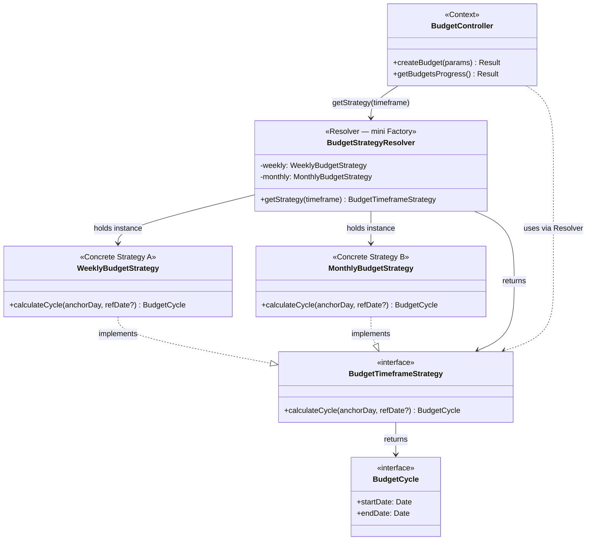
```mermaid
classDiagram
    class BudgetTimeframeStrategy {
        <<interface>>
        +calculateCycle(anchorDay, refDate?) BudgetCycle
    }

    class BudgetCycle {
        <<interface>>
        +startDate: Date
        +endDate: Date
    }

    class WeeklyBudgetStrategy {
        <<Concrete Strategy A>>
        +calculateCycle(anchorDay, refDate?) BudgetCycle
    }

    class MonthlyBudgetStrategy {
        <<Concrete Strategy B>>
        +calculateCycle(anchorDay, refDate?) BudgetCycle
    }

    class BudgetStrategyResolver {
        <<Resolver — mini Factory>>
        -weekly: WeeklyBudgetStrategy
        -monthly: MonthlyBudgetStrategy
        +getStrategy(timeframe) BudgetTimeframeStrategy
    }

    class BudgetController {
        <<Context>>
        +createBudget(params) Result
        +getBudgetsProgress() Result
    }

    WeeklyBudgetStrategy ..|> BudgetTimeframeStrategy : implements
    MonthlyBudgetStrategy ..|> BudgetTimeframeStrategy : implements
    BudgetStrategyResolver --> WeeklyBudgetStrategy : holds instance
    BudgetStrategyResolver --> MonthlyBudgetStrategy : holds instance
    BudgetStrategyResolver --> BudgetTimeframeStrategy : returns
    BudgetController --> BudgetStrategyResolver : getStrategy(timeframe)
    BudgetController ..> BudgetTimeframeStrategy : uses via Resolver
    BudgetTimeframeStrategy --> BudgetCycle : returns
```

#### Lợi ích đạt được

| Lợi ích | Mô tả cụ thể |
|---|---|
| **Tách biệt thuật toán** | Weekly và Monthly là 2 file riêng — thay đổi một không ảnh hưởng cái kia |
| **Testability tối ưu** | `budgetStrategies.spec.ts` test từng class riêng với 6 case biên (leap year, tháng 28, tuần vắt tháng) mà không cần DB hay UI |
| **OCP** | Thêm `QuarterlyBudgetStrategy` → tạo file mới + thêm 1 nhánh Resolver — `BudgetController` không thay đổi |
| **Tích hợp TimeService** | Strategy tự gọi `TimeService.getNow()` và `TimeService.getFirstDayOfWeek()` — cô lập hoàn toàn logic thời gian |

#### Giới hạn và đánh đổi

| Giới hạn | Mô tả |
|---|---|
| **Overhead class** | Với chỉ 2 strategy hiện tại, pattern có vẻ over-engineered so với `if/else` đơn giản — nhưng đây là đầu tư cho mở rộng tương lai |
| **Resolver phải cập nhật** | Khi thêm Strategy mới, vẫn phải sửa `BudgetStrategyResolver` — không hoàn toàn OCP tuyệt đối |

---

### 7.5. Pattern 4: Facade Pattern

#### Vấn đề trước khi dùng pattern

**Mô tả vấn đề thiết kế:**

`DashboardScreen` cần hiển thị 2 loại biểu đồ:
1. **Pie Chart** — Tổng chi tiêu theo danh mục trong tháng
2. **Bar Chart** — Chi tiêu theo ngày trong 7 ngày gần nhất

Để lấy dữ liệu này, hệ thống phải:
- Query bảng `transactions` với filter `type = EXPENSE` + khoảng thời gian
- Query bảng `categories` để lấy tên và màu
- Join thủ công (WatermelonDB không có SQL JOIN)
- Group by category / group by date
- Tính tổng, sort, format thành cấu trúc của thư viện `react-native-gifted-charts`

**Nếu không có Facade:**
```typescript
// DashboardScreen.tsx — 60+ dòng query/aggregation lẫn với render logic
const transactions = await database.get('transactions')
  .query(Q.where('type', 'EXPENSE'), Q.where('date', Q.between(start, end)))
  .fetch()
const categories = await database.get('categories').query().fetch()
const categoryMap = new Map(categories.map(c => [c.id, c]))
const sumMap = new Map()
transactions.forEach(tx => { /* tính tổng */ })
// ... 30 dòng nữa
```
- Screen vừa là View vừa là Query Engine — vi phạm SRP
- Logic này bị lặp nếu nhiều Screen cần báo cáo
- Khó test vì phụ thuộc trực tiếp vào WatermelonDB

#### Cách áp dụng trong dự án

**File / lớp liên quan:**

| Vai trò Facade Pattern | File |
|---|---|
| **Facade** | `src/patterns/ReportFacade.ts` |
| **Client** | `src/screens/DashboardScreen.tsx` |
| **Subsystem 1** | WatermelonDB — `database.get('transactions').query()` |
| **Subsystem 2** | WatermelonDB — `database.get('categories').query()` |
| **Subsystem 3** | `TimeService.getNow()` |
| **Output types** | `CategoryExpenseReportItem[]`, `DailyExpenseReportItem[]` |

**Mô tả vai trò các lớp:**

- **`ReportFacade`** (Facade): Cung cấp 2 static method đơn giản ẩn hoàn toàn logic query phức tạp. Bên trong: query 2 bảng → join thủ công qua Map → aggregate → sort → format output.
- **`DashboardScreen`** (Client): Chỉ gọi `ReportFacade.getExpensesByCategory(start, end)` và `ReportFacade.getDailyExpenseTrend(7)` — không biết gì về SQL, Map, hay cách tính ngày.
- **WatermelonDB + TimeService** (Subsystems): Các hệ thống con phức tạp được bọc hoàn toàn bên trong Facade.

**Luồng hoạt động:**

```
DashboardScreen.loadData()
  ↓
ReportFacade.getExpensesByCategory(startOfMonth, endOfMonth)
  ├── database.get('transactions').query(EXPENSE, date range).fetch()
  ├── database.get('categories').query().fetch()
  ├── Build categoryMap: Map<id, Category>
  ├── Build sumMap: Map<categoryId, totalCents>
  ├── Transform → CategoryExpenseReportItem[]
  └── Sort by value DESC → return

ReportFacade.getDailyExpenseTrend(7)
  ├── TimeService.getNow() → today
  ├── Build date range: today-6 → today
  ├── database.get('transactions').query(EXPENSE, date range).fetch()
  ├── Initialize trendMap: Map<dateString, 0>
  ├── Accumulate transactions into trendMap
  └── Format → DailyExpenseReportItem[] (label + value)
```

#### Sơ đồ minh họa

```mermaid
classDiagram
    class DashboardScreen {
        <<Client>>
        +loadData() void
    }

    class ReportFacade {
        <<Facade>>
        +getExpensesByCategory(start, end) Promise~CategoryExpenseReportItem[]~
        +getDailyExpenseTrend(days) Promise~DailyExpenseReportItem[]~
    }

    class CategoryExpenseReportItem {
        <<Output DTO>>
        +value: number
        +color: string
        +text: string
        +categoryId: string
    }

    class DailyExpenseReportItem {
        <<Output DTO>>
        +value: number
        +label: string
    }

    class TransactionDB {
        <<Subsystem 1>>
        +query(filters) Transaction[]
    }

    class CategoryDB {
        <<Subsystem 2>>
        +query() Category[]
    }

    class TimeService {
        <<Subsystem 3>>
        +getNow() Date
    }

    DashboardScreen --> ReportFacade : gọi 2 method đơn giản
    ReportFacade --> TransactionDB : query EXPENSE transactions
    ReportFacade --> CategoryDB : fetch all categories
    ReportFacade --> TimeService : getNow() cho date range
    ReportFacade ..> CategoryExpenseReportItem : produces
    ReportFacade ..> DailyExpenseReportItem : produces
```

#### Lợi ích đạt được

| Lợi ích | Mô tả cụ thể |
|---|---|
| **DashboardScreen cực kỳ sạch** | Screen không chứa một dòng query hay aggregation — chỉ gọi 2 hàm |
| **Tái sử dụng** | Bất kỳ Screen nào cần báo cáo chi tiêu đều có thể gọi `ReportFacade` |
| **Dễ test Facade độc lập** | Mock WatermelonDB và TimeService → test từng method của Facade mà không cần UI |
| **Thêm báo cáo mới** | Thêm method vào Facade → Screen gọi thêm 1 dòng, không thay đổi gì đã có |

#### Giới hạn và đánh đổi

| Giới hạn | Mô tả |
|---|---|
| **Không reactive** | `ReportFacade` là one-shot fetch — không subscribe WatermelonDB Observable, phải pull-to-refresh thủ công |
| **Phụ thuộc WatermelonDB** | Facade biết trực tiếp API của WatermelonDB — nếu đổi DB cần sửa Facade |
| **Static class** | Không thể inject hay subclass — khó mock trong test tích hợp |

---

### 7.6. Các Pattern Có Thể Cân Nhắc

Bảng dưới đây tổng hợp các pattern phổ biến và trả lời rõ **khi nào phù hợp** — giúp đội ngũ ra quyết định khi mở rộng tính năng trong tương lai.

| Pattern | Khi nào phù hợp | Có trong dự án? |
|---|---|---|
| **Factory Method / Abstract Factory** | Cần tạo nhiều loại object cùng họ, che giấu logic khởi tạo phức tạp | ✅ `TransactionFactory` — tạo giao dịch nguyên tử |
| **Builder** | Object có nhiều tham số tùy chọn, cần tạo từng bước (ví dụ: Report với filter linh hoạt) | ⬜ Chưa dùng — có thể cân nhắc khi mở rộng `ReportFacade` |
| **Singleton** | Chỉ dùng thận trọng cho cấu hình/logging/service dùng chung | ⚠️ `TimeService` và `database` instance là singleton ngầm định qua module export |
| **Strategy** | Có nhiều thuật toán/chính sách có thể hoán đổi | ✅ `WeeklyBudgetStrategy` + `MonthlyBudgetStrategy` |
| **Observer / Pub-Sub** | Một thay đổi cần thông báo cho nhiều thành phần | ✅ `TransactionSubject` → `AccountObserver` + `DebtObserver` |
| **Adapter** | Cần bọc thư viện/API bên ngoài để phù hợp interface nội bộ | ⬜ Chưa dùng — có thể áp dụng nếu thêm Payment API bên ngoài |
| **Facade** | Cần cung cấp interface đơn giản cho một hệ thống con phức tạp | ✅ `ReportFacade` — ẩn query + aggregation |
| **Repository** | Tách logic truy cập dữ liệu khỏi domain/service | ⚠️ WatermelonDB Models đóng vai trò Repository ngầm định; Controllers truy vấn trực tiếp |
| **MVC / MVVM** | Tách UI, trạng thái, xử lý và dữ liệu | ✅ Toàn bộ kiến trúc: View (screens/components) → Controller → Pattern (Domain) → DB |

---

## 8. REFACTORING VÀ CHẤT LƯỢNG MÃ NGUỒN

### 8.1. Code Smell Đã Phát Hiện

| STT | Code Smell | Vị trí | Ảnh hưởng | Cách xử lý |
|---|---|---|---|---|
| 1 | **Primitive Obsession** | Toàn dự án — giá trị tiền tệ ban đầu dùng `number` (float) tự do | Lỗi làm tròn kiểu `0.1 + 0.2 = 0.30000000000000004` có thể làm sai số dư ví | Standardize tất cả monetary value thành **integer cents** (×100). `toCents()/fromCents()` xử lý tại biên UI, không bao giờ lưu float vào DB |
| 2 | **Long Method / God Method** | `getBudgetsProgress()` trong `BudgetController.ts` (80+ dòng) thực hiện: fetch DB, rollover cycle, query transactions, lookup categories, tính toán, format output | Khó đọc, khó test từng bước riêng, loop có side effect (write DB bên trong for-loop) | **Extract Method**: tách logic rollover thành khối rõ ràng với comment phân đoạn; tách category lookup ra ngoài loop (O(n+m) thay vì O(n×m)); thêm comment mô tả từng pha |
| 3 | **Duplicated Code — Result Shape** | 5 Controller (Account, Transaction, Debt, Budget, Category) đều return `{ success: boolean; data?: T; error?: string }` nhưng không có type chung | Nếu muốn thêm field (ví dụ: `metadata`) phải sửa tất cả Controllers đồng loạt | Có thể extract `ControllerResult<T>` generic type — hiện tại chấp nhận vì là interface ngầm định nhất quán |
| 4 | **Feature Envy** | `DebtController.createDebt()` tự tính `txType` dựa trên `DebtType` để quyết định EXPENSE/INCOME — logic này thuộc về domain Debt, không phải Controller | Controller biết quá nhiều về nghiệp vụ chuyển đổi loại giao dịch cho nợ | Logic được comment rõ ràng (`// Money leaves wallet to lend to someone`) để làm tường minh intent; có thể extract thành `DebtTransactionTypeResolver` nếu scale |
| 5 | **Magic Number** | `BudgetController.getBudgetsProgress()` — `if (nowSeconds > budget.endDate)` so sánh timestamp trực tiếp | Không rõ đơn vị (giây hay millisecond?), dễ nhầm khi maintain | Giải quyết bằng comment rõ ràng và naming nhất quán (`xxxSeconds` cho tất cả timestamp variables) |
| 6 | **Inappropriate Intimacy** | `AccountObserver` trực tiếp query `database.get('accounts').find(accountId)` | Observer biết cấu trúc DB và Table name hardcoded `'accounts'` | Chấp nhận trade-off vì WatermelonDB không có Repository pattern; Table name được centralise trong schema |
| 7 | **Dead Code / Unused Import** | Các file screen ban đầu có import unused từ thư viện — ví dụ Alert, StyleSheet tạm dùng khi debug | Làm tăng bundle size và gây confusion khi đọc import list | Cleanup thực hiện định kỳ; TypeScript `noUnusedLocals` trong `tsconfig.json` bắt lỗi tại compile time |

---

### 8.2. Refactoring Đã Thực Hiện

| STT | Trước refactoring | Sau refactoring | Kỹ thuật áp dụng | Minh chứng |
|---|---|---|---|---|
| 1 | Float được dùng trực tiếp để lưu tiền tệ vào DB, tính toán số dư | Integer cents + `toCents()`/`fromCents()` tại biên UI | **Introduce Parameter Object + Standardize Primitive** | `src/utils/currencyFormatter.ts`, `tests/utils/currencyFormatter.spec.ts` |
| 2 | Logic tính chu kỳ ngân sách (weekly/monthly) nằm trong `BudgetController` với `if/else` dài | Tách thành `WeeklyBudgetStrategy` và `MonthlyBudgetStrategy` implement cùng interface | **Extract Class + Introduce Interface** | `src/patterns/BudgetTimeframeStrategy.ts`, `WeeklyBudgetStrategy.ts`, `MonthlyBudgetStrategy.ts` |
| 3 | Logic cập nhật số dư tài khoản và khoản nợ nằm trong `TransactionFactory` | Tách thành `AccountObserver` và `DebtObserver` đăng ký vào `TransactionSubject` | **Extract Class + Introduce Observer** | `src/patterns/AccountObserver.ts`, `DebtObserver.ts`, `TransactionSubject.ts` |
| 4 | `DashboardScreen` chứa 60+ dòng query + aggregation để lấy dữ liệu biểu đồ | Toàn bộ query logic được đặt vào `ReportFacade` — Screen chỉ gọi 2 method | **Extract Class (Facade)** | `src/patterns/ReportFacade.ts` |
| 5 | `getBudgetsProgress()` query category riêng lẻ trong vòng lặp (N+1 query problem) | Fetch tất cả categories một lần trước loop, build `Map<id, Category>` để O(1) lookup | **Optimize Loop / Hoist Invariant** | `src/controllers/BudgetController.ts` dòng 91–92 |
| 6 | Test files nằm rải rác trong `src/` cùng source code | Di chuyển toàn bộ vào thư mục `tests/` tách biệt | **Restructure Project Layout** | `tests/patterns/`, `tests/utils/`, `tests/components/` |

---

#### Chi Tiết Refactoring Quan Trọng

**R1 — Standardize Primitive: Float → Integer Cents**

```diff
// TRƯỚC — Lưu float trực tiếp vào DB, tính toán bị lỗi floating-point
- const balance = account.currentBalance + amount  // 0.1 + 0.2 = 0.30000000000000004 🚨
- database.write(() => account.update(a => { a.currentBalance = balance }))

// SAU — Tất cả amount là integer (cents), formatting chỉ ở UI
+ // DB invariant: amount luôn là integer (cents × 100)
+ const newBalance = account.currentBalance + transaction.amount  // 10 + 20 = 30 ✅
+ models.push(account.prepareUpdate(acc => { acc.currentBalance += amount }))
```

```typescript
// currencyFormatter.ts — Biên UI xử lý chuyển đổi
export function toCents(amount: number): number {
  return Math.round(amount * 100)  // Math.round() ngăn floating-point drift
}
export function fromCents(cents: number): number {
  return cents / 100
}
```

**R2 — Extract Class: BudgetController inline logic → Strategy Pattern**

```diff
// TRƯỚC — if/else phức tạp trong BudgetController
- if (timeframe === 'WEEKLY') {
-   const firstDay = appStore.getState().firstDayOfWeek
-   let currentDay = start.getDay() - firstDay + 1
-   if (currentDay <= 0) currentDay += 7
-   // ... 15 dòng tính toán tiếp ...
- } else if (timeframe === 'MONTHLY') {
-   // ... 20 dòng khác với edge case tháng ngắn ...
- }

// SAU — BudgetController chỉ còn 2 dòng
+ const strategy = BudgetStrategyResolver.getStrategy(params.timeframe)
+ const cycle = strategy.calculateCycle(params.anchorDay)
```

**R3 — Hoist Invariant: Giải quyết N+1 Query trong getBudgetsProgress()**

```diff
// TRƯỚC — Query category riêng cho mỗi budget trong loop (N+1 queries)
- for (const budget of budgets) {
-   if (budget.categoryId) {
-     const cat = await database.get('categories').find(budget.categoryId)  // N queries
-     categoryName = cat.name
-   }
- }

// SAU — 1 query duy nhất trước loop, O(1) lookup bên trong
+ // Build a category Map once before the loop — O(1) lookup per budget
+ // instead of a separate database.find() call per iteration (O(n*m) → O(n+m))
+ const allCategories = await database.get('categories').query().fetch()  // 1 query
+ const categoryMap = new Map(allCategories.map(c => [c.id, c]))
+
+ for (const budget of budgets) {
+   const cat = categoryMap.get(budget.categoryId)  // O(1), no async
+ }
```

---

### 8.3. Tác Động Của Refactoring

#### Code Dễ Đọc Hơn Ở Điểm Nào?

| Module / Pattern | Trước | Sau |
|---|---|---|
| **`BudgetController.createBudget()`** | Phải đọc 30+ dòng công thức tính ngày để hiểu chu kỳ | Chỉ còn `strategy.calculateCycle(anchorDay)` — tên gọi tự mô tả intent |
| **`TransactionFactory`** | Phải trace qua nhiều bước ghi DB để hiểu "ai cập nhật số dư?" | Rõ ràng: `TransactionSubject.notifyCreated(tx)` → Observer phản ứng |
| **`DashboardScreen`** | 60+ dòng query/aggregation lẫn với render | 2 dòng: `ReportFacade.getExpensesByCategory()` và `getDailyExpenseTrend()` |
| **`AccountObserver`** | N/A (trước kia không tồn tại — logic nằm rải rác) | `applyTransactionEffect()` / `revertTransactionEffect()` — tên method mô tả chính xác hành vi |
| **Tất cả monetary value** | `amount: 10.50` — không rõ đơn vị | `amount: 1050` (cents) — convention được enforce ở mọi nơi trong codebase |

#### Test Có Giúp Đảm Bảo Refactoring Không Làm Sai Chức Năng?

**Có — và đây là lý do chính để viết test trước khi refactor.**

Dự án có **4 file test** với tổng **19+ test cases** bao phủ phần cốt lõi:

| File test | Số test | Bảo vệ refactoring nào |
|---|---|---|
| `tests/utils/currencyFormatter.spec.ts` | 7 cases | Đảm bảo `toCents/fromCents/formatCurrency` không thay đổi hành vi khi refactor formatting logic |
| `tests/patterns/budgetStrategies.spec.ts` | 4 cases Monthly + 2 cases Weekly | Đảm bảo Strategy Pattern không làm sai công thức tính ngày sau khi tách class |
| `tests/components/Transactions.spec.tsx` | Mock-based component test | Đảm bảo UI không bị break khi Controller signature thay đổi |
| `tests/components/AccountsAndCategories.spec.tsx` | Mock-based component test | Đảm bảo Account và Category flow hoạt động sau restructure |

**Ví dụ cụ thể:** Khi refactor `MonthlyBudgetStrategy` để xử lý leap year, test case sau phát hiện ngay nếu logic clamp bị sai:

```typescript
it('should correctly handle February leap years during clamping', () => {
  // Tháng 2 năm 2028 có 29 ngày (năm nhuận)
  const refDate = new Date(2028, 2, 2)
  const cycle = strategy.calculateCycle(31, refDate)  // anchor=31, nhưng Feb chỉ có 29 ngày
  
  expect(cycle.startDate.getDate()).toBe(29)  // clamp về 29, không phải 31 hay 28
})
```

> [!TIP]
> Nhờ test chạy < 5ms/case và không cần emulator, team có thể refactor Strategy mạnh dạn và verify ngay — không phải test thủ công trên thiết bị.

#### Module Nào Dễ Mở Rộng Hơn Sau Khi Refactor?

| Module | Trước refactor | Sau refactor — Điểm mở rộng cụ thể |
|---|---|---|
| **Budget Strategies** | Thêm chu kỳ mới → sửa `BudgetController` (có thể break existing logic) | Tạo `QuarterlyBudgetStrategy.ts` → implement interface → đăng ký Resolver. `BudgetController` **không thay đổi** |
| **Transaction Side Effects** | Thêm hành vi mới khi tạo GD → sửa `TransactionFactory` (ngày càng lớn) | Tạo class mới implement `TransactionObserver` → `TransactionSubject.subscribe()`. Factory **không thay đổi** |
| **Report / Analytics** | Thêm loại biểu đồ → sửa Screen, thêm query logic vào UI | Thêm 1 static method vào `ReportFacade`. Screen chỉ gọi thêm **1 dòng** |
| **Currency Formatting** | Logic format rải rác trong mỗi Screen | Thay đổi logic format → sửa duy nhất `currencyFormatter.ts`. Test suite verify ngay tính đúng đắn |
| **Monetary Storage** | Float tự do — refactor thành cents phải sửa nhiều chỗ | Invariant được enforce: **tất cả** amount trong DB đều là cents. Thêm tính năng mới không cần lo lắng về float |

---

*Báo cáo được tổng hợp từ toàn bộ source code, context documentation, mermaid diagrams và test files của dự án Cash Flow Wave.*
